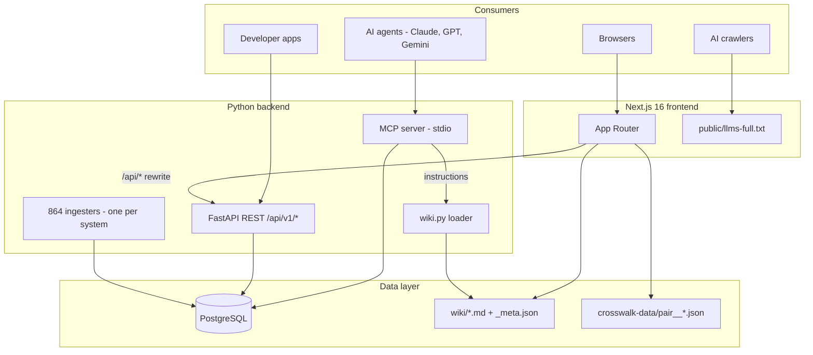

# HANDOVER.md - WorldOfTaxonomy

A narrative handover for an engineer (or a from-scratch rebuild team) with zero prior context. It stitches together code, config, and the ops surface into one story. Drill-downs live under [docs/handover/](docs/handover/).

---

## 1. Why this exists

Industry, product, occupation, and regulatory taxonomies are fragmented. The US uses NAICS; Europe uses NACE; the UN uses ISIC; healthcare uses ICD/LOINC/ATC; trade uses HS/CPC; occupations use SOC/ISCO/O\*NET; and every country ships its own flavor. Translating a single code across systems is painful, error-prone, and today happens inside consulting decks and throwaway spreadsheets.

**WorldOfTaxonomy is a unified global classification knowledge graph.** It ingests 1,000+ classification systems as equal peers (no single "canonical" one) and connects them with 320K+ crosswalk edges. One Postgres graph, three surfaces on top: a **REST API**, an **MCP server**, and a **Next.js web app**. The full system catalog lives in [CLAUDE.md](CLAUDE.md).

---

## 2. The big picture

Source: [docs/diagrams/system-architecture.mmd](docs/diagrams/system-architecture.mmd). More diagrams in [docs/diagrams/](docs/diagrams/) for the ingestion pipeline, API request flow, MCP session lifecycle, and wiki data flow.

---

## 3. Repository map

| Path | Role |
|------|------|
| [world_of_taxonomy/](world_of_taxonomy/) | Python backend: API + MCP + ingesters + query layer |
| [world_of_taxonomy/api/](world_of_taxonomy/api/) | FastAPI app factory, DI, middleware, 16 routers |
| [world_of_taxonomy/mcp/](world_of_taxonomy/mcp/) | Stdio MCP server and tool handlers |
| [world_of_taxonomy/ingest/](world_of_taxonomy/ingest/) | One module per classification system (~864 files) |
| [world_of_taxonomy/schema.sql](world_of_taxonomy/schema.sql) | Core DDL |
| [world_of_taxonomy/schema_auth.sql](world_of_taxonomy/schema_auth.sql) | Auth DDL |
| [world_of_taxonomy/__main__.py](world_of_taxonomy/__main__.py) | CLI dispatcher: `serve`, `mcp`, `ingest`, `init`, `init-auth` |
| [frontend/](frontend/) | Next.js 16 App Router app (Turbopack) |
| [frontend/src/app/](frontend/src/app/) | Pages, route handlers, sitemap, robots, feed |
| [frontend/src/components/](frontend/src/components/) | Layout, visualizations, shadcn/ui primitives |
| [frontend/src/lib/](frontend/src/lib/) | Client + server API fetchers, types, categories, auth |
| [frontend/public/llms-full.txt](frontend/public/llms-full.txt) | LLM crawler context, built from `wiki/` |
| [wiki/](wiki/) | 10 curated markdown guide pages + `_meta.json` |
| [blog/](blog/) | Blog posts (markdown + `_meta.json`) |
| [crosswalk-data/](crosswalk-data/) | Exported `pair__*.json` files consumed by the frontend |
| [tree-data/](tree-data/) | Exported per-system hierarchy JSON |
| [scripts/](scripts/) | `build_llms_txt.py`, `export_crosswalk_data.py`, `export_tree_data.py` |
| [skills/](skills/) | Four AI-agent bundles: `claude-code/`, `anthropic/`, `openapi/`, `portable/` |
| [tests/](tests/) | pytest suite - uses `test_wot` schema isolation |
| [docs/](docs/) | Diagrams (`*.mmd`), `adding-a-new-system.md`, launch copy |
| [.github/workflows/ci.yml](.github/workflows/ci.yml) | CI: pytest + em-dash check + frontend `tsc` + `next build` |
| [Dockerfile.backend](Dockerfile.backend), [docker-compose.yml](docker-compose.yml) | Backend container + local dev stack |

Drill-down files:
- **[docs/handover/backend.md](docs/handover/backend.md)** - FastAPI internals, MCP, auth, ingest, wiki pipeline
- **[docs/handover/frontend.md](docs/handover/frontend.md)** - Next 16 specifics, App Router, data layer, theming
- **[docs/handover/rebuild-checklist.md](docs/handover/rebuild-checklist.md)** - Ordered "rebuild from zero" checklist

---

## 4. Tech stack and why

| Layer | Choice | Why |
|-------|--------|-----|
| Backend language | Python 3.9+ (CI on 3.11) | Fastest path from "download a government CSV" to "parse it in a test." |
| Web framework | FastAPI | Pydantic models double as schema + OpenAPI; async fits asyncpg. |
| DB driver | asyncpg | Native async, non-blocking. Set `statement_cache_size=0` when the pool sits behind pgbouncer in transaction-pooling mode (Neon, Supabase pooler, any self-hosted pgbouncer). pgbouncer doesn't support server-side prepared statements in that mode. Drop the setting if you connect direct to Postgres. |
| Database | PostgreSQL | Any Postgres 14+ works. Hosted options (Neon, Supabase, RDS, self-managed) are interchangeable; the only driver-visible difference is whether a pgbouncer-style pooler sits in front. |
| Auth | bcrypt + PyJWT (HS256) | No external IdP; API keys are `wot_` + 32 hex, bcrypt-hashed, 8-char prefix indexed. OAuth (GitHub/Google/LinkedIn) is layered on top. |
| Rate limit | slowapi + custom tier-aware middleware | Anonymous 30/min up to Enterprise effectively unlimited. |
| MCP | Official Python MCP SDK, stdio transport | Works in Claude Desktop, Claude Code, Cursor, any stdio-aware host. |
| Frontend framework | Next.js 16 + Turbopack | SSR for SEO + React Query for client UX. See [frontend/AGENTS.md](frontend/AGENTS.md) - this is NOT the Next.js you know; check `node_modules/next/dist/docs/` before writing code. |
| UI | Tailwind v4 + shadcn/ui + oklch theme tokens | Dark/light theming via `next-themes`. |
| Visualizations | D3 (force, radial dendrogram, world map), Cytoscape.js (crosswalk graph), Mermaid (diagrams) | Lazy-loaded where heavy. |
| Markdown | remark + remark-gfm + remark-html | Server-side rendered. |

---

## 5. Data model in five tables

All DDL is in [world_of_taxonomy/schema.sql](world_of_taxonomy/schema.sql) and [world_of_taxonomy/schema_auth.sql](world_of_taxonomy/schema_auth.sql). Only the shape you need to hold in your head:

- **`classification_system`** - one row per system (`id`, `name`, `region`, `version`, `authority`, `node_count`, `data_provenance`, `license`, `source_file_hash`). `data_provenance` is an enum: `official_download | structural_derivation | manual_transcription | expert_curated` - used to color-code trustworthiness in the UI and in API responses.
- **`classification_node`** - every code in every system (`system_id`, `code`, `title`, `level`, `parent_code`, `sector_code`, `is_leaf`, `search_vector TSVECTOR`). A trigger (`trg_node_search_vector`) maintains `search_vector` on INSERT/UPDATE with `setweight` for code/title/description. Indexes: GIN on `search_vector`, btree on `(system_id, parent_code)`, `(system_id, level)`, `code`.
- **`equivalence`** - crosswalk edges (`source_system`, `source_code`, `target_system`, `target_code`, `match_type`). `match_type` is `exact | partial | broad | narrow`.
- **`app_user`** - UUID PK, email, bcrypt password hash, `tier` (`free | pro | enterprise`), optional `oauth_provider` / `oauth_provider_id`.
- **`api_key`** - UUID PK, `user_id` FK, `key_hash` (bcrypt), `key_prefix` (first 8 chars after `wot_` for index lookup), `name`, `last_used_at`, `expires_at`.

Plus `usage_log` (per-request audit) and `daily_usage` (tier cap counter) - see [docs/handover/backend.md](docs/handover/backend.md).

---

## 6. Three surfaces

### REST API (`/api/v1/*`)

Routers in [world_of_taxonomy/api/routers/](world_of_taxonomy/api/routers/): `systems`, `nodes`, `search`, `equivalences`, `explore`, `countries`, `classify`, `auth`, `oauth`, `wiki`, `contact`, `audit`, `export`, `bulk_export`, `crosswalk_graph`. Ops/security routers mounted directly from [world_of_taxonomy/api/](world_of_taxonomy/api/): `metrics` (Prometheus at `/api/v1/metrics`, `METRICS_TOKEN`-gated), `healthz` (`/api/v1/healthz` for uptime probes), `version` (`/api/v1/version` for deploy verification), `honeypot` (decoy paths + RFC 9116 `security.txt`), `csp_report` (`/api/v1/csp-report` sink), `canary` (provenance-traced tokens embedded in `llms-full.txt`). App factory at [world_of_taxonomy/api/app.py](world_of_taxonomy/api/app.py) (lifespan-managed asyncpg pool, DB connect retry, env validation, graceful shutdown). Route inventory and auth rules live in [docs/handover/backend.md](docs/handover/backend.md).

### MCP server

Stdio JSON-RPC in [world_of_taxonomy/mcp/server.py](world_of_taxonomy/mcp/server.py). 23 tools defined in [world_of_taxonomy/mcp/protocol.py](world_of_taxonomy/mcp/protocol.py). Tool handlers in [world_of_taxonomy/mcp/handlers.py](world_of_taxonomy/mcp/handlers.py) reuse the same query layer as the REST API. The `initialize` response injects priority wiki pages (`getting-started`, `systems-catalog`, `crosswalk-map`, `industry-classification`, `categories-and-sectors`) as `instructions`, so host LLMs get 10-15K tokens of context upfront. Run locally: `python -m world_of_taxonomy mcp`. Shell wrapper: [run_mcp.sh](run_mcp.sh).

### Web app

Next.js 16 App Router under [frontend/src/app/](frontend/src/app/). Key pages: `/` (galaxy view), `/explore` (search + browse, SSR shell), `/system/[id]` + `/system/[id]/node/[code]` (detail pages), `/crosswalk-explorer` (Cytoscape graph), `/guide/[slug]` (wiki), `/blog/[slug]`, `/about`, `/pricing`, `/developers`, `/login`, `/auth/callback`. Full page inventory in [docs/handover/frontend.md](docs/handover/frontend.md).

---

## 7. Ingest philosophy

**One module per system**, living in [world_of_taxonomy/ingest/](world_of_taxonomy/ingest/) (~864 files). Each module exposes an `ingest()` function; [world_of_taxonomy/__main__.py](world_of_taxonomy/__main__.py) dispatches them via `python -m world_of_taxonomy ingest <target>`.

The only shared base is [world_of_taxonomy/ingest/base.py](world_of_taxonomy/ingest/base.py), with two helpers:
- `ensure_data_file(url, local_path)` - download with cache, custom User-Agent, disabled SSL verify (some gov sites have bad certs).
- `ensure_data_file_zip(url, local_path, member)` - same but extracts one file from a ZIP.

Everything else (parsing, level detection, parent resolution, sector mapping) is per-system. NAICS 2022 does Excel via openpyxl + range-code logic for the 31-33 sector. NACE Rev 2 reuses ISIC4 sections. NACE-derived systems (WZ, ÖNACE, NOGA) copy all NACE nodes plus 1:1 equivalence edges. Domain vocabularies (truck operations, AI ethics, etc.) are hand-curated Python literals.

**Adding a new system**: the canonical 7-step checklist lives in [CONTRIBUTING.md](CONTRIBUTING.md) (red-test first, TDD). Longer walkthrough in [docs/adding-a-new-system.md](docs/adding-a-new-system.md). Upstream source attribution for every system is in [DATA_SOURCES.md](DATA_SOURCES.md).

---

## 8. Auth and rate limits

- **Registration** (`POST /api/v1/auth/register`): email + password, bcrypt hash, returns JWT (15 min expiry).
- **Login** (`POST /api/v1/auth/login`): password or OAuth (`/api/v1/auth/oauth/{provider}/authorize` -> `/auth/callback`).
- **API keys**: `wot_` + 32 hex chars = 36 chars total. Stored as bcrypt hash plus an indexed 8-char prefix so lookup is one btree seek + one bcrypt compare.
- **JWT config**: HS256, secret in `JWT_SECRET` (>=32 chars in prod - generate with `python3 -c 'import secrets; print(secrets.token_hex(32))'`). Dev bypass: set `DISABLE_AUTH=true` to receive a synthetic user instead of a 401.
- **Rate-limit tiers** (middleware in [world_of_taxonomy/api/middleware.py](world_of_taxonomy/api/middleware.py)):

| Tier | Per minute | Per day |
|------|-----------:|--------:|
| Anonymous | 30 | 1,000 |
| Free | 100 | 5,000 |
| Pro | 1,000 | 100,000 |
| Enterprise | 10,000 | unlimited |

Counters stored in `daily_usage`; every request audited to `usage_log`. Responses carry `X-RateLimit-Limit`, `X-RateLimit-Remaining`, and `X-RateLimit-Reset` headers.

**Failed-auth lockout**: a sliding-window in-process tracker ([world_of_taxonomy/api/failed_auth.py](world_of_taxonomy/api/failed_auth.py)) counts login failures per IP and per email. Thresholds tunable via `AUTH_FAILURE_WINDOW_SECONDS`, `AUTH_FAILURE_MAX_PER_IP`, `AUTH_FAILURE_MAX_PER_EMAIL`. Request bodies over 2 MiB are rejected before they reach handlers.

**Input length caps** on auth + API key schemas (Pydantic `min_length`/`max_length`) stop pathological payloads before validation runs. Prompt-injection guard on `/classify` NFKC-normalizes input and rejects known jailbreak patterns ([world_of_taxonomy/api/text_guard.py](world_of_taxonomy/api/text_guard.py)).

OAuth provider setup (redirect URIs, secrets) lives in [OAUTH_PRODUCTION_SETUP.md](OAUTH_PRODUCTION_SETUP.md).

---

## 8a. Security posture

The backend and frontend enforce a layered defense surface beyond auth:

- **Baseline security headers** on both surfaces: `Strict-Transport-Security`, `X-Content-Type-Options: nosniff`, `X-Frame-Options: DENY`, `Referrer-Policy: strict-origin-when-cross-origin`, `Permissions-Policy` (geo/mic/camera denied). Backend middleware: [world_of_taxonomy/api/security_headers.py](world_of_taxonomy/api/security_headers.py). Frontend: [frontend/next.config.ts](frontend/next.config.ts). `X-Powered-By` disabled.
- **Content-Security-Policy Report-Only** on the frontend posts violations to `/api/v1/csp-report`, which increments a bounded-cardinality Prometheus counter keyed on directive. Flip to enforcement by swapping the header name once the violation log is clean.
- **CORS allowlist** driven by `ALLOWED_ORIGINS` env var (comma-separated). Defaults closed.
- **SSRF defense** on `LEAD_WEBHOOK_URL`: HTTPS-only by default, optional `WEBHOOK_HOST_ALLOWLIST`, `WEBHOOK_ALLOW_HTTP` opt-in for dev, IP resolution rejects loopback/link-local/private/multicast/metadata endpoints at import time. See [world_of_taxonomy/webhook.py](world_of_taxonomy/webhook.py).
- **Constant-time compares** for `METRICS_TOKEN` (`hmac.compare_digest`) and `REVALIDATE_SECRET` (`node:crypto.timingSafeEqual`). No byte-at-a-time timing leaks.
- **Honeypot paths** (`/wp-admin`, `/.env`, `/admin.php`, etc.) return decoys and increment `wot_honeypot_hits_total`. `/.well-known/security.txt` satisfies RFC 9116.
- **Canary tokens** in [frontend/public/llms-full.txt](frontend/public/llms-full.txt) let us detect LLM crawler provenance by watching `wot_canary_hits_total`.
- **Request correlation** via `X-Request-ID` propagation (generated if missing) and one JSON log line per HTTP request with method/route/status/latency/request-id.
- **Startup env validation** refuses to boot if required vars are missing or weak (e.g. short `JWT_SECRET` outside dev).

Policy + disclosure contact: [SECURITY.md](SECURITY.md). Operational response: [docs/runbooks/](docs/runbooks/).

---

## 8b. Observability

One Prometheus exposition endpoint, one uptime probe, one version probe, one structured access log. No external APM unless you opt in to Sentry.

| Surface | Purpose |
|---------|---------|
| `GET /api/v1/metrics` | Prometheus scrape target. Token-gated in prod via `METRICS_TOKEN`. |
| `GET /api/v1/healthz` | Liveness probe for uptime monitors and Docker `HEALTHCHECK`. No DB hit. |
| `GET /api/v1/version` | Git SHA + build time for deploy verification. |
| JSON access log | One line per HTTP request: method, route template, status, latency, `X-Request-ID`. |
| Sentry (optional) | Backend + frontend error + performance telemetry when `SENTRY_DSN` is set. |

**Metric families** ([world_of_taxonomy/api/metrics.py](world_of_taxonomy/api/metrics.py) + per-feature modules):

| Metric | Labels | What it counts |
|--------|--------|----------------|
| `wot_http_requests_total` | method, route, status_class | Request volume. Route template, not URL, to keep cardinality bounded. |
| `wot_http_request_latency_seconds` | method, route | Latency histogram (9 buckets, 10ms -> 10s). |
| `wot_http_requests_in_flight` | - | Gauge of concurrent requests. |
| `wot_http_errors_total` | route | 5xx responses per route. |
| `wot_honeypot_hits_total` | path | Attacker knocks on `/wp-admin`, `/.env`, etc. |
| `wot_canary_hits_total` | token | LLM crawler provenance (tokens in `llms-full.txt`). |
| `wot_csp_reports_total` | directive | Browser CSP violations, bucketed on known directives. |
| `wot_failed_auth_total` | scope | Login failures (scope=ip/email). |
| `wot_injection_rejections_total` | reason | `/classify` prompt-injection rejections. |

Dashboards are intentionally not committed; the metric names above are the contract. Runbooks in [docs/runbooks/](docs/runbooks/) describe what an alert on each family should trigger.

---

## 8c. Performance posture

- **GZip compression** on responses >=500 bytes (middleware; skips small JSON to avoid CPU overhead on hot paths).
- **Static bundling** of crosswalks and trees via `predev`/`prebuild` hooks: SSR reads from disk, zero network calls for the common case.
- **Lazy-loaded heavy libs** on the frontend: Cytoscape (~300 KB), Mermaid, D3 radial dendrogram.
- **asyncpg pool tunable** via `DB_POOL_MIN_SIZE` / `DB_POOL_MAX_SIZE`. Defaults 2/10.
- **Connect retry** on DB pool startup avoids a race with cold-started database instances.
- **Graceful uvicorn shutdown** drains in-flight requests before closing the pool.

---

## 9. Wiki / llms.txt as one source

[wiki/*.md](wiki/) + [wiki/_meta.json](wiki/_meta.json) is the single source of truth for human + machine documentation. It feeds four channels:

1. **Web pages** at `/guide/[slug]` - server-rendered HTML with SEO metadata ([frontend/src/lib/wiki.ts](frontend/src/lib/wiki.ts)).
2. **MCP instructions** - injected into the MCP `initialize` response so Claude/Cursor/etc. have context before the first tool call ([world_of_taxonomy/wiki.py](world_of_taxonomy/wiki.py) `build_wiki_context`).
3. **Wiki API** at `GET /api/v1/wiki` - JSON for RAG pipelines ([world_of_taxonomy/api/routers/wiki.py](world_of_taxonomy/api/routers/wiki.py)).
4. **[frontend/public/llms-full.txt](frontend/public/llms-full.txt)** - concatenated plain text for AI crawlers (Perplexity, ChatGPT, etc.). Rebuilt by `python scripts/build_llms_txt.py` after any wiki edit.

This is the "Karpathy wiki" pattern: edit once, serve four audiences. CI does not auto-regenerate `llms-full.txt`; you must run the script before committing.

---

## 10. Crosswalk data bundling

The frontend treats crosswalks as **static data**, not live queries:

1. [scripts/export_crosswalk_data.py](scripts/export_crosswalk_data.py) reads the `equivalence` table and writes ~220 `pair__<a>___<b>.json` files plus `all-sections.json` into [crosswalk-data/](crosswalk-data/).
2. [scripts/export_tree_data.py](scripts/export_tree_data.py) does the same for per-system hierarchies, writing to [tree-data/](tree-data/).
3. `npm run predev` / `npm run prebuild` copies these into `frontend/src/content/` so SSR reads them from disk with zero network calls.
4. The route handler at `frontend/src/app/api/crosswalk/[source]/[target]/graph/route.ts` falls back to the live backend for pairs not bundled.

Pair file naming is sorted: `pair__<alphabetically_first_system>___<second_system>.json`. The frontend loader tries both orderings so callers don't have to care which side is "source."

---

## 11. Environment and deployment

### Environment variables

| Var | Consumer | Purpose | Required |
|-----|----------|---------|----------|
| `DATABASE_URL` | backend | Postgres connection string (any provider: Neon, Supabase, RDS, self-hosted, local) | yes |
| `JWT_SECRET` | backend | HS256 signing key, >=32 chars in prod | yes |
| `BACKEND_URL` | backend OAuth, frontend SSR fetchers, sitemap | API base URL | prod yes, dev defaults to `http://localhost:8000` |
| `ANTHROPIC_API_KEY` | backend | Enables `/classify` and AI taxonomy generation endpoints | optional |
| `DISABLE_AUTH` | backend | Dev-only bypass (`true`/`1`/`yes`) | never in prod |
| `REPORT_EMAIL` | backend | Session completion reports via Gmail MCP | optional |
| `REVALIDATE_SECRET` | frontend | Validates the ISR revalidate webhook (constant-time compared) | optional |
| `ALLOWED_ORIGINS` | backend | Comma-separated CORS allowlist | prod yes |
| `METRICS_TOKEN` | backend | Gates `/api/v1/metrics` (Prometheus) | prod yes |
| `SENTRY_DSN`, `SENTRY_ENVIRONMENT`, `SENTRY_TRACES_SAMPLE_RATE` | backend + frontend | Optional error + performance telemetry | optional |
| `WEBHOOK_HOST_ALLOWLIST`, `WEBHOOK_ALLOW_HTTP` | backend | SSRF hardening knobs for `LEAD_WEBHOOK_URL` | optional |
| `AUTH_FAILURE_WINDOW_SECONDS`, `AUTH_FAILURE_MAX_PER_IP`, `AUTH_FAILURE_MAX_PER_EMAIL` | backend | Failed-auth lockout thresholds | optional |
| `SECURITY_CONTACT`, `SECURITY_POLICY_URL`, `SECURITY_EXPIRES`, `SECURITY_ACK_POLICY`, `SECURITY_PREFERRED_LANGS` | backend | Populate `/.well-known/security.txt` (RFC 9116) | optional |
| `OPENAPI_SERVERS` | backend | Comma-separated `url:description` pairs advertised in `/docs`, `/redoc`, Scalar | optional |
| `DB_POOL_MIN_SIZE`, `DB_POOL_MAX_SIZE` | backend | Tune asyncpg pool | optional |

Template: [.env.example](.env.example). `.env` is git-ignored.

### Deployment topology

- **Frontend**: Vercel, served at `worldoftaxonomy.com`. Build-time: `npm run predev`/`prebuild` hooks copy `wiki/`, `blog/`, `crosswalk-data/`, and `tree-data/` into `frontend/src/content/`. Then `npm run build`.
- **Backend + MCP**: container from [Dockerfile.backend](Dockerfile.backend), deployed at `wot.aixcelerator.app`. Entry: `uvicorn world_of_taxonomy.api.app:create_app --factory --host 0.0.0.0 --port 8000`. Container runs as non-root uid 10001 and has a Docker `HEALTHCHECK` probing `/api/v1/healthz`. `.dockerignore` trims build context.
- **Database**: any PostgreSQL 14+. If a pgbouncer-style pooler sits in front of it (Neon, Supabase pooled URL, self-hosted pgbouncer in transaction mode), set `statement_cache_size=0` in the asyncpg pool config. Direct connections don't need it. Schema evolution via Alembic ([migrations/](migrations/), psycopg v3 driver) on top of the baseline `schema*.sql`.
- **Local dev stack**: [docker-compose.yml](docker-compose.yml).

### API proxy

[frontend/next.config.ts](frontend/next.config.ts) rewrites `/api/v1/*` to `${BACKEND_URL}/api/v1/*`. Same-origin from the browser; one fewer CORS headache in prod.

---

## 12. Testing and CI

- **Schema isolation**: [tests/conftest.py](tests/conftest.py) creates a `test_wot` Postgres schema per session, sets `search_path` on every connection, and tears down after. Production data in `public` schema is never touched. Mandatory.
- **Running**: `python3 -m pytest tests/ -v`. Single ingester: `python3 -m pytest tests/test_ingest_naics.py -v`.
- **CI** ([.github/workflows/ci.yml](.github/workflows/ci.yml)):
  1. Python 3.11, install `requirements.txt`, run `pytest` with coverage.
  2. Grep for em-dashes across Python/Markdown/TypeScript/SQL. Fails on any match. Mirrored as a local pre-commit hook ([.pre-commit-config.yaml](.pre-commit-config.yaml)).
  3. Node 20 in `frontend/`: `npm ci`, `npx tsc --noEmit`, `npm run build`, `npm audit`.
  4. Stale-check: fails if `frontend/public/llms-full.txt` is out of sync with `wiki/`.
- **Security workflow** (`.github/workflows/security.yml`): Bandit (Python SAST), pip-audit, GitLeaks, Trivy (container + filesystem), `npm audit`. Runs on push and on a schedule.
- **Dependabot** (`.github/dependabot.yml`) updates pip, npm, and github-actions weekly.
- **Monthly ingest cron** refreshes NAICS, ISIC, NACE, and crosswalks.
- **Ingest validators** ([world_of_taxonomy/ingest/validators.py](world_of_taxonomy/ingest/validators.py)): post-load sanity checks (orphan nodes, missing roots, parent-child cycles, duplicate codes). Runs in CI against seeded test data.
- **Non-negotiable rules** (from [CLAUDE.md](CLAUDE.md) and [CONTRIBUTING.md](CONTRIBUTING.md)):
  - **TDD**: Red -> Green -> Refactor. No implementation before a failing test.
  - **No em-dashes** (U+2014) anywhere - code, docs, comments, markdown, JSON. Use `-` instead. CI enforces.
  - **No speculative code**: don't add features, abstractions, or error handling the task doesn't require.
  - **Types stay in sync**: `frontend/src/lib/types.ts` mirrors the backend Pydantic models in `world_of_taxonomy/api/schemas.py`.

---

## 13. AI skill distribution

Four bundles in [skills/](skills/) plus the MCP server itself:

| Bundle | For | Entry file |
|--------|-----|------------|
| [skills/claude-code/](skills/claude-code/) | Claude Code CLI | `worldoftaxonomy.md` slash-command-style instructions |
| [skills/anthropic/](skills/anthropic/) | Claude.ai agent skills | `SKILL.md` |
| [skills/openapi/](skills/openapi/) | ChatGPT Custom GPTs | `instructions.md` + `export_openapi.py` generates the OpenAPI spec on demand |
| [skills/portable/](skills/portable/) | Gemini, Llama, generic LLMs | `system_prompt.md` + `tool_schemas.json` |

The MCP server covers Claude Desktop, Claude Code, Cursor, and any stdio-aware host without a bundle. Overview: [skills/README.md](skills/README.md).

---

## 13a. Developer experience and repo hygiene

External-facing product readiness, not just code:

- **Typed frontend API** generated from the live FastAPI OpenAPI spec via `openapi-typescript`. Backend schema changes cascade into frontend types on regenerate.
- **OpenAPI servers** declared via `OPENAPI_SERVERS` (comma-separated `url:description`) so `/docs`, `/redoc`, and Scalar show the right base URL per environment.
- **Pre-commit hook** ([.pre-commit-config.yaml](.pre-commit-config.yaml)) mirrors the CI em-dash check locally so contributors fail fast.
- **Editor settings** ([.editorconfig](.editorconfig)) pin whitespace across editors.
- **Docker build hygiene**: [.dockerignore](.dockerignore) trims context; container runs as non-root uid 10001; HEALTHCHECK probes `/api/v1/healthz`.
- **CODEOWNERS** auto-requests reviews on PRs touching owned paths.
- **Issue templates** + `ISSUE_TEMPLATE/config.yml` shape bug reports and feature requests.
- **README badges**: Next.js, MCP-compatible, Sponsor (GitHub Sponsors via [FUNDING.yml](.github/FUNDING.yml)).
- **Repo metadata**: [SECURITY.md](SECURITY.md) (disclosure policy), [CITATION.cff](CITATION.cff) (academic "Cite this repository" button), [CHANGELOG.md](CHANGELOG.md) (infra/ops work logged under "Unreleased" between tagged releases).

---

## 14. How to rebuild from scratch

Shortened, executable version in [docs/handover/rebuild-checklist.md](docs/handover/rebuild-checklist.md). TL;DR:

1. **Provision** - any PostgreSQL 14+ (hosted or self-managed); fill [.env.example](.env.example) into `.env`.
2. **Schemas** - `python -m world_of_taxonomy init && python -m world_of_taxonomy init-auth`.
3. **Ingest the anchors first** - NAICS, ISIC, NACE (the other ~860 systems crosswalk back to these three).
4. **Ingest the rest** - `python -m world_of_taxonomy ingest all` or one at a time. ISIC <-> NAICS concordance is a separate target.
5. **API up** - `python -m uvicorn world_of_taxonomy.api.app:create_app --factory --port 8000`. Hit `/api/v1/systems` to confirm.
6. **MCP up** - `python -m world_of_taxonomy mcp`. Point Claude Desktop at it via `claude_desktop_config.json`.
7. **Export static assets** - `python scripts/export_crosswalk_data.py`, `python scripts/export_tree_data.py`, `python scripts/build_llms_txt.py`.
8. **Frontend** - `cd frontend && npm ci && npm run dev`. Opens on `:3000`, proxies `/api/*` to `:8000`.
9. **Tests green** - `pytest tests/ -v` and `cd frontend && npx tsc --noEmit`.
10. **Deploy** - Vercel for frontend; container from `Dockerfile.backend` anywhere for API/MCP. Redirect DNS; set env vars.

---

## 15. What's deliberately absent

- **Sentry is optional, not default.** Set `SENTRY_DSN` (backend + frontend) to enable error + performance telemetry. With no DSN the stack logs locally and counts rate-limit events via Prometheus only.
- **No server-side session store.** JWT lives in `localStorage`. This means logout is client-side-only and JWTs cannot be revoked before expiry. Acceptable for a read-mostly public API.
- **No background job runner (Celery/RQ/etc.).** Ingest is CLI-invoked. Scheduled ingest (e.g. nightly NAICS refresh) would need a cron or GitHub Actions workflow - not built.
- **Single-writer model.** Ingesters are expected to run one at a time on one host. There is no distributed locking.
- **No analytics beacons.** Pageviews are not tracked; `usage_log` is the only observability surface.
- **No tag-based ISR.** Next.js 16 deprecated tag-based revalidation; frontend uses time-based ISR (`next: { revalidate: seconds }`) only.
- **No RxNorm / full ICD-O / full SNOMED ingest.** These are skeletons - see [CLAUDE.md](CLAUDE.md) and [ROADMAP.md](ROADMAP.md).

What's queued: [ROADMAP.md](ROADMAP.md).

---

## 16. Where to go deeper

| File | For |
|------|-----|
| [docs/handover/backend.md](docs/handover/backend.md) | FastAPI internals, MCP, auth, ingest pipeline, wiki loader |
| [docs/handover/frontend.md](docs/handover/frontend.md) | Next 16 specifics, App Router, data layer, SSR+React Query, theming, crosswalk bundling |
| [docs/handover/rebuild-checklist.md](docs/handover/rebuild-checklist.md) | Step-by-step rebuild from zero |
| [DESIGN.md](DESIGN.md) | Architectural rationale and trade-offs |
| [CONTRIBUTING.md](CONTRIBUTING.md) | TDD workflow + 7-step new-system checklist |
| [DATA_SOURCES.md](DATA_SOURCES.md) | Upstream authority, license, URL for every system |
| [OAUTH_PRODUCTION_SETUP.md](OAUTH_PRODUCTION_SETUP.md) | GitHub/Google/LinkedIn redirect URIs + env vars |
| [docs/adding-a-new-system.md](docs/adding-a-new-system.md) | Long-form walkthrough for adding an ingester |
| [docs/diagrams/](docs/diagrams/) | Mermaid sources: system architecture, ingest, API, MCP, wiki flow |
| [docs/runbooks/](docs/runbooks/) | On-call runbooks: DB, auth, ingest, rate limits, rollback, migrations |
| [SECURITY.md](SECURITY.md) | Disclosure policy and contact |
| [CITATION.cff](CITATION.cff) | "Cite this repository" metadata |
| [CLAUDE.md](CLAUDE.md) | Full 1,000-system catalog with code counts, regions, versions |
| [ROADMAP.md](ROADMAP.md) | Queued work |
| [CHANGELOG.md](CHANGELOG.md) | Release history |

That's the whole thing.
