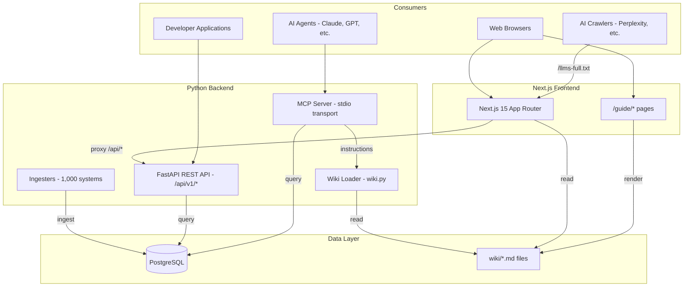
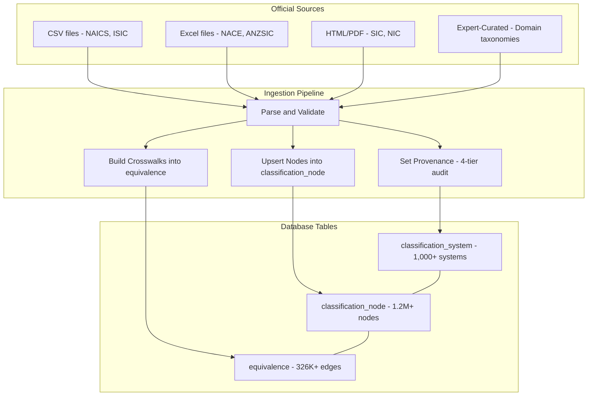
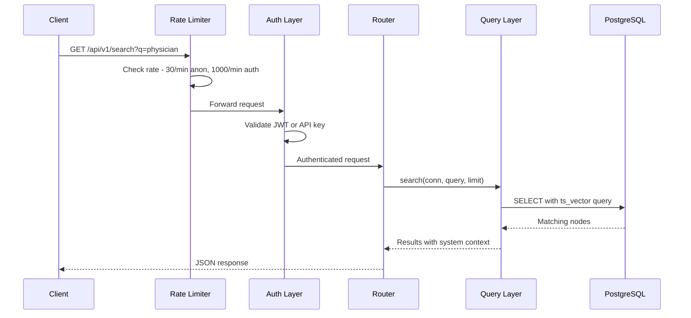
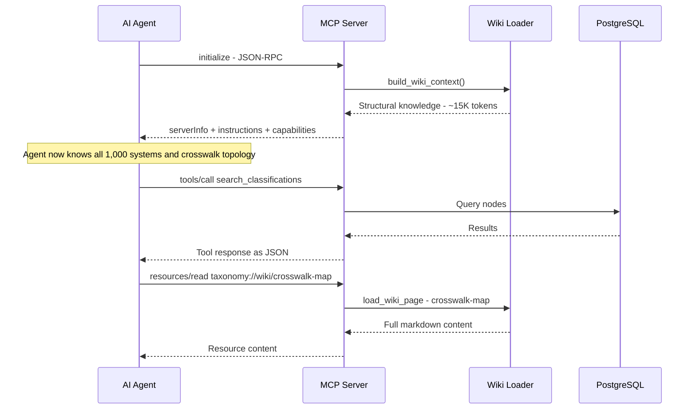

# WorldOfTaxonomy

<p align="center">
  <strong>1,000 classification systems. 1,212,000+ codes. 326,000+ crosswalk edges.</strong><br>
  The open-source Rosetta Stone for global industry, trade, occupation, health, and regulatory taxonomies.<br>
  An open-source project by <a href="https://www.colaberry.ai">Colaberry Inc</a> and <a href="https://www.colaberry.ai">Colaberry Research Labs</a>.
</p>

<p align="center">
  <a href="https://github.com/colaberry/WorldOfTaxonomy/actions/workflows/ci.yml">
    
  </a>
  <a href="https://opensource.org/licenses/MIT">
    
[](https://safeskill.dev/scan/colaberry-worldoftaxonomy)
  </a>
  
  
  
  
  
  <a href="https://github.com/sponsors/ramdhanyk">
    
  </a>
</p>

---

## The Problem

Every country, industry body, and standards organization has its own classification system. When you need to reconcile data across them, you're on your own.

A truck driver in the US is `NAICS 484`, `SOC 53-3032`, `ISCO-08 8332`, `NACE 49.4`, and `ISIC 4923` - five different codes in five different systems that all mean the same thing. Figuring that out manually costs hours. Doing it at scale costs entire teams.

**WorldOfTaxonomy solves this.** One queryable graph connects all 1,000 systems. One API call translates any code to any other system. One MCP server gives AI agents access to the entire taxonomy universe.

---

## Architecture

### System Overview

The platform serves four consumer interfaces - a web application, a REST API, an MCP server, and an AI-readable wiki - all backed by a shared PostgreSQL database.



### Ingestion Pipeline

Each of the 1,000 systems has a dedicated ingester that fetches from authoritative sources and loads into three core tables.



### API Request Flow



### MCP Session Lifecycle



### Directory Structure

```
WorldOfTaxonomy/
├── world_of_taxonomy/
│   ├── api/              # FastAPI REST API (lifespan pool, rate limiting)
│   │   ├── routers/      # systems, nodes, search, equivalences, countries, auth, crosswalk_graph
│   │   └── schemas.py    # Pydantic response models
│   ├── mcp/              # MCP server (stdio transport, 26 tools)
│   ├── ingest/           # One ingester per system (100+ files)
│   │   ├── naics.py      # Downloads from Census Bureau
│   │   ├── nace_derived.py  # EU national adaptations (copy NACE + equivalences)
│   │   ├── isic_derived.py  # LATAM/Asia/Africa adaptations
│   │   └── crosswalk_*.py   # 20+ crosswalk ingesters
│   ├── query/            # Query layer (browse, search, equivalence)
│   ├── schema.sql        # Core tables
│   └── schema_auth.sql   # Auth tables
├── frontend/             # Next.js 15 + TypeScript + Tailwind + shadcn/ui
│   └── src/app/          # Home, Explore, System, Dashboard, Crosswalk Explorer, Guide
├── wiki/                 # Curated guides (serves web, MCP, llms.txt, and API)
├── tests/                # pytest (test_wot schema isolation, never touches production)
└── data/                 # Downloaded source files (gitignored, re-downloadable)
```

**Database** (PostgreSQL):

```sql
classification_system      -- 1,000 rows: id, name, region, authority, node_count
classification_node        -- 1.2M rows: system_id, code, title, level, parent_code
equivalence                -- 326K rows: source_system, source_code, target_system, target_code, match_type (edge_kind is computed on read)
country_system_link        -- 27K rows: country_code, system_id, relevance ('official'|'regional'|'recommended')
```

---

## Quick Start

**Docker (recommended - runs in under 2 minutes):**

```bash
git clone https://github.com/colaberry/WorldOfTaxonomy.git
cd WorldOfTaxonomy
docker compose up
```

Open [http://localhost:3000](http://localhost:3000). The API is at [http://localhost:8000](http://localhost:8000).

Then ingest your first systems:

```bash
# Core global systems (~3 minutes)
docker compose exec backend python3 -m world_of_taxonomy ingest naics
docker compose exec backend python3 -m world_of_taxonomy ingest isic
docker compose exec backend python3 -m world_of_taxonomy ingest crosswalk

# Everything (~30-45 minutes)
docker compose exec backend python3 -m world_of_taxonomy ingest all
```

**Python only (bring your own PostgreSQL):**

```bash
pip install -e .
cp .env.example .env   # set DATABASE_URL and JWT_SECRET
python3 -m world_of_taxonomy init
python3 -m world_of_taxonomy ingest naics
python3 -m uvicorn world_of_taxonomy.api.app:create_app --factory --port 8000
```

---

## API in 60 Seconds

```bash
# Translate NAICS 4841 (general freight trucking) to all equivalent systems
curl "http://localhost:8000/api/v1/systems/naics_2022/nodes/4841/translations"

# Search for "hospital" across all 1,000 systems simultaneously
curl "http://localhost:8000/api/v1/search?q=hospital&grouped=true"

# Get every classification system applicable to Germany
curl "http://localhost:8000/api/v1/countries/DE"

# Find all codes in NACE with no mapping to NAICS
curl "http://localhost:8000/api/v1/diff?a=nace_rev2&b=naics_2022"

# Full text search within a specific system
curl "http://localhost:8000/api/v1/search?q=logistics&system=isco_08"
```

**Python client:**

```python
import httplib2, json

base = "http://localhost:8000/api/v1"

# Get all systems for France
r = httplib2.Http().request(f"{base}/countries/FR")
profile = json.loads(r[1])
# {'official': 'naf_rev2', 'regional': 'nace_rev2', 'recommended': ['isic_rev4', ...]}

# Translate a code
r = httplib2.Http().request(f"{base}/systems/naics_2022/nodes/5415/translations")
translations = json.loads(r[1])
# {'nace_rev2': '62.01', 'isic_rev4': '6201', 'sic_1987': '7371', ...}
```

---

## Use With Claude / AI Agents (MCP)

WorldOfTaxonomy ships with a Model Context Protocol server. Add it to Claude Desktop and your AI gets instant access to all 1,000 systems as structured tools.

**`~/Library/Application Support/Claude/claude_desktop_config.json`:**

```json
{
  "mcpServers": {
    "world-of-taxonomy": {
      "command": "python3",
      "args": ["-m", "world_of_taxonomy", "mcp"],
      "env": {
        "DATABASE_URL": "your-database-url"
      }
    }
  }
}
```

**26 tools available**, including:

| Tool | What it does |
|------|-------------|
| `translate_code` | Translate any code to a target system |
| `translate_across_all_systems` | One code -> all 1,000 systems at once |
| `search_classifications` | Full-text search across all codes |
| `get_country_taxonomy_profile` | Official + recommended systems for any country |
| `compare_sector` | Side-by-side root nodes across two systems |
| `get_system_diff` | Codes in system A with no mapping to B |
| `explore_industry_tree` | Browse hierarchy with context |
| `find_by_keyword_all_systems` | Search grouped by system |

**Example prompt to Claude:**
> "I have a dataset with NACE codes. Convert every unique code to NAICS and ISIC equivalents and flag any that have no crosswalk."

---

## What's Covered

**16 categories. 1,000 systems. Every major region.**

| Category | Systems | Highlights |
|----------|---------|-----------|
| Industry | 68 | NAICS, ISIC, NACE + 58 national adaptations (EU, LATAM, Asia, Africa) |
| Life Sciences | 108 | ICD-11, ICD-10-CM/PCS, LOINC (102K), MeSH, SNOMED, NDC, NCI Thesaurus (211K) |
| Domain Deep-Dives | 434 | Plain-language sector vocabularies for 40+ verticals, all bridged to NAICS / ISIC / NACE via sector anchors (`derived:sector_anchor:v1`) |
| Regulatory | 80+ | GDPR, FDA, SOX, HIPAA, ISO standards, EU directives, NIST frameworks |
| Occupational | 10 | SOC, ISCO-08, ESCO (14K skills), O\*NET, ANZSCO, NOC, KldB, ROME |
| Product / Trade | 11 | HS 2022, UNSPSC (77K codes), CPC, SITC, HTS, Schedule B, ECCN |
| Research & Knowledge | 8 | FORD, JEL, LCC, PACS, MSC, ACM CCS, arXiv, ANZSRC |
| Financial / Investment | 7 | GICS, ICB, CFI (ISO 10962), COFOG, COICOP, GHG Protocol, Patent CPC |
| Geographic | 7 | ISO 3166-1/2, UN M.49, EU NUTS, US FIPS, World Bank income groups |
| Education | 3 | ISCED 2011, ISCED-F 2013, CIP 2020 |

**249 countries** are profiled with their official, regional, and recommended systems.

---

## Use Cases

- **Data engineering**: Reconcile supplier data (NAICS) with EU reporting (NACE) automatically
- **Compliance**: Map your product portfolio to HS codes for any customs jurisdiction
- **HR / Recruitment**: Translate job titles between SOC (US), ESCO (EU), ISCO (global)
- **Financial research**: Bridge GICS sector codes to NAICS for cross-market analysis
- **AI / LLM**: Give your AI agent structured knowledge of every industry and occupation
- **Academic**: Study how different countries classify the same economic activity
- **Healthcare**: Cross-reference ICD-11 diagnoses against ICD-10-CM/PCS variants
- **Trade compliance**: Classify goods across HS, HTS, ECCN, and Schedule B simultaneously

---

## REST API Reference

```
GET /api/v1/systems                                List all systems
GET /api/v1/systems?country={code}                 Systems for a country
GET /api/v1/systems/{id}                           System detail
GET /api/v1/systems/{id}/nodes/{code}              A specific code
GET /api/v1/systems/{id}/nodes/{code}/children     Direct children
GET /api/v1/systems/{id}/nodes/{code}/ancestors    Parent chain to root
GET /api/v1/systems/{id}/nodes/{code}/equivalences Cross-system mappings
GET /api/v1/systems/{id}/nodes/{code}/translations All equivalences in one call
GET /api/v1/systems/{id}/nodes/{code}/siblings     Sibling codes
GET /api/v1/search?q={query}                       Full-text search
GET /api/v1/search?q={query}&grouped=true          Results grouped by system
GET /api/v1/compare?a={sys}&b={sys}                Side-by-side comparison
GET /api/v1/diff?a={sys}&b={sys}                   Codes in A with no match in B
GET /api/v1/countries/stats                        Coverage stats (world map)
GET /api/v1/countries/{code}                       Country taxonomy profile
GET /api/v1/systems/{src}/crosswalk/{tgt}/graph    Crosswalk graph for visualization
GET /api/v1/equivalences/stats?group_by=edge_kind  Counts grouped by the four edge kinds
```

Every equivalence returned by `/equivalences` and `/translations` carries an `edge_kind` field computed from the two endpoint systems: `standard_standard`, `standard_domain`, `domain_standard`, or `domain_domain`. Filter with `?edge_kind=standard_standard` (or a comma-separated list) to narrow results. Filter with `?match_type=exact` to exclude the generated sector-anchor bridges and keep only authoritative statistical concordances.

Interactive docs: `http://localhost:8000/docs` (Swagger UI, auto-generated)

**Rate limits** (default): 30 req/min unauthenticated, 1000 req/min with API key.

---

## Contributing

**We are actively seeking contributors to add classification systems.**

Every country has a national industry classification standard that should be in this graph. Most are public domain or openly licensed. Adding one takes about 2 hours following our guide.

**[Read CONTRIBUTING.md](CONTRIBUTING.md)** for the full TDD-enforced guide.

**Quick version:**

1. Pick a system from the [open issues](https://github.com/colaberry/WorldOfTaxonomy/issues?q=is%3Aissue+is%3Aopen+label%3A%22new+system%22) or [request one](https://github.com/colaberry/WorldOfTaxonomy/issues/new?template=new_system_request.md)
2. Write failing tests first (`tests/test_ingest_<system>.py`) - TDD is non-negotiable
3. Implement `world_of_taxonomy/ingest/<system>.py`
4. Wire into `__main__.py`, update `CLAUDE.md`
5. Open a PR - one system per PR

**Systems most wanted:**
- Additional national industry codes (Middle East, Sub-Saharan Africa, Central Asia)
- UNSD/Eurostat statistical classifications
- Commodity classifications (agricultural, mineral, pharmaceutical)
- US state-level occupation codes

---

## Roadmap

See [ROADMAP.md](ROADMAP.md) for the full list. Key near-term items:

- [ ] Hosted public API (no self-hosting required)
- [ ] Python client library (`pip install world-of-taxonomy-client`)
- [ ] JavaScript / TypeScript client
- [ ] Bulk export: Parquet + CSV snapshots on Hugging Face Datasets
- [ ] API key dashboard (frontend UI for managing keys)
- [ ] dbt package for warehouse-native crosswalk joins
- [ ] Weekly "new system" digest for contributors

---

## Data Sources and Licensing

Code is MIT licensed. Classification data is sourced from public domain and openly licensed sources (UN, Eurostat, US Census Bureau, WHO, ILO, etc.).

**WorldOfTaxonomy does not redistribute raw data files.** Each ingester downloads data directly from its authoritative source at ingest time. See [DATA_SOURCES.md](DATA_SOURCES.md) for per-system attribution and license information.

---

## Community

- **GitHub Issues**: Bug reports, feature requests, new system requests
- **GitHub Discussions**: Questions, ideas, show-and-tell
- **Contributing**: See [CONTRIBUTING.md](CONTRIBUTING.md)

---

<p align="center">
  Built with precision. Open forever. PRs welcome.
</p>
