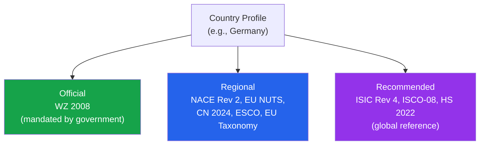
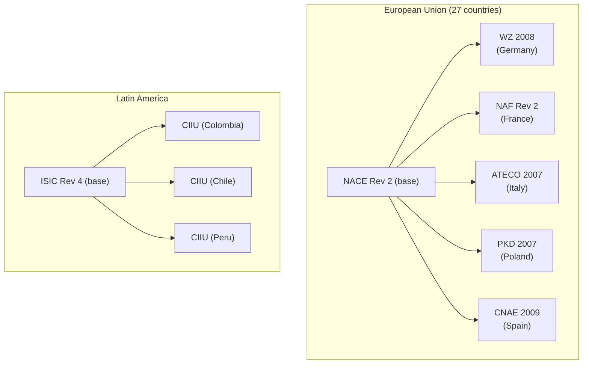

## 249 Countries, One Taxonomy Profile Each

> **TL;DR:** Expanding into a new market? Every country has a different combination of official, regional, and recommended classification systems. World Of Taxonomy profiles all 249 countries so you can see which systems apply where - before you file the wrong code.

---

## What a country profile contains



| Tier | Meaning | Example (Germany) |
|------|---------|-------------------|
| **Official** | Mandated by statistical office for regulatory filings | WZ 2008 |
| **Regional** | Shared across a regional bloc | NACE Rev 2, EU NUTS, CN 2024, ESCO |
| **Recommended** | Global reference systems for cross-country comparison | ISIC Rev 4, ISCO-08, HS 2022 |

## Using the API

### Get a country's full profile

```bash
curl "https://wot.aixcelerator.ai/api/v1/countries/DE"
```

```json
{
  "country": "DE",
  "name": "Germany",
  "official": ["wz_2008"],
  "regional": ["nace_rev2", "eu_nuts_2021", "cn_2024"],
  "recommended": ["isic_rev4", "isco_08", "hs_2022"]
}
```

### Get all systems for a country

```bash
curl "https://wot.aixcelerator.ai/api/v1/systems?country=DE"
```

### Get global coverage statistics

```bash
curl "https://wot.aixcelerator.ai/api/v1/countries/stats"
```

## Regional patterns



### European Union (27 countries)

Every EU member has a national adaptation of NACE Rev 2 - structurally identical (all 996 codes) with the national name. All share:

| Shared System | Purpose |
|--------------|---------|
| NACE Rev 2 | Industry classification |
| EU NUTS 2021 | Geographic regions |
| CN 2024 | Combined Nomenclature for trade |
| ESCO | Occupations and skills |
| EU Taxonomy | Sustainable activities |

### Latin America

Most countries use CIIU Rev 4 - the Spanish-language ISIC adaptation. Colombia, Argentina, Chile, Peru, Ecuador, Bolivia, Venezuela, Costa Rica, Guatemala, and Panama all have CIIU variants. Codes identical to ISIC; labels in Spanish.

### Sub-Saharan Africa

30+ countries adopt ISIC Rev 4 directly: Nigeria, Kenya, Ethiopia, Tanzania, Ghana, Senegal, and more. Sometimes with a national name, always the same 766 codes.

### Asia-Pacific

The most diverse region:

| Country | System | Codes |
|---------|--------|-------|
| China | GB/T 4754-2017 | 118 |
| South Korea | KSIC 2017 | 108 |
| Japan | JSIC 2013 | 20 |
| Singapore | SSIC 2020 | 21 |
| Indonesia | KBLI 2020 | 766 |
| India | NIC 2008 | 2,070 |
| Australia/NZ | ANZSIC 2006 | 825 |

### Middle East

Saudi Arabia, UAE, Oman, Qatar, Bahrain, and Kuwait all use ISIC Rev 4 adaptations.

## Use cases

| Use Case | What You Need | How the Profile Helps |
|----------|--------------|----------------------|
| **Market entry** | Which codes to register with | Official tier tells you the required system |
| **Cross-border reporting** | One internal code, translated per jurisdiction | Translation API + country profile per market |
| **Data harmonization** | Partners in different countries using different systems | Identify systems, then translate to common framework |
| **Compliance mapping** | Which regulations apply where | Regulatory systems included per jurisdiction |

> If you operate in 10 countries and need to report industry data for each, the country profiles tell you which system to use where. Combined with the translation API, you can maintain one internal code and translate to the local system for each jurisdiction.

## World map

The country dashboard includes an interactive world map showing coverage by country. Color intensity indicates the number of applicable classification systems - from a handful in small island nations to dozens in major economies.

Click any country to see its full profile and browse the applicable systems.
