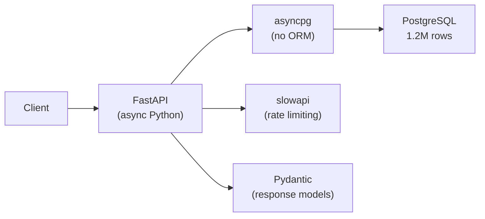
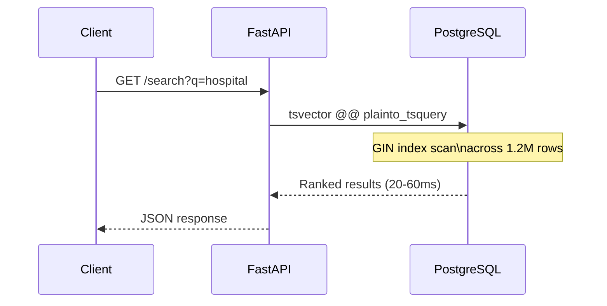
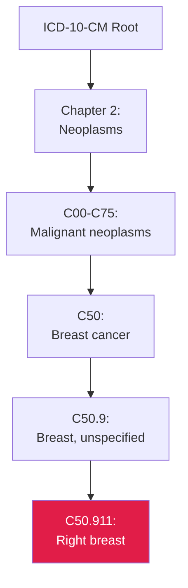

## Building a REST API for 1.2 Million Codes

> **TL;DR:** Sub-100ms responses across 1.3M+ codes with no Redis, no Elasticsearch, no caching layer. Just FastAPI + asyncpg + PostgreSQL. This post covers the technical architecture - full-text search, recursive CTEs for hierarchy traversal, bidirectional crosswalk queries, and rate limiting.

---

## The stack



| Component | Role |
|-----------|------|
| FastAPI | Async web framework |
| asyncpg | Async PostgreSQL driver (raw SQL, no ORM) |
| PostgreSQL | The entire data layer |
| slowapi | Rate limiting middleware |
| Pydantic | Request/response validation |

> No Redis. No Elasticsearch. No caching layer. The simplicity of "just PostgreSQL" keeps operational complexity low.

## Why no ORM

With 1.2M rows in `classification_node` and 321K rows in `equivalence`, query performance matters.

| ORM Overhead | Impact |
|-------------|--------|
| Object instantiation per row | Memory + CPU for large result sets |
| Query generation | May not use optimal access patterns |
| N+1 query risk | Especially dangerous with hierarchical data |

asyncpg returns rows as native Python tuples. The connection pool is managed through FastAPI's lifespan handler:

```python
@asynccontextmanager
async def lifespan(app: FastAPI):
    app.state.pool = await asyncpg.create_pool(
        DATABASE_URL, statement_cache_size=0
    )
    yield
    await app.state.pool.close()
```

> `statement_cache_size=0` is required for connection poolers like PgBouncer that multiplex connections. Without it, prepared statement IDs collide between connections.

## Full-text search



PostgreSQL's built-in `tsvector` handles full-text search without Elasticsearch:

```sql
SELECT system_id, code, title, description
FROM classification_node
WHERE to_tsvector('english', title || ' ' || coalesce(description, ''))
   @@ plainto_tsquery('english', $1)
ORDER BY ts_rank(...) DESC
LIMIT $2
```

A GIN index on the tsvector expression makes this fast:

```sql
CREATE INDEX idx_node_search ON classification_node
USING GIN (to_tsvector('english', title || ' ' || coalesce(description, '')));
```

Search across 1.2M rows returns in **20-60ms**.

## Grouped search

The `grouped=true` parameter groups results by system. This prevents large systems (ICD-10-CM with 97K+ codes) from dominating results - at most N results per system.

## Hierarchy traversal



Ancestor queries use a recursive CTE to walk from any node to the root in a single query:

```sql
WITH RECURSIVE ancestors AS (
  SELECT code, title, parent_code, 0 AS depth
  FROM classification_node
  WHERE system_id = $1 AND code = $2

  UNION ALL

  SELECT n.code, n.title, n.parent_code, a.depth + 1
  FROM classification_node n
  JOIN ancestors a ON n.code = a.parent_code AND n.system_id = $1
)
SELECT * FROM ancestors ORDER BY depth DESC;
```

Works regardless of hierarchy depth (7+ levels in ICD-10-CM).

## Translation endpoint

The crosswalk query unions both directions since edges are stored once:

```sql
SELECT target_system_id, target_code, match_type
FROM equivalence
WHERE source_system_id = $1 AND source_code = $2
UNION
SELECT source_system_id, source_code, match_type
FROM equivalence
WHERE target_system_id = $1 AND target_code = $2
```

Indexed on `(source_system_id, source_code)` and `(target_system_id, target_code)`.

## Rate limiting

| Tier | Limit | Keyed By |
|------|-------|----------|
| Anonymous | 30 req/min | IP address |
| Authenticated | 1,000 req/min | API key |

API keys are sent in `X-API-Key` header and validated against bcrypt hashes stored in the `api_key` table.

## API endpoints at a glance

| Endpoint | What It Does | Typical Latency |
|----------|-------------|----------------|
| `GET /search?q=` | Full-text search across all systems | 20-60ms |
| `GET /systems/{id}/nodes/{code}` | Node detail with metadata | <10ms |
| `GET .../children` | Direct children in hierarchy | <10ms |
| `GET .../ancestors` | Recursive parent chain to root | 10-30ms |
| `GET .../translations` | All crosswalk equivalences | 10-20ms |
| `GET .../equivalences` | Detailed match types | 10-20ms |
| `GET /diff?a=&b=` | Gap analysis between systems | 50-200ms |

## What we would do differently

| Change | Why |
|--------|-----|
| **Materialized views for crosswalk stats** | Dashboard query scans full equivalence table |
| **Connection pooling from the start** | Hit `statement_cache_size` issues only in production |
| **Batch endpoints earlier** | Current API optimized for single-code lookups |

These are on the roadmap. The current architecture handles production load comfortably.
