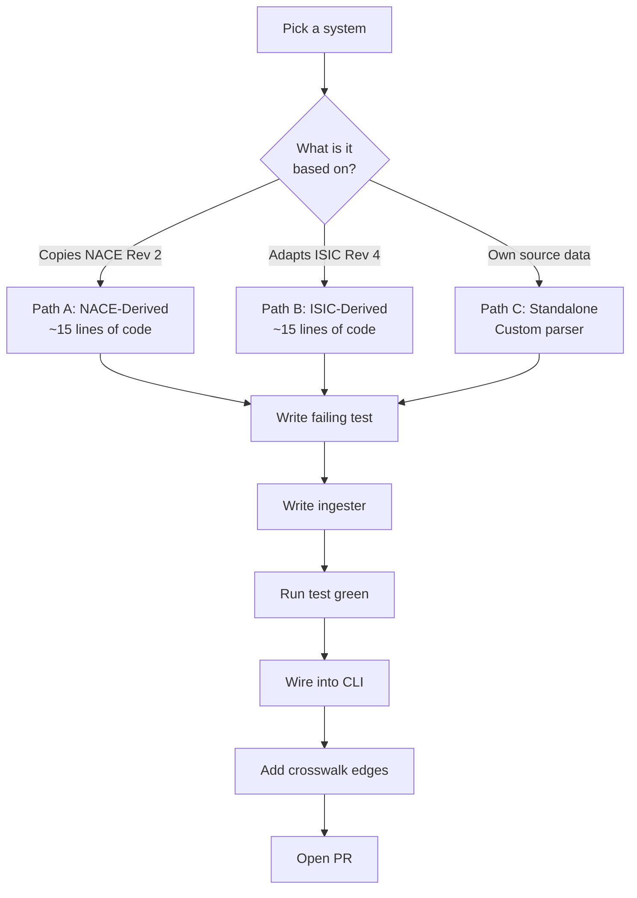
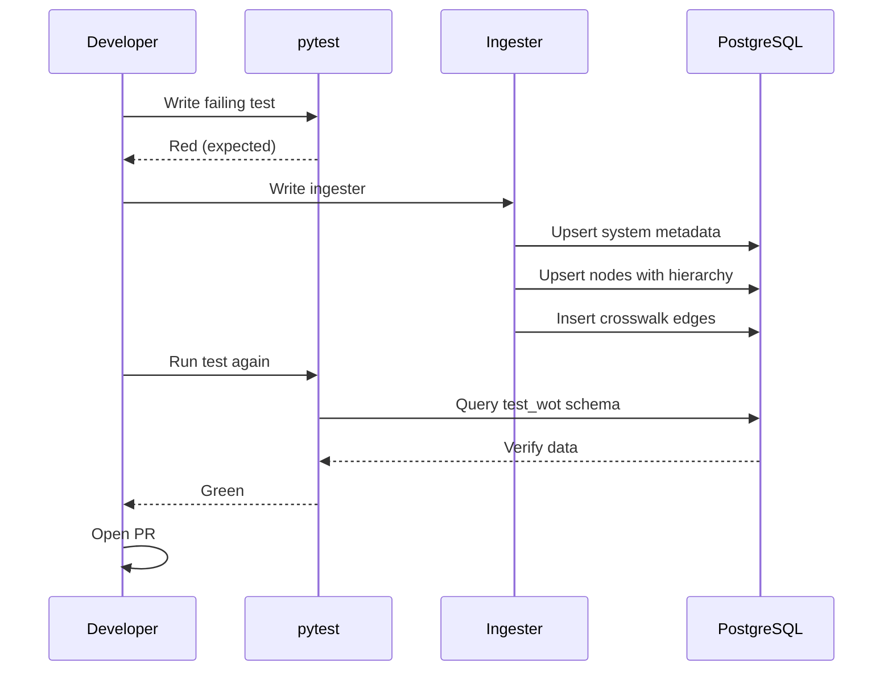

## Contributing a New Classification System

> **TL;DR:** Adding a classification system to World Of Taxonomy takes about 2 hours. Three paths (NACE-derived, ISIC-derived, or standalone), strict TDD, and idempotent ingestion. This guide walks through every step.

---

## Three paths to contribution



| Path | When to Use | Effort | Examples |
|------|-------------|--------|---------|
| **A: NACE-Derived** | System copies all NACE Rev 2 codes | ~15 lines | WZ 2008, ATECO 2007, NAF Rev 2, PKD 2007 |
| **B: ISIC-Derived** | National adaptation of ISIC Rev 4 | ~15 lines | CIIU (Colombia), VSIC (Vietnam), BSIC (Bangladesh) |
| **C: Standalone** | Own source file (CSV, XLSX, JSON, XML) | Custom parser | NAICS, LOINC, ICD-10-CM, HS |

## Before you start

1. Check [open issues](https://github.com/colaberry/WorldOfTaxonomy/issues?q=is%3Aissue+is%3Aopen+label%3A%22new+system%22) for systems already requested
2. Find the **official source** - government statistical office, standards body, or international organization
3. Never use third-party copies (not GitHub mirrors, not Kaggle, not Wikipedia)

## Step by step

### 1. Write the failing test first

> TDD is non-negotiable. A test that was never red proves nothing.

Create `tests/test_ingest_my_system.py`:

```python
import pytest

@pytest.mark.asyncio
async def test_ingest_my_system(test_conn):
    from world_of_taxonomy.ingest.my_system import ingest
    await ingest(test_conn)

    # Verify system registered
    row = await test_conn.fetchrow(
        "SELECT * FROM test_wot.classification_system WHERE id = 'my_system_2024'"
    )
    assert row is not None
    assert row['name'] == 'My Classification System 2024'

    # Verify nodes created
    count = await test_conn.fetchval(
        "SELECT count(*) FROM test_wot.classification_node WHERE system_id = 'my_system_2024'"
    )
    assert count > 0

    # Verify hierarchy integrity (no orphan nodes)
    orphans = await test_conn.fetchval("""
        SELECT count(*) FROM test_wot.classification_node n
        WHERE n.system_id = 'my_system_2024'
          AND n.parent_code IS NOT NULL
          AND NOT EXISTS (
            SELECT 1 FROM test_wot.classification_node p
            WHERE p.system_id = n.system_id AND p.code = n.parent_code
          )
    """)
    assert orphans == 0, f"Found {orphans} orphan nodes"
```

Run it. Confirm it fails. Then write the implementation.

### 2. Create the ingester

```python
SYSTEM = {
    "id": "my_system_2024",
    "name": "My Classification System 2024",
    "authority": "Issuing Body",
    "region": "Global",
    "version": "2024",
    "description": "What this system classifies",
}

NODES = [
    ("A", "Section A", "Description", None),
    ("A01", "Subsection A01", "Description", "A"),
]

async def ingest(conn) -> None:
    # Upsert system
    await conn.execute("""
        INSERT INTO classification_system (id, name, authority, region, version, description)
        VALUES ($1, $2, $3, $4, $5, $6)
        ON CONFLICT (id) DO UPDATE SET
            name = EXCLUDED.name, authority = EXCLUDED.authority,
            region = EXCLUDED.region, version = EXCLUDED.version,
            description = EXCLUDED.description
    """, SYSTEM["id"], SYSTEM["name"], SYSTEM["authority"],
         SYSTEM["region"], SYSTEM["version"], SYSTEM["description"])

    # Compute leaf flags dynamically
    codes_with_children = {parent for (_, _, _, parent) in NODES if parent}

    for code, title, desc, parent in NODES:
        is_leaf = code not in codes_with_children
        await conn.execute("""
            INSERT INTO classification_node (system_id, code, title, description, parent_code, is_leaf)
            VALUES ($1, $2, $3, $4, $5, $6)
            ON CONFLICT (system_id, code) DO UPDATE SET
                title = EXCLUDED.title, description = EXCLUDED.description,
                parent_code = EXCLUDED.parent_code, is_leaf = EXCLUDED.is_leaf
        """, SYSTEM["id"], code, title, desc, parent, is_leaf)
```

### 3. Run the test green

```bash
python3 -m pytest tests/test_ingest_my_system.py -v
```

### 4. Wire into the CLI

Add your system to `world_of_taxonomy/__main__.py`.

### 5. Add crosswalk edges

```python
CROSSWALKS = [
    ("A01", "isic_rev4", "011", "exact"),
    ("A02", "isic_rev4", "012", "broad"),
]

for source_code, target_system, target_code, match_type in CROSSWALKS:
    await conn.execute("""
        INSERT INTO equivalence (source_system_id, source_code, target_system_id, target_code, match_type)
        VALUES ($1, $2, $3, $4, $5)
        ON CONFLICT DO NOTHING
    """, SYSTEM["id"], source_code, target_system, target_code, match_type)
```

### 6. Update CLAUDE.md and open a PR

One system per PR. Include: test file, ingester, CLI wiring, CLAUDE.md update.

## The ingestion flow



## Key rules

| Rule | Why |
|------|-----|
| **Never hard-code leaf flags** | Compute from hierarchy - parent relationships change |
| **Never skip the red step** | A test that was never red proves nothing |
| **Use test_wot schema** | Production data is never touched |
| **Download from authoritative sources** | Provenance and accuracy matter |
| **Idempotent ingestion** | `ON CONFLICT ... DO UPDATE` makes re-runs safe |
| **No em-dashes** | CI enforces this project-wide |

## Systems most wanted

- National industry codes from the Middle East, Sub-Saharan Africa, and Central Asia
- UNSD and Eurostat statistical classifications
- Commodity classifications (agricultural, mineral, pharmaceutical)
- US state-level occupation codes
- Professional licensing classifications

Check the [GitHub issues](https://github.com/colaberry/WorldOfTaxonomy/issues) for the current list. Pick one. Write the test. Ship the PR.
