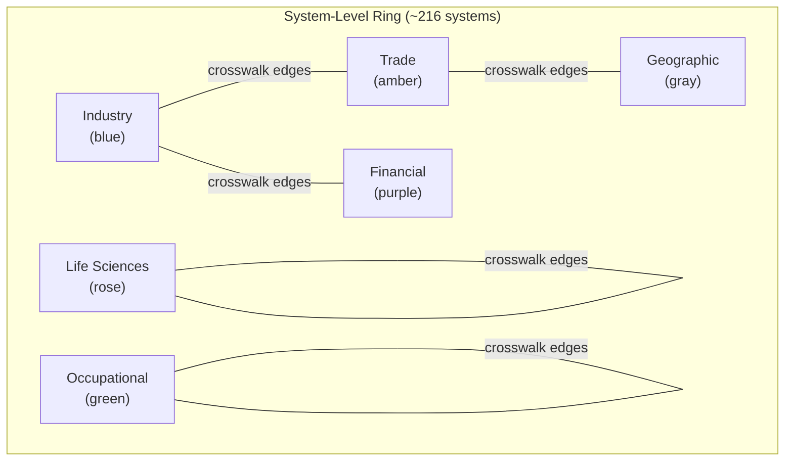
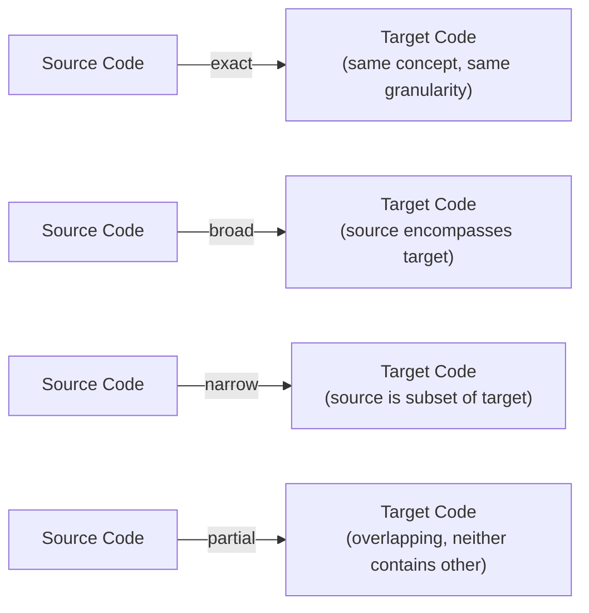
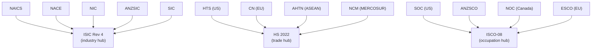

## The Crosswalk Graph: Visualizing How Systems Connect

> **TL;DR:** 321,000 crosswalk edges connecting 1,000+ systems are hard to comprehend as numbers. The Crosswalk Explorer renders them as an interactive graph - systems on a ring, edges showing connections, click to drill into code-level mappings. Built with Cytoscape.js.

---

## What you see

Every system with at least one crosswalk edge appears on the ring, grouped by category and color-coded:

| Color | Category | Example Systems |
|-------|----------|----------------|
| Blue | Industry | NAICS, ISIC, NACE, SIC, ANZSIC |
| Rose | Life Sciences | ICD-10-CM, LOINC, NCI Thesaurus, ATC |
| Amber | Trade / Product | HS, UNSPSC, CPC, SITC |
| Green | Occupational | SOC, ISCO, ESCO, O*NET |
| Purple | Financial | GICS, ICB, COFOG |
| Gray | Geographic | ISO 3166, UN M.49, EU NUTS |

## What the edges mean

| Match Type | Meaning | Example |
|------------|---------|---------|
| `exact` | 1:1 correspondence | WZ 2008 01.11 = NACE Rev 2 01.11 |
| `broad` | Source is broader than target | ISIC division -> multiple NAICS groups |
| `narrow` | Source is narrower than target | Detailed NAICS -> broad ISIC |
| `partial` | Overlapping, neither contains other | Different structural cuts of same activity |

## The hub-and-spoke pattern

The visualization reveals three clear hubs:

> Even systems with no direct crosswalk can be translated indirectly by hopping through a hub. The graph makes these multi-hop paths visible.

## Code-level view

Click an edge between two systems and the visualization switches to code-level mode:

| Feature | What You See |
|---------|-------------|
| Individual codes as nodes | Each code in system A and system B |
| Equivalence edges | Specific mappings between codes |
| Match type coloring | Exact, broad, narrow, partial edges |
| One-to-many relationships | Where one code maps to multiple targets |
| Gaps | Codes with no mapping on the other side |

## Built with Cytoscape.js

| Feature | Why Cytoscape.js |
|---------|-----------------|
| **Preset layout** | Systems positioned on a ring by category - no physics simulation needed |
| **Interaction model** | Built-in zoom, pan, hover, selection |
| **Performance** | 200+ nodes and thousands of edges, smooth |
| **Styling** | CSS-like selectors for dynamic highlighting on hover |

The system-level ring uses preset layout with positions calculated by category grouping and angular spacing. The code-level view uses COSE (Compound Spring Embedder) for force-directed placement.

## Try it

1. Find your industry's classification system on the ring
2. See which other systems it connects to
3. Click an edge to see code-level mappings
4. Search for a specific system to highlight it

Works in both light and dark mode. Also embedded as a preview on the home page.
