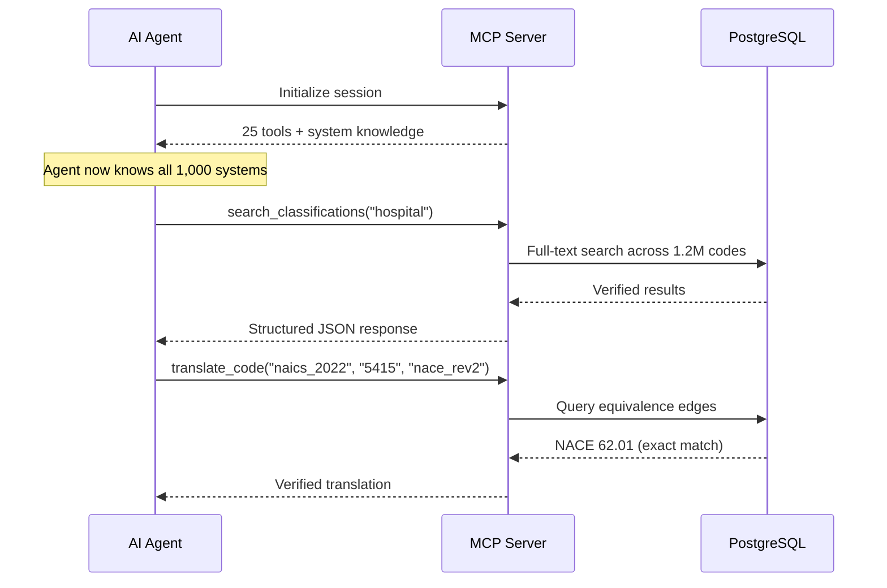

## Give Your AI Agent Access to Every Taxonomy

> **TL;DR:** The WorldOfTaxonomy MCP server gives AI agents structured tool access to 1,000+ classification systems. 25 tools. Works with Claude, Cursor, VS Code, Windsurf, and any MCP client. Setup takes under 5 minutes.

---

## The problem with LLMs and codes

Ask an LLM to translate NAICS 4841 to NACE and it will try. Sometimes it gets close. Often it hallucinates a plausible-looking code that does not exist.

LLMs lack three things for classification work:

1. **Verified data** - they guess from training data, not from authoritative sources
2. **Graph structure** - they cannot traverse hierarchies or follow crosswalk edges
3. **Completeness** - they know major systems but miss domain taxonomies and national adaptations

The fix is not better prompting. It is giving the AI structured tool access to the actual database.

## How MCP works



Instead of guessing, the AI calls tools. The tools query the database. The AI gets verified, structured data.

## Setup

### Claude Desktop

```json
{
  "mcpServers": {
    "world-of-taxonomy": {
      "command": "python3",
      "args": ["-m", "world_of_taxonomy", "mcp"],
      "env": { "DATABASE_URL": "your-database-url" }
    }
  }
}
```

### Cursor / VS Code

Add to your MCP settings (`.cursor/mcp.json` or VS Code MCP config):

```json
{
  "world-of-taxonomy": {
    "command": "python3",
    "args": ["-m", "world_of_taxonomy", "mcp"],
    "env": { "DATABASE_URL": "your-database-url" }
  }
}
```

### Claude Code

```bash
claude mcp add world-of-taxonomy python3 -m world_of_taxonomy mcp
```

## The 25 tools

| Category | Tools | What they do |
|----------|-------|-------------|
| **Search** | `search_classifications`, `find_by_keyword_all_systems` | Full-text search across all systems |
| **Translate** | `translate_code`, `translate_across_all_systems` | Code-to-code translation |
| **Navigate** | `browse_system`, `explore_industry_tree`, `get_children`, `get_ancestors`, `get_siblings` | Hierarchy traversal |
| **Detail** | `get_node_detail`, `get_system_detail`, `list_all_systems` | Metadata and context |
| **Compare** | `compare_sector`, `get_system_diff`, `get_crosswalk_stats`, `get_equivalences` | Cross-system analysis |
| **Country** | `get_country_taxonomy_profile`, `get_country_systems`, `get_world_coverage_stats` | Geographic context |
| **Knowledge** | `read_wiki_page`, `list_wiki_pages` | Curated guide content |

## Example prompts

**Classify a business:**

> "I have a company that manufactures electric vehicle batteries in Germany. What industry codes apply?"

The AI calls `search_classifications`, then `get_country_taxonomy_profile` for Germany, then `translate_code` - returning verified WZ 2008, NACE, and ISIC codes.

**Cross-border job mapping:**

> "Our US job posting uses SOC 15-1252. What is the EU equivalent?"

The AI calls `translate_across_all_systems` and returns ESCO, ISCO-08, and other mapped systems with match types.

**Gap analysis:**

> "Which of our NAICS codes have no NACE equivalent?"

The AI calls `get_system_diff` and returns the exact gap list.

## Why MCP instead of RAG

| Approach | Strengths | Weaknesses |
|----------|-----------|------------|
| **RAG** | Good for fuzzy semantic search | Approximate matches, no graph traversal |
| **MCP** | Exact lookups, hierarchy navigation, crosswalk edges | Requires structured queries |

Classification codes are not fuzzy semantic content. They are structured hierarchical data with precise relationships. RAG returns approximate matches. MCP returns exact matches from a relational database.

The MCP server also enables operations that vector search cannot perform: hierarchy traversal, multi-hop translation, gap analysis, and system comparison.
