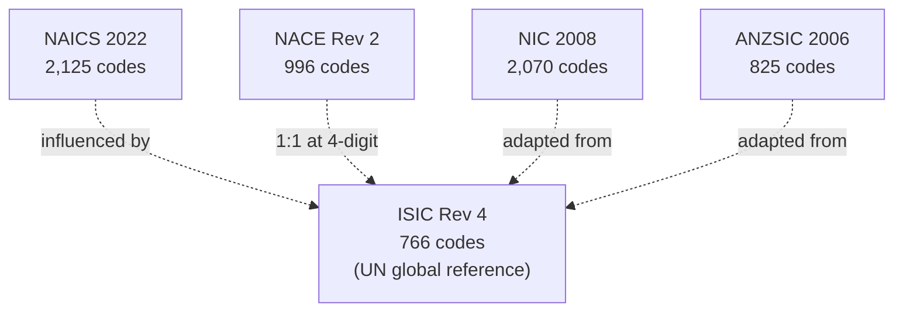
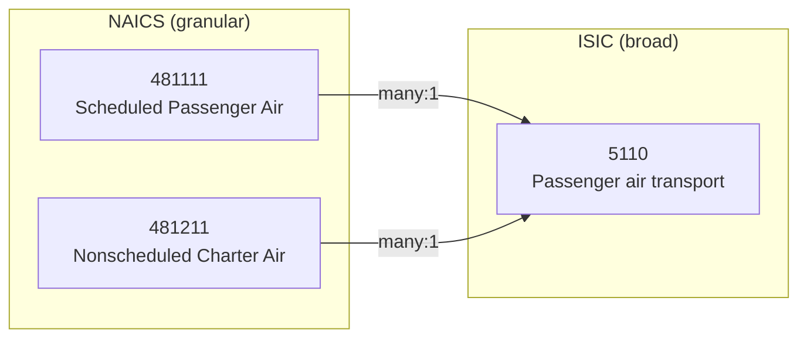
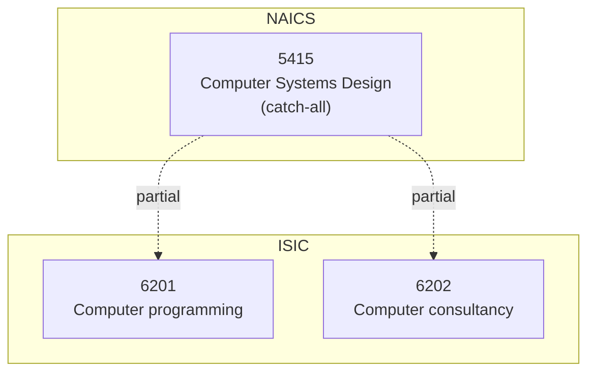

## From NAICS to NIC: How National Industry Codes Diverge

> **TL;DR:** Five major economies, five industry classification systems, same economic activities - but different structures, different granularity, different philosophical choices. This post shows where they align, where they diverge, and why that matters for cross-border data.

---

## The five systems



| System | Country/Region | Codes | Structure |
|--------|---------------|-------|-----------|
| NAICS 2022 | US, Canada, Mexico | 2,125 | 2-6 digit numeric |
| ISIC Rev 4 | Global (UN) | 766 | Letter + 2-4 digit |
| NACE Rev 2 | European Union | 996 | Letter + 2-4 digit |
| NIC 2008 | India | 2,070 | 2-5 digit numeric |
| ANZSIC 2006 | Australia, NZ | 825 | Letter + 3-4 digit |

All five share the same conceptual DNA - influenced by ISIC. But each was adapted to reflect the economic structure of its region.

## Where they agree

At the broadest level, all five recognize the same major sectors:

| Sector | NAICS | ISIC | NACE | NIC | ANZSIC |
|--------|-------|------|------|-----|--------|
| Agriculture | 11 | A | A | 01-03 | A |
| Mining | 21 | B | B | 05-09 | B |
| Manufacturing | 31-33 | C | C | 10-33 | C |
| Construction | 23 | F | F | 41-43 | E |
| Retail trade | 44-45 | G | G | 45-47 | G |
| Transportation | 48-49 | H | H | 49-53 | I |
| Finance | 52 | K | K | 64-66 | K |
| Healthcare | 62 | Q | Q | 86-88 | Q |

## Where they diverge

### Granularity



| System | Total Codes | Granularity Ratio vs ISIC |
|--------|-------------|--------------------------|
| NAICS 2022 | 2,125 | 2.8x more granular |
| NIC 2008 | 2,070 | 2.7x more granular |
| NACE Rev 2 | 996 | 1.3x more granular |
| ANZSIC 2006 | 825 | 1.1x more granular |
| ISIC Rev 4 | 766 | Baseline |

> Translating from NAICS to ISIC is inherently lossy - multiple NAICS codes collapse into one ISIC code. Going the other direction, one ISIC code expands into multiple NAICS codes, and you cannot determine which one without additional context.

### Structural differences

| Difference | What Happens | Systems Affected |
|-----------|-------------|-----------------|
| **Information sector** | NAICS has dedicated sector 51. ISIC/NACE split across multiple sections. | NAICS vs ISIC/NACE |
| **Real estate** | NAICS separates Real Estate (531) from Rental (532). ISIC combines them differently. | All five |
| **Government** | NIC gives detailed attention to public administration, reflecting India's large public sector. | NIC vs others |
| **Technology** | Software, cloud, AI classified differently everywhere. No system captures SaaS well. | All five |

### The technology problem



All five systems struggle with technology. Software development, cloud services, AI, and digital platforms are classified differently because these industries did not exist when most frameworks were designed.

> This is one reason World Of Taxonomy includes 400+ domain-specific taxonomy systems - they fill the gaps where the major systems lack granularity.

## The crosswalk challenge

A simple code-to-code lookup is not enough. You need to know:

| Question | Endpoint |
|----------|----------|
| Is the mapping 1:1, 1:many, or many:many? | `/equivalences` |
| What is the match type (exact, broad, narrow, partial)? | `/equivalences` |
| Does the mapping hold at leaf level or only aggregate? | `/ancestors` + `/equivalences` |
| Which codes have no mapping at all? | `/diff` |

## Practical implications

| Audience | Recommendation |
|----------|---------------|
| **Data engineers** | Use `/diff` to find gaps. Use `/equivalences` for match quality. Do not assume 1:1 mappings. |
| **Compliance teams** | Use country profile to find required system. Flag partial and broad matches for manual review. |
| **Analysts** | Aggregate to ISIC level for cross-country comparisons, even if it means losing detail. |
| **System designers** | Study divergence patterns. NAICS, ISIC, and NACE reflect different priorities: statistical precision vs international comparability vs regional relevance. |

## Exploring the differences

```bash
# Compare NAICS and ISIC at root level
curl "https://wot.aixcelerator.ai/api/v1/compare?a=naics_2022&b=isic_rev4"

# Find NAICS codes with no ISIC equivalent
curl "https://wot.aixcelerator.ai/api/v1/diff?a=naics_2022&b=isic_rev4"
```

Or use the crosswalk explorer visualization to see the connection density between any two systems in the graph.
