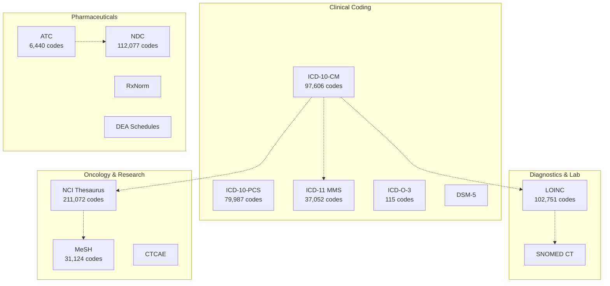
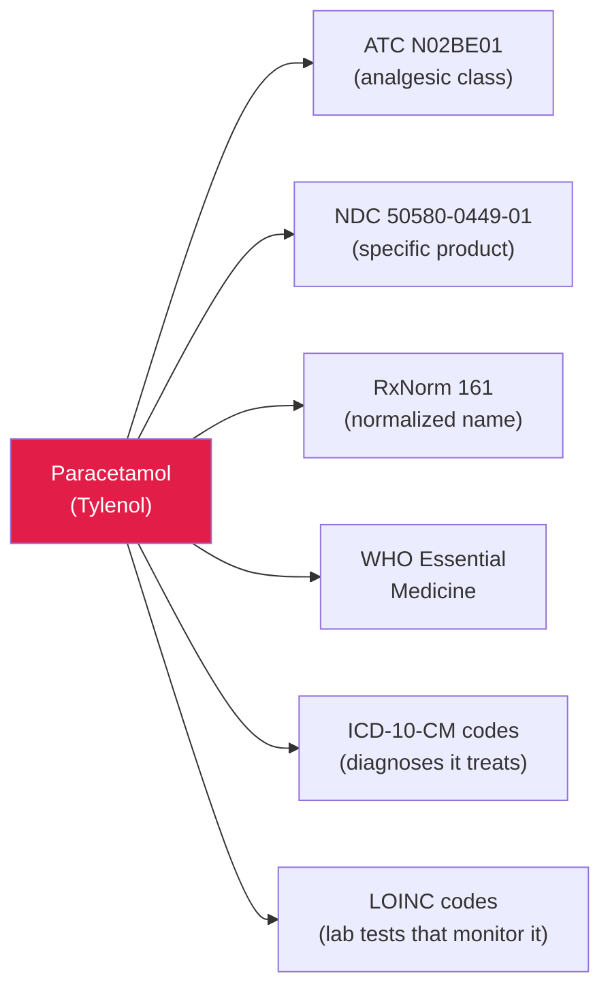
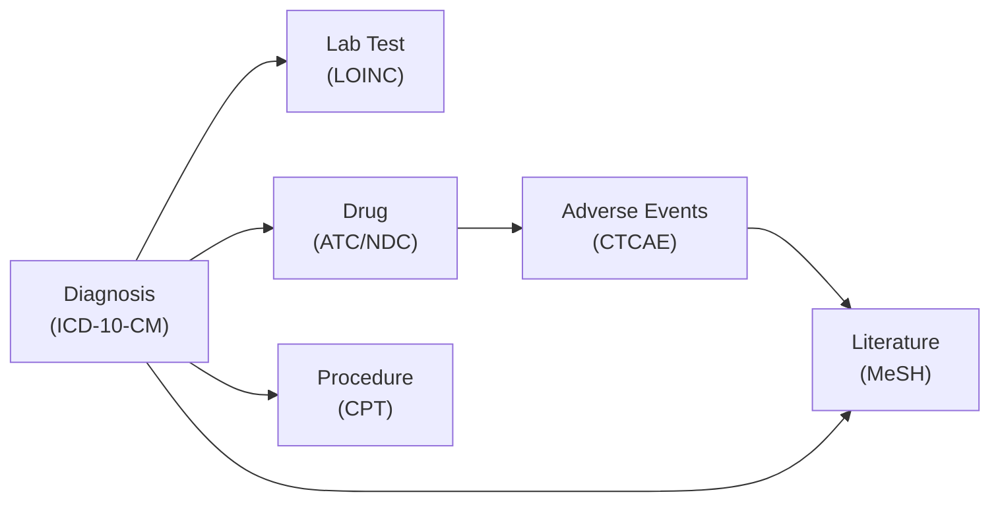
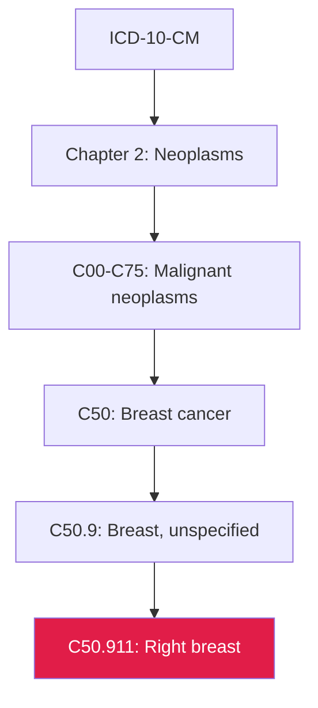

## Life Sciences Classification: Navigating Pharma, Clinical, and Biotech Taxonomies

> **TL;DR:** Life sciences is the most classification-intensive industry in the world. A single drug touches ATC, NDC, ICD, LOINC, NCI Thesaurus, and FDA regulatory codes before it reaches a patient. WorldOfTaxonomy connects 50+ life sciences systems so clinical, pharmaceutical, and research teams can search and translate across all of them.

---

## The classification landscape



## One drug, six systems

> A single medication can carry codes from six different systems simultaneously. Translating between them is essential for formulary management, drug interaction checking, and regulatory reporting.



## Clinical coding systems

| System | Codes | Classifies |
|--------|-------|-----------|
| ICD-10-CM | 97,606 | Diagnoses (US clinical) |
| ICD-10-PCS | 79,987 | Inpatient procedures (US) |
| ICD-11 MMS | 37,052 | Diagnoses (WHO global, latest) |
| ICD-O-3 | 115 | Oncology morphology and topography |
| ICF | 34 | Functioning, disability, and health |
| DSM-5 | skeleton | Mental health diagnoses |
| ICPC-2 | 18 | Primary care encounters |

Every patient encounter, every claim, every quality metric starts with a diagnosis code.

## Pharmaceutical systems

| System | Codes | Classifies |
|--------|-------|-----------|
| ATC WHO 2021 | 6,440 | Drugs by therapeutic class |
| NDC | 112,077 | Drug products by manufacturer and package |
| RxNorm | skeleton | Normalized drug names |
| DEA Schedules | 25 | Controlled substance classification |
| WHO Essential Medicines | 27 | Priority drug list |
| EDQM Dosage Forms | 17 | Standard dosage form terms (EU) |

## Diagnostics and lab

| System | Codes | Classifies |
|--------|-------|-----------|
| LOINC | 102,751 | Lab tests and clinical observations |
| SNOMED CT | skeleton | Clinical terminology (concepts, relationships) |

> LOINC covers everything from basic blood panels to specialized genetic assays. Every lab result that flows through an EHR system should have a LOINC code.

## Oncology and research

| System | Codes | Classifies |
|--------|-------|-----------|
| NCI Thesaurus | 211,072 | Cancer research ontology |
| MeSH | 31,124 | Medical literature indexing (PubMed) |
| CTCAE | 27 | Adverse event grading in clinical trials |
| GBD Cause List | 23 | Global Burden of Disease causes |

NCI Thesaurus is the **largest single system** in WorldOfTaxonomy at 211,072 codes - the reference ontology for cancer research, clinical trials, and FDA/EMA regulatory submissions.

## Medical devices

| System | Codes | Classifies |
|--------|-------|-----------|
| GMDN | 17 | Global Medical Device Nomenclature |
| MDR (EU) | 22 | EU Medical Device Regulation categories |
| IVDR (EU) | 17 | EU In Vitro Diagnostics Regulation |
| FDA 21 CFR | 24 | US device regulation categories |

## Procedures and billing

| System | Codes | Classifies |
|--------|-------|-----------|
| CPT | skeleton | Outpatient procedures (AMA) |
| HCPCS Level II | 59 | Non-physician services and supplies |
| MS-DRG | 50 | Medicare inpatient payment groups |
| G-DRG | 26 | German inpatient payment groups |
| NUCC HCPT | 94 | Healthcare provider taxonomy |

## The connection problem

> The fragmentation is not just inconvenient - it is dangerous. If connections between diagnosis, lab, drug, and procedure codes are broken or outdated, clinical decision support systems fail.



A clinical decision support system needs diagnosis -> lab test -> drug -> procedure connections. A pharmacovigilance team needs drug -> adverse event -> diagnosis -> literature connections. Each system is maintained by a different organization with a different update cycle.

## Health regulation systems

| System | What It Covers |
|--------|---------------|
| HIPAA | Patient data privacy (US) |
| FDA 21 CFR | Drug and device regulation (US) |
| MDR / IVDR | Medical devices and diagnostics (EU) |
| CLIA | Clinical laboratory standards (US) |
| Joint Commission | Hospital accreditation |
| CAP | Pathology lab accreditation |
| HITRUST | Health information security |

Regulatory frameworks are classification systems too. HIPAA provisions map to data handling requirements. FDA 21 CFR parts map to product categories. They are in the graph because compliance teams need to cross-reference regulations with the clinical and pharmaceutical systems they govern.

## Using the API for life sciences

### Search across all clinical systems

```bash
curl "https://wot.aixcelerator.ai/api/v1/search?q=breast+cancer&grouped=true"
```

Returns codes from ICD-10-CM, ICD-11, NCI Thesaurus, MeSH, ICD-O-3, and domain systems.

### Translate between coding systems

```bash
curl "https://wot.aixcelerator.ai/api/v1/systems/icd10cm/nodes/C50/translations"
```

### Navigate deep hierarchies

```bash
curl "https://wot.aixcelerator.ai/api/v1/systems/icd10cm/nodes/C50.911/ancestors"
```



### Find coverage gaps

```bash
curl "https://wot.aixcelerator.ai/api/v1/diff?a=icd10cm&b=icd11_mms"
```

## For AI in healthcare

> Instead of the AI guessing that "metformin" is "probably A10BA02" in ATC, it calls a tool, gets the verified code, and can navigate the hierarchy to find related drugs, check NDC codes, and cross-reference with ICD diagnosis codes.

The MCP server gives AI agents structured access to all life sciences systems. Clinical decision support, coding assistance, drug interaction checking, research tools - all backed by verified data from authoritative sources rather than LLM hallucination.

The life sciences classification landscape is complex. WorldOfTaxonomy does not simplify it - it connects it.
