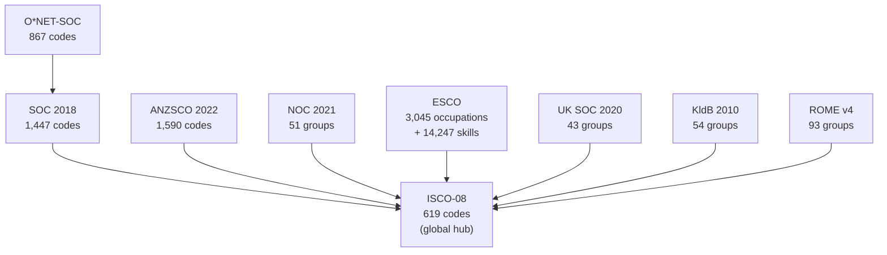
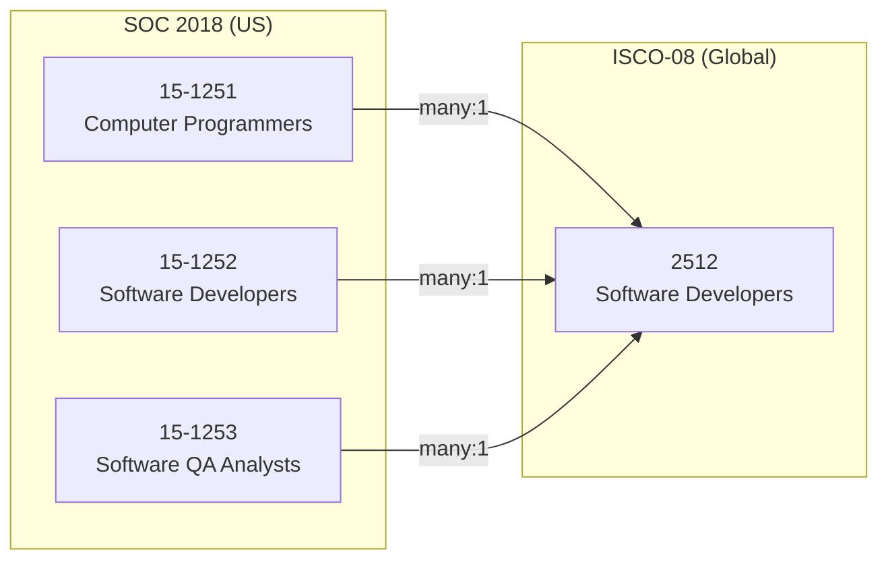
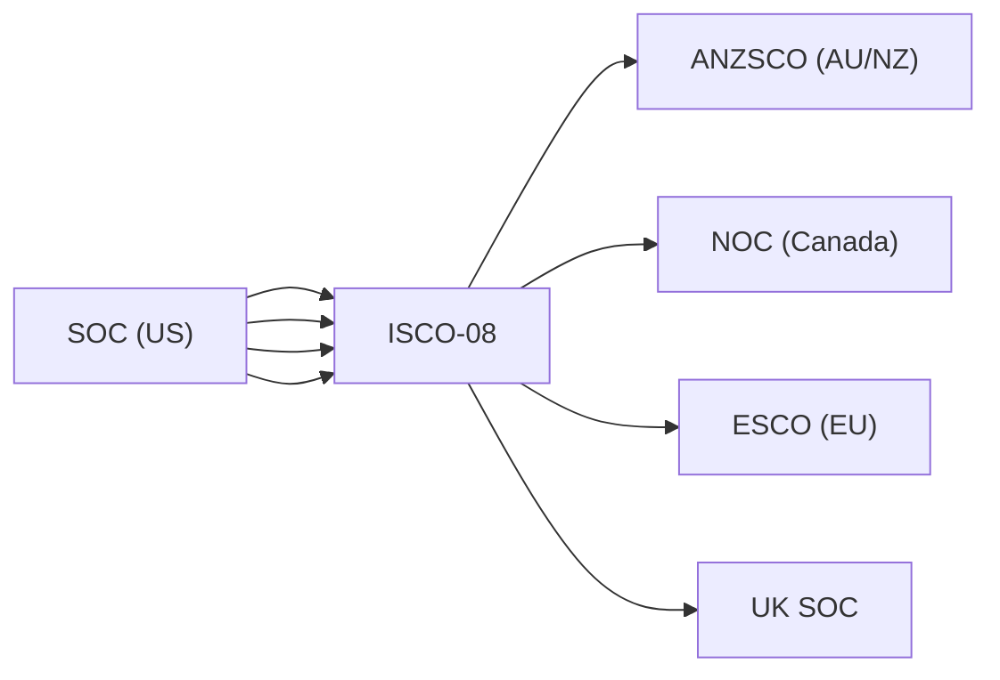

## Mapping Occupations Across Borders

> **TL;DR:** A "Software Developer" has five different codes in five countries: SOC 15-1252 (US), ESCO 2511.2 (EU), ISCO-08 2512 (global), ANZSCO 261312 (Australia), NOC 21232 (Canada). World Of Taxonomy connects 9 occupation systems with crosswalk edges so you can translate, compare, and analyze jobs across borders.

---

## The major occupation systems



| System | Region | Codes | Granularity |
|--------|--------|-------|-------------|
| SOC 2018 | United States | 1,447 | 6-digit (867 detailed occupations) |
| ISCO-08 | Global (ILO) | 619 | 4-digit (unit groups) |
| ESCO | Europe (EU Commission) | 3,045 + 14,247 skills | Highly granular with skill mappings |
| O*NET-SOC | United States (DOL) | 867 | SOC-based with detailed work profiles |
| ANZSCO 2022 | Australia/NZ | 1,590 | 6-digit with unit groups |
| NOC 2021 | Canada | 51 broad groups | 5-digit TEER-based structure |
| KldB 2010 | Germany | 54 groups | 5-digit with competence levels |
| ROME v4 | France | 93 groups | Job/skill domain structure |
| UK SOC 2020 | United Kingdom | 43 groups | 4-digit with sub-major groups |

## Where the differences bite



| Challenge | Example |
|-----------|---------|
| **Granularity mismatch** | SOC has 1,447 codes; ISCO has 619. Multiple SOC codes collapse into one ISCO unit group. |
| **Conceptual differences** | Canada's NOC uses TEER (Training, Education, Experience, Responsibilities). Germany's KldB embeds competence levels in the code. Neither exists in SOC or ISCO. |
| **Skill vs. occupation** | ESCO maps 14,247 skills to occupations. No other system does this at scale. |

## Translate a US job code internationally

```bash
curl "https://wot.aixcelerator.ai/api/v1/systems/soc_2018/nodes/15-1252/translations"
```

Returns ISCO-08, ESCO, O*NET-SOC, and other equivalent codes with match types.

## Search across all systems

```bash
curl "https://wot.aixcelerator.ai/api/v1/search?q=software+developer&grouped=true"
```

Returns matching codes from SOC, ISCO, ESCO, ANZSCO, NOC, KldB, ROME, and UK SOC in a single response.

## Find gaps between systems

```bash
curl "https://wot.aixcelerator.ai/api/v1/diff?a=soc_2018&b=isco_08"
```

Returns SOC codes with no ISCO equivalent - the gap analysis needed for international expansion.

## Practical use cases

| Use Case | Who | Systems Involved |
|----------|-----|-----------------|
| **Global job posting** | HR platforms | SOC, ESCO, ANZSCO for regulatory tagging |
| **Labor market analytics** | Economists | SOC-to-ISCO, ANZSCO-to-ISCO crosswalks |
| **Skills gap analysis** | Workforce planners | SOC -> ESCO -> 14,247 skills |
| **Immigration processing** | HR, attorneys | H-1B uses SOC; EU Blue Card uses ISCO |
| **Cross-border recruiting** | Agencies | Translate job requirements across systems |

## The ISCO hub

> Like ISIC for industry codes, ISCO-08 serves as the hub for occupation crosswalks. Most national systems have an official or semi-official concordance to ISCO.

Translation between national systems routes through ISCO:



## O*NET dimensions

O*NET goes beyond occupation titles. World Of Taxonomy includes each dimension as a separate system:

| O*NET System | What It Captures |
|-------------|-----------------|
| Knowledge Areas | What knowledge the job requires |
| Abilities | Cognitive, psychomotor, physical, sensory |
| Work Activities | Generalized and detailed work activities |
| Work Context | Environmental and interpersonal conditions |
| Interests (RIASEC) | Holland occupational interest profiles |
| Work Values | Conditions that foster job satisfaction |
| Work Styles | Personal characteristics for performance |

Each dimension has crosswalk edges to O*NET-SOC codes. Search for occupations by required ability, work context, or interest profile - not just by title.
