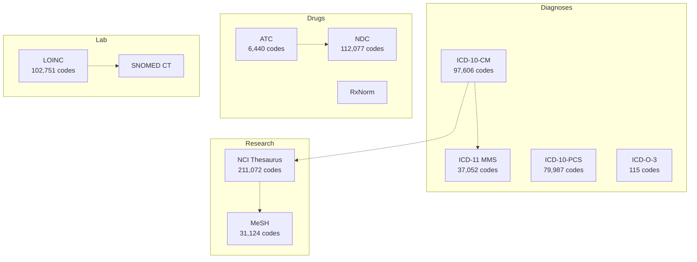
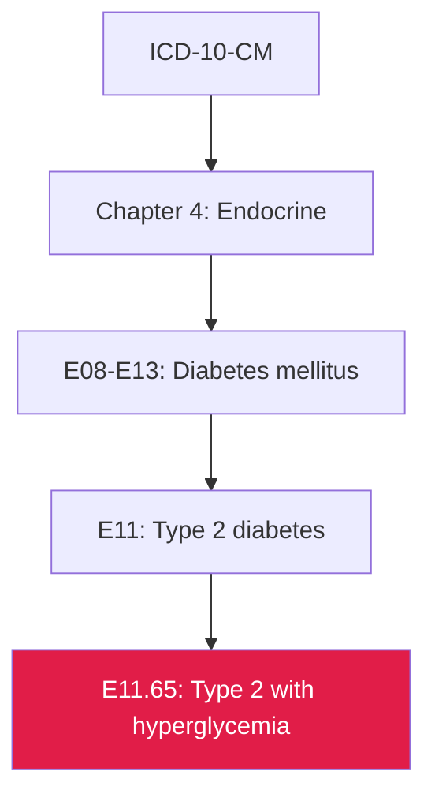

## Medical Coding Made Navigable

> **TL;DR:** ICD-10-CM (97K codes), LOINC (102K), NCI Thesaurus (211K), MeSH (31K) - all in one searchable graph. One query searches across every clinical system. One API call translates between them.

---

## The systems at a glance



| System | Codes | Classifies |
|--------|-------|-----------|
| ICD-10-CM | 97,606 | Diagnoses (US clinical) |
| ICD-10-PCS | 79,987 | Procedures (US inpatient) |
| ICD-11 MMS | 37,052 | Diagnoses (WHO latest) |
| LOINC | 102,751 | Lab tests and observations |
| NCI Thesaurus | 211,072 | Cancer research ontology |
| NDC | 112,077 | Drug products (FDA) |
| MeSH | 31,124 | Medical literature indexing |
| ATC | 6,440 | Drug therapeutic classes |

Plus dozens of domain systems covering nursing, lab testing, imaging, pathology, pharmacy, clinical trials, and telemedicine.

## One search, all systems

```bash
curl "https://wot.aixcelerator.ai/api/v1/search?q=diabetes&grouped=true"
```

Results come back grouped by system:

| System | Code | Title |
|--------|------|-------|
| ICD-10-CM | E11 | Type 2 diabetes mellitus |
| ICD-10-CM | E10 | Type 1 diabetes mellitus |
| ICD-11 | 5A11 | Type 2 diabetes mellitus |
| LOINC | - | HbA1c, glucose, insulin tests |
| ATC | A10 | Drugs used in diabetes |
| MeSH | - | Diabetes Mellitus (heading) |

One query. Five systems. Structured results with codes, titles, and hierarchy context.

## Navigate deep hierarchies

ICD-10-CM codes can be 7 characters deep. The ancestors endpoint walks the full path:

```bash
curl "https://wot.aixcelerator.ai/api/v1/systems/icd10cm/nodes/E11.65/ancestors"
```



Every level of clinical grouping from the specific code up to the chapter - in one call.

## Cross-system translation

A hospital's billing department works in ICD-10-CM. The research team uses MeSH. Quality reporting needs ICD-11.

```bash
curl "https://wot.aixcelerator.ai/api/v1/systems/icd10cm/nodes/E11/equivalences"
```

Returns crosswalk edges to ICD-11, MeSH, NCI Thesaurus, and other systems - with match types indicating the precision of each mapping.

## Use cases

| Who | What | Systems involved |
|-----|------|-----------------|
| **Clinical coders** | Assign diagnosis codes to encounters | ICD-10-CM, ICD-10-PCS |
| **Lab directors** | Standardize test ordering | LOINC, SNOMED CT |
| **Pharmacists** | Drug classification and interaction checking | ATC, NDC, RxNorm |
| **Researchers** | Literature search and ontology navigation | MeSH, NCI Thesaurus |
| **Quality teams** | ICD-10 to ICD-11 migration analysis | ICD-10-CM, ICD-11 |
| **Billing teams** | DRG assignment and HCPCS coding | MS-DRG, HCPCS, CPT |

## Data provenance

Medical coding accuracy matters - wrong codes lead to claim denials, audit flags, and patient safety issues.

Core systems are ingested directly from authoritative sources:

| System | Source |
|--------|--------|
| ICD-10-CM | CMS (Centers for Medicare & Medicaid Services) |
| ICD-11 | WHO (World Health Organization) |
| LOINC | Regenstrief Institute |
| ATC | WHO Collaborating Centre for Drug Statistics |
| NDC | FDA National Drug Code Directory |
| NCI Thesaurus | National Cancer Institute |

No intermediaries. No third-party transformations. For licensed systems (CPT, SNOMED CT), structural skeletons provide hierarchy and crosswalk connectivity.
