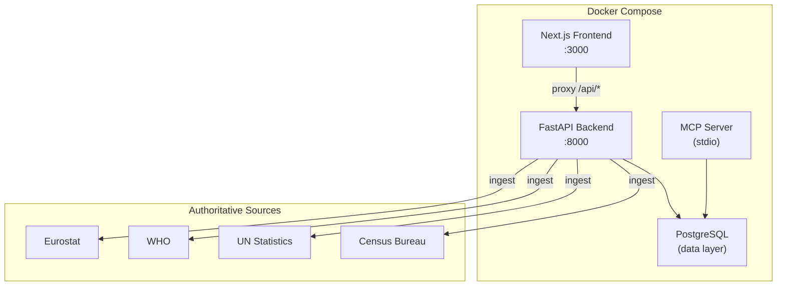
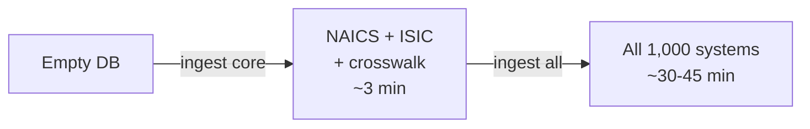
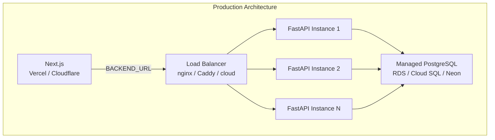

## Self-Host World Of Taxonomy in 2 Minutes

> **TL;DR:** MIT-licensed, fully open source. Clone, `docker compose up`, and you have the complete platform - API, web app, MCP server, and all 1,000 systems - on your own infrastructure. No vendor lock-in, no per-query pricing.

---

## Architecture overview



## Quick start (Docker)

```bash
git clone https://github.com/colaberry/WorldOfTaxonomy.git
cd World Of Taxonomy
docker compose up
```

That is it. Web app at `http://localhost:3000`. API at `http://localhost:8000`.

## Ingest systems



The database starts empty. Ingest what you need:

```bash
# Core systems (~3 minutes)
docker compose exec backend python3 -m world_of_taxonomy ingest naics
docker compose exec backend python3 -m world_of_taxonomy ingest isic
docker compose exec backend python3 -m world_of_taxonomy ingest crosswalk

# All 1,000 systems (~30-45 minutes)
docker compose exec backend python3 -m world_of_taxonomy ingest all
```

> Each ingester downloads data directly from its authoritative source (Census Bureau, UN, Eurostat, WHO) and loads into your local PostgreSQL. No pre-built data dumps. No third-party intermediaries.

## Python only (bring your own PostgreSQL)

```bash
pip install -e .
cp .env.example .env
# Edit .env: set DATABASE_URL and JWT_SECRET
python3 -m world_of_taxonomy init
python3 -m world_of_taxonomy ingest naics
python3 -m uvicorn world_of_taxonomy.api.app:create_app --factory --port 8000
```

## Run the MCP server

```bash
python3 -m world_of_taxonomy mcp
```

Point your AI client (Claude Desktop, Cursor, VS Code) at it using the MCP configuration.

## Run the frontend

```bash
cd frontend
npm install
npm run dev
```

Frontend at `http://localhost:3000`, proxies API calls to `:8000` via Next.js rewrites.

## Environment variables

| Variable | Required | Default | Description |
|----------|----------|---------|-------------|
| `DATABASE_URL` | Yes | - | PostgreSQL connection string |
| `JWT_SECRET` | For auth | - | JWT signing secret (min 32 chars) |
| `BACKEND_URL` | For frontend | `http://localhost:8000` | API URL for Next.js proxy |

## Selective ingestion

You do not need all 1,000 systems. Ingest only what your use case requires:

| Use Case | Commands |
|----------|----------|
| **Industry classification** | `ingest naics`, `ingest isic`, `ingest nace`, `ingest crosswalk` |
| **Medical coding** | `ingest icd10cm`, `ingest icd11`, `ingest loinc` |
| **Trade classification** | `ingest hs`, `ingest unspsc` |
| **Occupations** | `ingest soc`, `ingest isco`, `ingest esco` |

Each ingester is independent. Run them in any order. Re-run to update - they use upsert logic, so re-ingestion is idempotent.

## Production deployment



| Component | Recommendation |
|-----------|---------------|
| **PostgreSQL** | Any managed service - AWS RDS, Cloud SQL, Neon, Supabase |
| **Backend** | FastAPI behind reverse proxy. Stateless - scale horizontally. |
| **Frontend** | Vercel, Cloudflare Pages, or any Node.js host |
| **MCP** | Local process connecting directly to PostgreSQL |

## Why self-host?

| Benefit | Detail |
|---------|--------|
| **No rate limits** | Hosted API has limits for reliability. Self-hosted has none. |
| **Data sovereignty** | Keep the entire database within your infrastructure. |
| **Custom ingestion** | Add proprietary classification systems alongside public ones. |
| **Airgapped environments** | Full platform without internet after initial ingestion. |
| **Cost control** | PostgreSQL + small server. No per-query pricing. |

> The hosted API is great for getting started. Self-hosting is great for production workloads at scale.
