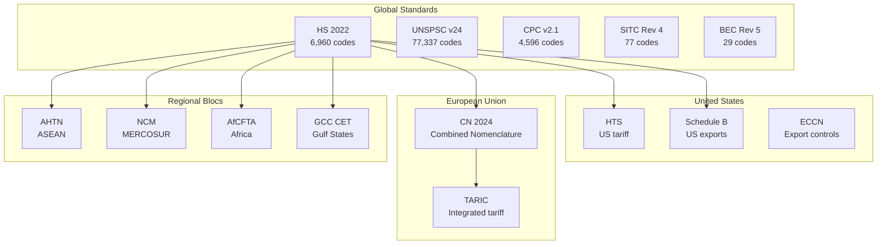
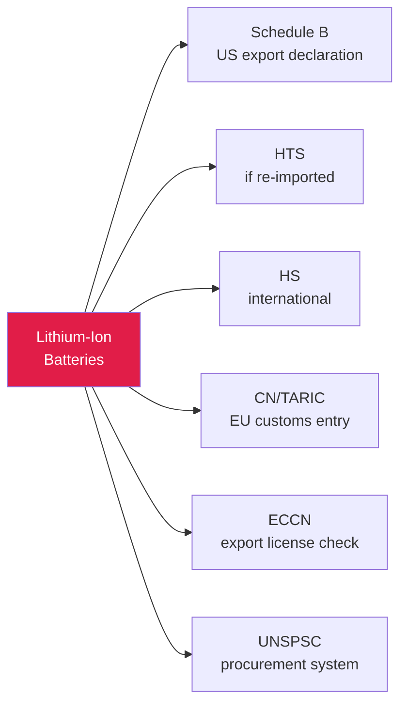
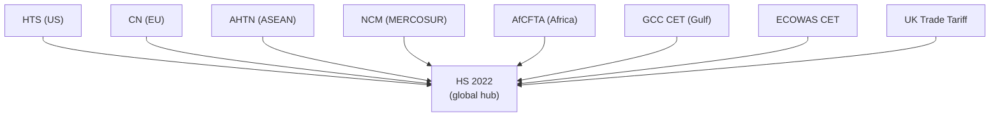

## Trade Classification for Global Commerce

> **TL;DR:** Every product crossing a border needs a code. HS, UNSPSC, ECCN, HTS, CN, TARIC - six systems for one shipment. World Of Taxonomy connects all trade classification systems so you can search, translate, and find gaps in one place.

---

## The trade classification landscape



| System | Scope | Codes | Purpose |
|--------|-------|-------|---------|
| HS 2022 | Global (WCO) | 6,960 | Customs classification (200+ countries) |
| UNSPSC v24 | Global (GS1 US) | 77,337 | Procurement and spend analysis |
| CPC v2.1 | Global (UN) | 4,596 | Statistical product classification |
| HTS | United States | 120 | US import tariff schedule |
| Schedule B | United States | 119 | US export classification |
| ECCN | United States | 58 | Export control classification |
| CN 2024 | European Union | 118 | Combined Nomenclature (HS + EU extensions) |
| TARIC | European Union | 22 | EU integrated tariff with trade measures |

## Six codes, one product

A US exporter shipping lithium-ion batteries to Germany needs:



Some are derived from HS (Schedule B, HTS, CN) but with different extensions. Others (UNSPSC, ECCN) use entirely different classification logic.

## HS as the hub

> The Harmonized System is maintained by the World Customs Organization and used by 200+ countries. It is the de facto hub for all trade classification crosswalks.



National tariff schedules extend HS with additional digits. The first 6 digits of any national code map back to the HS system. Translation between national tariff schedules routes through HS:

```
HTS (US) -> HS 2022 -> CN (EU) -> TARIC (EU with trade measures)
```

## Search across all trade systems

```bash
curl "https://wot.aixcelerator.ai/api/v1/search?q=lithium+battery&grouped=true"
```

Returns matching codes across HS, UNSPSC, Schedule B, HTS, ECCN, and other systems in one response.

## Translate between systems

```bash
curl "https://wot.aixcelerator.ai/api/v1/systems/hs_2022/nodes/8507.60/translations"
```

## Find gaps in coverage

```bash
curl "https://wot.aixcelerator.ai/api/v1/diff?a=hs_2022&b=unspsc_v24"
```

## Compliance use cases

| Use Case | What You Do | API Endpoint |
|----------|-------------|--------------|
| **Tariff engineering** | Compare classification across jurisdictions | `/compare` |
| **Export control screening** | Check if HS maps to controlled ECCN | `/equivalences` |
| **Dual-use goods** | Surface cross-system connections | `/translations` |
| **Procurement standardization** | Bridge UNSPSC procurement to HS customs | `/translations` |

> Products classified as civilian under HS might fall under export controls in ECCN. The graph surfaces these cross-system connections that are invisible when looking at each system in isolation.

## Regional tariff systems

| System | Region | Relationship to HS |
|--------|--------|-------------------|
| ASEAN AHTN | Southeast Asia | HS + ASEAN extensions |
| MERCOSUR NCM | South America | HS + MERCOSUR extensions |
| AfCFTA | Africa | HS + continental preferences |
| GCC Common Customs Tariff | Gulf States | HS + GCC extensions |
| ECOWAS CET | West Africa | HS + ECOWAS extensions |
| UK Trade Tariff | United Kingdom | HS + UK-specific rates |

All HS-based, all with regional extensions and preferential rate structures. Having them in the same graph as HS makes it possible to trace classification from the global level down to the regional and national levels.
