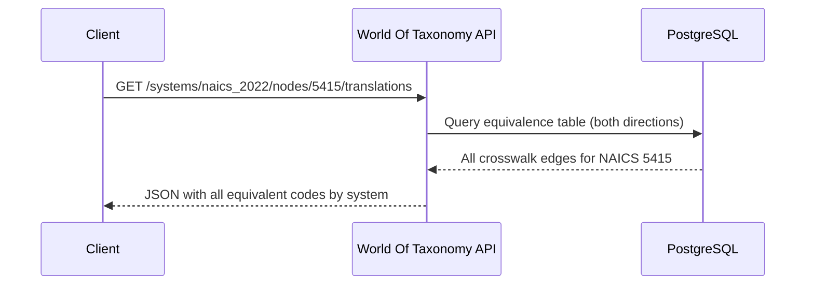

## Translating NAICS to NACE in One API Call

> **TL;DR:** Use the `/translations` endpoint to convert any NAICS code to NACE (or any other system) instantly. This post walks through single lookups, batch translation, handling one-to-many mappings, and finding gaps.

---

## The setup

| System | Region | Codes | Structure |
|--------|--------|-------|-----------|
| NAICS 2022 | North America | 2,125 | 2-6 digit numeric |
| NACE Rev 2 | European Union | 996 | Letter + 2-4 digit |

Both classify economic activities. Both have hierarchical structures. But they slice industries differently and use incompatible code formats.

## Single translation

```bash
curl "https://wot.aixcelerator.ai/api/v1/systems/naics_2022/nodes/5415/translations"
```

```json
{
  "naics_2022": "5415",
  "isic_rev4": "6201",
  "nace_rev2": "62.01",
  "sic_1987": "7371",
  "anzsic_2006": "7000",
  "nic_2008": "6201"
}
```

> NAICS 5415 (Computer Systems Design) maps to NACE 62.01 (Computer programming activities). One call, no lookup tables.

## Batch translation

```python
import requests

NAICS_CODES = ["5415", "4841", "6211", "2362", "3121"]
BASE = "https://wot.aixcelerator.ai/api/v1"

for code in NAICS_CODES:
    resp = requests.get(f"{BASE}/systems/naics_2022/nodes/{code}/translations")
    data = resp.json()
    nace = data.get("nace_rev2", "no mapping")
    print(f"NAICS {code} -> NACE {nace}")
```

**Output:**

| NAICS | Description | NACE |
|-------|-------------|------|
| 5415 | Computer Systems Design | 62.01 |
| 4841 | General Freight Trucking | 49.41 |
| 6211 | Offices of Physicians | 86.21 |
| 2362 | Nonresidential Building Construction | 41.20 |
| 3121 | Beverage Manufacturing | 11.01 |

## The translation flow



## Handling one-to-many mappings

Not all translations are 1:1. Use the equivalences endpoint for the full picture:

```bash
curl "https://wot.aixcelerator.ai/api/v1/systems/naics_2022/nodes/5415/equivalences"
```

Each edge includes a **match type**:

| Match type | Meaning | When it happens |
|------------|---------|-----------------|
| `exact` | 1:1 correspondence | Derived systems (WZ = NACE) |
| `broad` | Source is broader than target | ISIC division -> multiple NAICS groups |
| `narrow` | Source is narrower than target | Detailed NAICS -> broad ISIC |
| `partial` | Overlapping but not contained | Different structural cuts |

## Finding gaps

```bash
# NAICS codes with no NACE equivalent
curl "https://wot.aixcelerator.ai/api/v1/diff?a=naics_2022&b=nace_rev2"
```

This returns the exact codes you need to map manually - the gap analysis that usually takes days of spreadsheet work.

## Beyond NAICS and NACE

The same pattern works for **any system pair** in the graph:

- HS trade codes to UNSPSC product codes
- SOC occupation codes to ESCO skills
- ICD-10-CM diagnoses to ICD-11
- Any of the 1,000 systems to any other

If a crosswalk edge exists, the translation works. If it does not, the diff endpoint tells you exactly what is missing.
