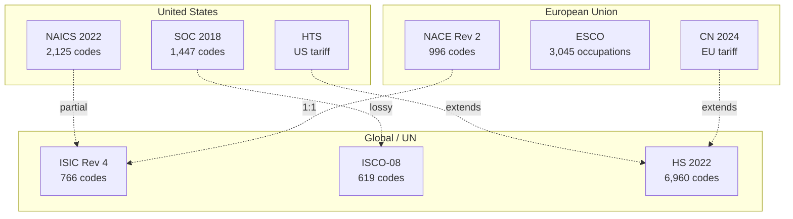
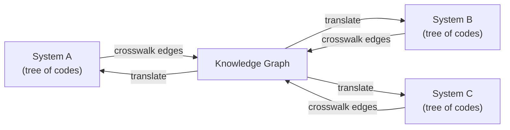

## Why Classification Systems Are Broken

> **TL;DR:** Classification systems were built independently by different organizations, in different decades, for different purposes. The result is global fragmentation that costs businesses millions in manual mapping, compliance risk, and missed insights.

---

## The fragmentation

Your US supplier uses NAICS. Your EU partner reports in NACE. Your customs broker wants HS codes. Your HR team maps jobs to SOC domestically and ISCO internationally.

None of these systems were designed to interoperate.

The dotted lines represent crosswalk mappings. Some are exact. Most are lossy, partial, or many-to-many. And many pairs have no official mapping at all.

## How we got here

**Each system was built for a specific purpose.** NAICS exists for the US/Canada/Mexico census. NACE exists for EU statistical reporting. ISIC exists as a UN global reference. Conceptual overlap, structural divergence.

**Systems evolve on different timelines.**

| System | Last major update | Update cycle |
|--------|-------------------|-------------|
| NAICS | 2022 | Every 5 years |
| NACE | 2008 (Rev 2) | ~15 years |
| SIC | 1987 | Frozen (still used) |
| ICD-10-CM | Annual updates | Yearly |
| HS | 2022 | Every 5 years |

**Granularity varies wildly.** ISIC has 766 codes. NAICS has 2,125. ICD-10-CM has 97,606. Mapping between different granularity levels is inherently lossy.

**No central authority coordinates mappings.** The UN publishes some concordances. Eurostat publishes others. But these are static PDFs and spreadsheets - not queryable APIs.

## The real cost

> Every multinational that consolidates reporting across regions employs people whose primary job is maintaining crosswalk tables by hand.

**Data engineering time.** Hand-curated crosswalk tables that break whenever either system updates.

**Compliance risk.** Wrong industry code on a regulatory filing triggers audits. 20 countries = 20 different systems = enormous error surface.

**Missed insights.** If US and EU teams use different systems with no mapping, you cannot answer: "What is our total transportation revenue globally?"

**AI blind spots.** LLMs know classification systems exist but hallucinate specific codes. They lack structured access to hierarchies and crosswalk edges.

## The fix is a graph, not a standard

The world does not need another standard. It needs a connector.

Every classification system is a tree. Crosswalks are edges between trees. Collect enough trees and edges, and any code can be translated to any other system by traversing the graph.

That is World Of Taxonomy: **1,000 trees connected by 321,000 edges.**

The systems will continue to exist independently. We connect them anyway.
