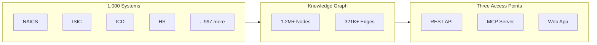

## Introducing WorldOfTaxonomy

> **TL;DR:** WorldOfTaxonomy connects 1,000+ classification systems, 1.2M+ codes, and 321K+ crosswalk edges into one queryable knowledge graph. REST API, MCP server, and web app - all open source.

---

## The problem

A truck driver in the US is five different codes in five different systems:

| System | Code | Region |
|--------|------|--------|
| NAICS 2022 | 484 | North America |
| SOC 2018 | 53-3032 | United States |
| ISCO-08 | 8332 | Global (ILO) |
| NACE Rev 2 | 49.4 | European Union |
| ISIC Rev 4 | 4923 | Global (UN) |

All five mean the same thing. Figuring that out manually costs hours. Doing it at scale costs entire teams.

Classification systems are the invisible backbone of global commerce, healthcare, trade, and labor markets. But they were never designed to talk to each other.

## What we built



**The knowledge graph** connects industry codes (NAICS, ISIC, NACE), health codes (ICD, LOINC, SNOMED), trade codes (HS, UNSPSC), occupation codes (SOC, ISCO, ESCO), regulatory frameworks, and hundreds of domain-specific taxonomies.

**The REST API** lets you search, translate, and browse:

```bash
# Translate NAICS 4841 to all equivalent systems
curl "https://wot.aixcelerator.ai/api/v1/systems/naics_2022/nodes/4841/translations"

# Search "hospital" across all 1,000 systems
curl "https://wot.aixcelerator.ai/api/v1/search?q=hospital&grouped=true"
```

**The MCP server** gives AI agents structured tool access - 25 tools for search, translation, hierarchy navigation, and system comparison. Works with Claude, Cursor, VS Code, Windsurf, and any MCP-compatible client.

## By the numbers

| Metric | Count |
|--------|-------|
| Classification systems | 1,000+ |
| Individual codes | 1,212,000+ |
| Crosswalk edges | 321,000+ |
| Countries profiled | 249 |
| Categories | 16 |
| MCP tools | 21 |

## Open source

The entire project is MIT-licensed. Two commands to run it locally:

```bash
git clone https://github.com/colaberry/WorldOfTaxonomy.git
cd WorldOfTaxonomy && docker compose up
```

Web app at `localhost:3000`. API at `localhost:8000`. No restrictions.

## What is next

We are finalizing hosted plans so you can use the API and MCP server without self-hosting. The full knowledge graph is available on every plan.

- **GitHub**: [colaberry/WorldOfTaxonomy](https://github.com/colaberry/WorldOfTaxonomy)
- **Web**: [worldoftaxonomy.com](https://worldoftaxonomy.com)
- **API docs**: [wot.aixcelerator.ai/docs](https://wot.aixcelerator.ai/docs)
