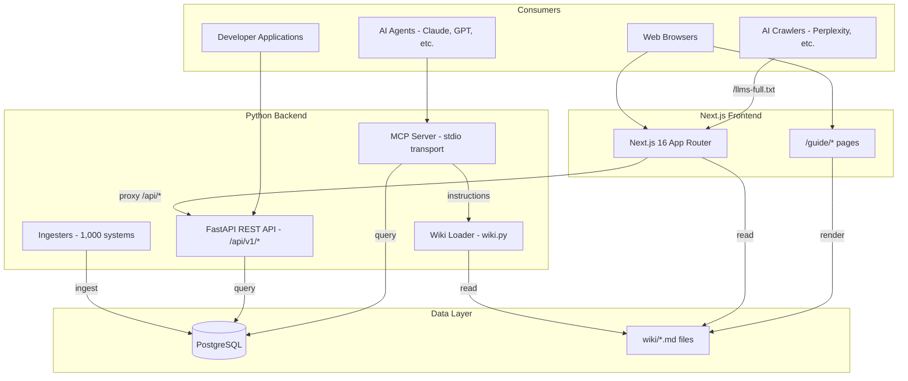
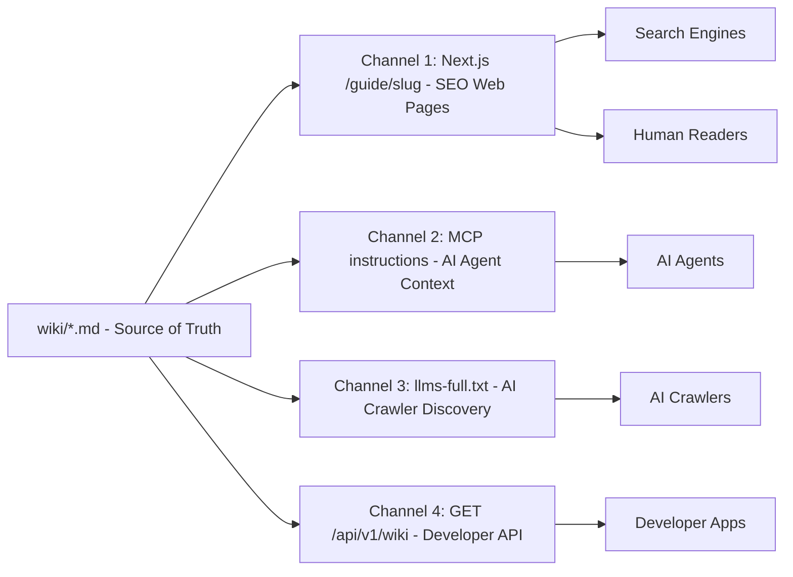
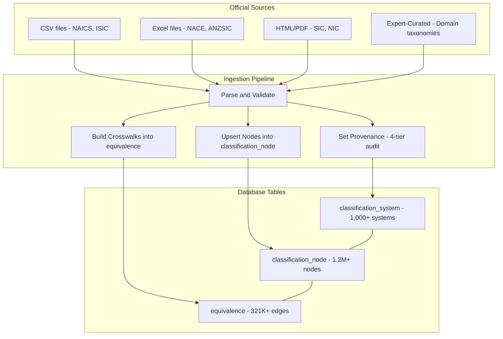
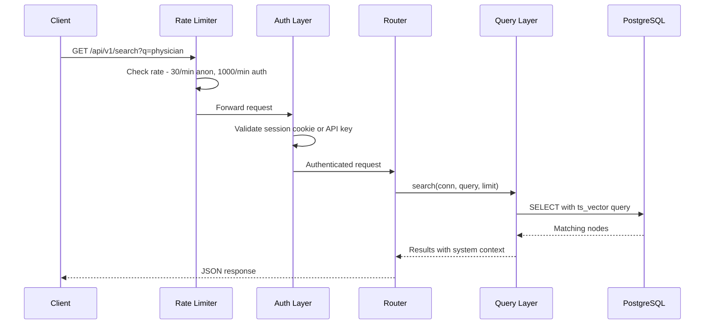
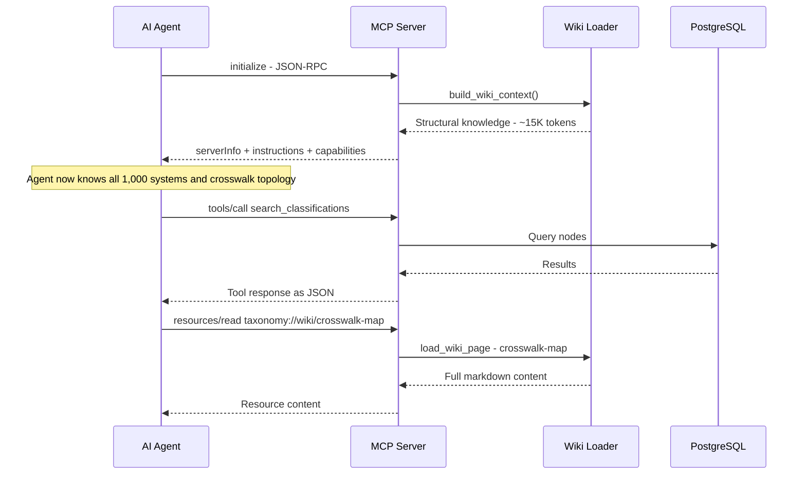
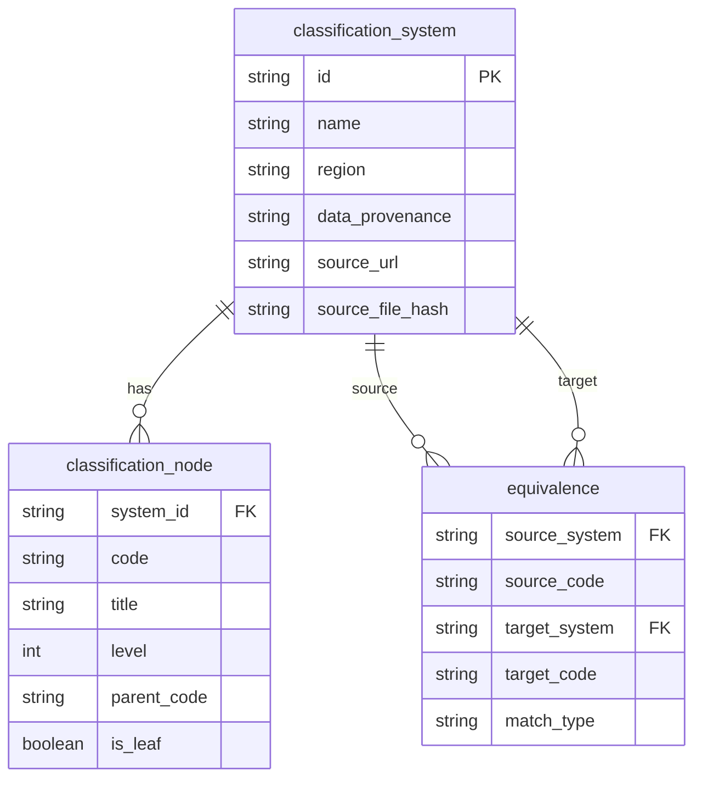

## System Architecture and Data Flows

> **TL;DR:** Three consumer interfaces (web app, REST API, MCP server) backed by PostgreSQL and a wiki knowledge layer. Data flows from 1,000 official sources through an ingestion pipeline into three core tables. Wiki content serves four channels from one source of truth.

---

## System architecture overview

The platform serves three consumer interfaces - a web application, a REST API, and an MCP server - all backed by a shared PostgreSQL database and wiki knowledge layer.



## Four-channel wiki data flow

The wiki system follows the "write once, serve four ways" pattern. A single set of curated markdown files feeds all distribution channels.



| Channel | Format | Refresh | Audience |
|---------|--------|---------|----------|
| Web pages at /guide/ | Server-rendered HTML with SEO metadata | Static generation at build time | Human readers, search engines |
| MCP instructions | Plain text injected at session start | Loaded on MCP initialize | AI agents (Claude, GPT, Gemini) |
| llms-full.txt | Concatenated plain text | Regenerated on build | AI crawlers (Perplexity, Google AI) |
| Wiki API | JSON with raw markdown | On-demand from disk | Developer applications, RAG pipelines |

## Classification data ingestion pipeline

Raw data from official sources flows through the ingestion pipeline into three database tables.



### Ingestion steps

1. **Parse**: Read the source file (CSV, Excel, HTML, or hardcoded data). Validate code format, hierarchy, and completeness.
2. **Upsert nodes**: Insert or update rows in `classification_node` with code, title, description, level, parent_code, is_leaf, and seq_order.
3. **Build crosswalks**: Create bidirectional edges in the `equivalence` table with match_type (exact, partial, broader, narrower, related).
4. **Set provenance**: Update `classification_system` with data_provenance tier, source_url, source_date, license, and source_file_hash.

## API request flow

Every API request passes through rate limiting and authentication before reaching the query layer.



### Rate limit tiers

| Tier | Requests/Minute | Daily Limit | Best For |
|------|-----------------|-------------|----------|
| Anonymous | 30 | Unlimited | Quick exploration |
| Free | 1,000 | Unlimited | Development |
| Pro | 5,000 | 100,000 | Production apps |
| Enterprise | 50,000 | Unlimited | High-volume |

## MCP session lifecycle

When an AI agent connects to the MCP server, it receives structural knowledge about the entire knowledge graph before making any tool calls.



### MCP capabilities

The server advertises 26 tools and wiki resources:

- **Tools**: list_classification_systems, search_classifications, get_industry, browse_children, get_equivalences, translate_code, classify_business, get_audit_report, and 18 more
- **Resources**: taxonomy://systems, taxonomy://stats, taxonomy://wiki/{slug} for each guide page

## Database schema

The three core tables and their relationships:



- Parent-child hierarchy within a system is modeled by `classification_node.parent_code`
- Crosswalk edges are bidirectional: if A maps to B, B maps to A

## Technology stack

| Layer | Technology | Purpose |
|-------|-----------|---------|
| Database | PostgreSQL (with pgbouncer) | 1.2M+ nodes, 321K+ edges |
| Backend | Python 3.9+, FastAPI, asyncpg | REST API + MCP server |
| Frontend | Next.js 16, TypeScript, Tailwind CSS v4, shadcn/ui | Web application |
| Visualization | D3.js (Galaxy View), Cytoscape.js (Crosswalk Explorer) | Interactive graphs |
| Auth | Magic-link cookie session + API keys (`wot_` prefix) | Tiered access |
| Rate Limiting | slowapi | Per-tier enforcement |
| MCP | Custom JSON-RPC over stdio | AI agent integration |
| Content | Markdown + remark + remarkGfm | Wiki and blog rendering |

## Self-hosting

Two commands to run everything locally:

```bash
git clone https://github.com/colaberry/WorldOfTaxonomy.git
cd WorldOfTaxonomy && docker compose up
```

Web app at `localhost:3000`. API at `localhost:8000`. MCP server via `python -m world_of_taxonomy mcp`.
