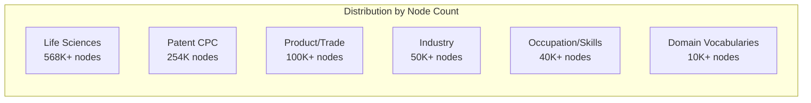

## Categories and Sectors - How Systems Are Organized

> **TL;DR:** 1,000+ classification systems are organized into 16 categories spanning industry, trade, health, occupation, regulation, and domain-specific vocabularies. This guide explains the category structure and how to navigate it.

---

## The 16 categories

```mermaid
graph TD
  WOT["World Of Taxonomy\n1,000+ systems"] --> IND["Industry\n~150 systems"]
  WOT --> TRADE["Product/Trade\n~20 systems"]
  WOT --> OCC["Occupation\n~15 systems"]
  WOT --> EDU["Education\n~10 systems"]
  WOT --> LIFE["Life Sciences\n~100+ systems"]
  WOT --> GEO["Geographic\n~10 systems"]
  WOT --> FIN["Financial/Environmental\n~20 systems"]
  WOT --> REG["Regulatory\n~100+ systems"]
  WOT --> ISO["ISO Standards\n~25 systems"]
  WOT --> INTL["Intl Agreements\n~25 systems"]
  WOT --> ACAD["Academic\n~15 systems"]
  WOT --> PAT["Patent\n1 system, 254K codes"]
  WOT --> DTECH["Domain: Technology\n~50 systems"]
  WOT --> DFIN["Domain: Finance\n~30 systems"]
  WOT --> DSEC["Domain: Sector-Specific\n~200+ systems"]
  WOT --> DREG["Domain: Regulatory Detail\n~50+ systems"]
```



| Category | Systems | Description |
|----------|---------|-------------|
| Industry | ~150+ | Economic activity classification (NAICS, ISIC, NACE, SIC, national variants) |
| Product/Trade | ~20+ | Goods and services classification (HS, CPC, UNSPSC, SITC) |
| Occupation | ~15+ | Job and skills classification (SOC, ISCO, ESCO, O*NET) |
| Education | ~10+ | Educational programs and levels (ISCED, CIP) |
| Life Sciences | ~100+ | Pharmaceuticals, clinical coding, diagnostics, devices, biotech, health informatics |
| Geographic | ~10+ | Country, region, and subdivision codes (ISO 3166, NUTS, FIPS) |
| Financial/Environmental | ~20+ | Sustainability, accounting, and governance (SASB, EU Taxonomy, GHG, COFOG) |
| Regulatory | ~100+ | Laws, standards, and compliance frameworks (HIPAA, GDPR, OSHA, FDA, SEC) |
| ISO Standards | ~25+ | Management system standards (ISO 9001, 14001, 27001, 45001) |
| International Agreements | ~25+ | Treaties and global frameworks (Basel, FATF, Paris Agreement, ILO) |
| Academic/Research | ~15+ | Subject classification for scholarly work (arXiv, MSC, JEL, ACM CCS) |
| Patent | 1 | Patent classification (CPC - 254K codes) |
| Domain: Technology | ~50+ | Software, AI, cybersecurity, cloud, data taxonomies |
| Domain: Finance | ~30+ | Insurance, banking, investment, payment taxonomies |
| Domain: Sector-Specific | ~200+ | Transportation, agriculture, mining, construction, energy, and other sector vocabularies |

## Category counts in the knowledge graph



| Category | Systems | Nodes | What drives the count |
|----------|---------|-------|----------------------|
| Life Sciences | ~100+ | 568K+ | ICD-10-CM (97K), NCI Thesaurus (211K), NDC (112K), LOINC (102K) |
| Patent | 1 | 254K | Patent CPC is a single massive hierarchy |
| Product/Trade | ~20 | 100K+ | UNSPSC dominates with 77K codes |
| Industry | ~150+ | 50K+ | Many national NACE/ISIC variants at ~1K codes each |
| Occupation/Skills | ~15 | 40K+ | ESCO Skills at 14K, ESCO Occupations at 3K |
| Domain vocabularies | ~300+ | 10K+ | Typically 15-30 codes each |
| Regulatory/Compliance | ~100+ | 5K+ | Frameworks range from 15-50 articles each |
| Everything else | ~300 | 15K+ | Geographic, academic, financial, ISO |

## How categories map to API queries

### Browse by category

```bash
# Get all systems (includes category metadata)
curl https://worldoftaxonomy.com/api/v1/systems

# Group by region
curl "https://worldoftaxonomy.com/api/v1/systems?group_by=region"

# Filter by country to find relevant systems
curl "https://worldoftaxonomy.com/api/v1/systems?country=US"
```

### Search within a category

The search endpoint searches across all systems. Use keywords to focus on specific domains:

```bash
# Find health-related codes
curl "https://worldoftaxonomy.com/api/v1/search?q=diabetes&grouped=true"

# Find trade codes
curl "https://worldoftaxonomy.com/api/v1/search?q=cotton&grouped=true"

# Find occupation codes
curl "https://worldoftaxonomy.com/api/v1/search?q=software+engineer&grouped=true"
```

## Domain-specific vocabularies

Domain taxonomies extend the standard classification systems with specialized vocabularies. They are organized by NAICS 2-digit sector.

### Sector-specific domains

| NAICS Sector | Domain Vocabularies | Total Codes |
|-------------|---------------------|-------------|
| 11 Agriculture | Crop types, livestock, farming methods, commodity grades, equipment, input supply, land classification, post-harvest | 300+ |
| 21 Mining | Mineral types, extraction methods, reserve classification, equipment, project lifecycle, safety | 130+ |
| 22 Utilities | Energy sources, grid regions, tariff structures, infrastructure assets, regulatory ownership | 130+ |
| 23 Construction | Trade types, building types, project delivery, material systems, sustainability | 130+ |
| 31-33 Manufacturing | Process types, quality, operations models, industry verticals, supply chain, facility config | 120+ |
| 44-45 Retail | Channel types, merchandise categories, fulfillment, pricing strategies, store formats | 100+ |
| 52 Finance | Instrument types, market structure, regulatory frameworks, client segments | 100+ |
| 484 Truck Transportation | Freight types, vehicle classes, cargo, carrier operations, pricing, compliance | 200+ |

### Emerging sector domains

| Domain | Focus | Systems |
|--------|-------|---------|
| AI and Data | Model types, deployment, ethics, governance | 4 |
| Cybersecurity | Threats, frameworks, zero trust, SIEM | 10+ |
| Space and Satellite | Orbital classification, regulatory, licensing | 4 |
| Climate Technology | Finance instruments, policy mechanisms | 4 |
| Quantum Computing | Application domains, commercialization stages | 4 |
| Digital Assets/Web3 | Regulatory frameworks, infrastructure layers | 4 |
| Autonomous Systems | Application domains, sensing technology | 4 |
| Synthetic Biology | Application sectors, biosafety levels | 4 |

## Life Sciences sub-sectors

The Life Sciences category (~100+ systems, ~568K nodes) is the largest by node count. It is organized into 13 sub-sectors:

| Sub-Sector | Key Systems |
|------------|-------------|
| Diagnoses and Classification | ICD-10-CM, ICD-11, ICD-10-PCS, DSM-5, SNOMED CT, ICPC-2 |
| Pharmaceuticals | ATC, NDC, RxNorm, EDQM, WHO Essential Medicines |
| Diagnostics and Lab | LOINC, lab test types, imaging modalities, biomarkers |
| Procedures and Billing | CPT, HCPCS, MS-DRG, G-DRG, NUCC |
| Oncology and Research | NCI Thesaurus, MeSH, OMIM, Orphanet, CTCAE |
| Medical Devices | GMDN, implant types, surgical instruments, sterilization |
| Biotechnology | Biotech types, biosimilars, gene therapy, cell therapy |
| Synthetic Biology | Synbio types, application sectors, biosafety levels |
| Health Informatics | FHIR, DICOM, telemedicine, clinical decision support |
| Nursing and Allied Health | ICN, NIC, NANDA, nursing specialties, allied health |
| Payment and Delivery | HEDIS, CMS Star, care settings, payer types, value-based care |
| Health Regulation | HIPAA, FDA 21 CFR, DEA, CLIA, MDR, IVDR |
| Dental, Mental, and Veterinary | Dental, mental health, and veterinary service types |

## Navigating categories

Use the web app at [worldoftaxonomy.com](https://worldoftaxonomy.com) for visual exploration. The home page Industry Map shows all 16 categories. Click any category to search for systems in that domain.

Use the API for programmatic access:

```bash
# Get all systems with metadata
curl https://worldoftaxonomy.com/api/v1/systems

# Get country-specific systems (e.g., what applies in Germany)
curl "https://worldoftaxonomy.com/api/v1/systems?country=DE"

# Get crosswalk statistics to see which systems are most connected
curl https://worldoftaxonomy.com/api/v1/equivalences/stats
```
