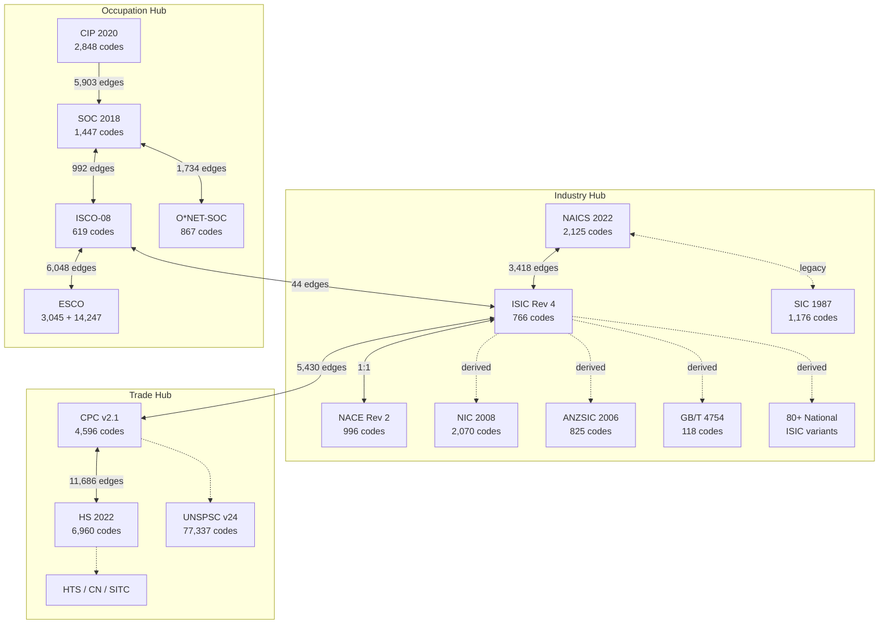
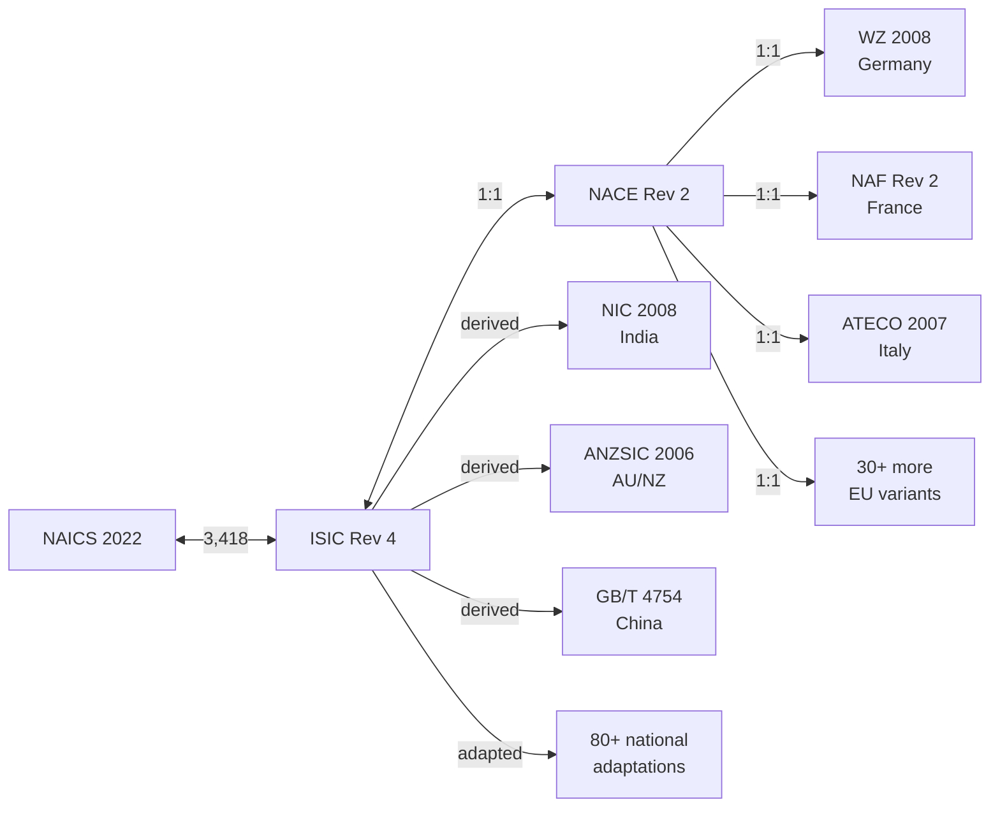
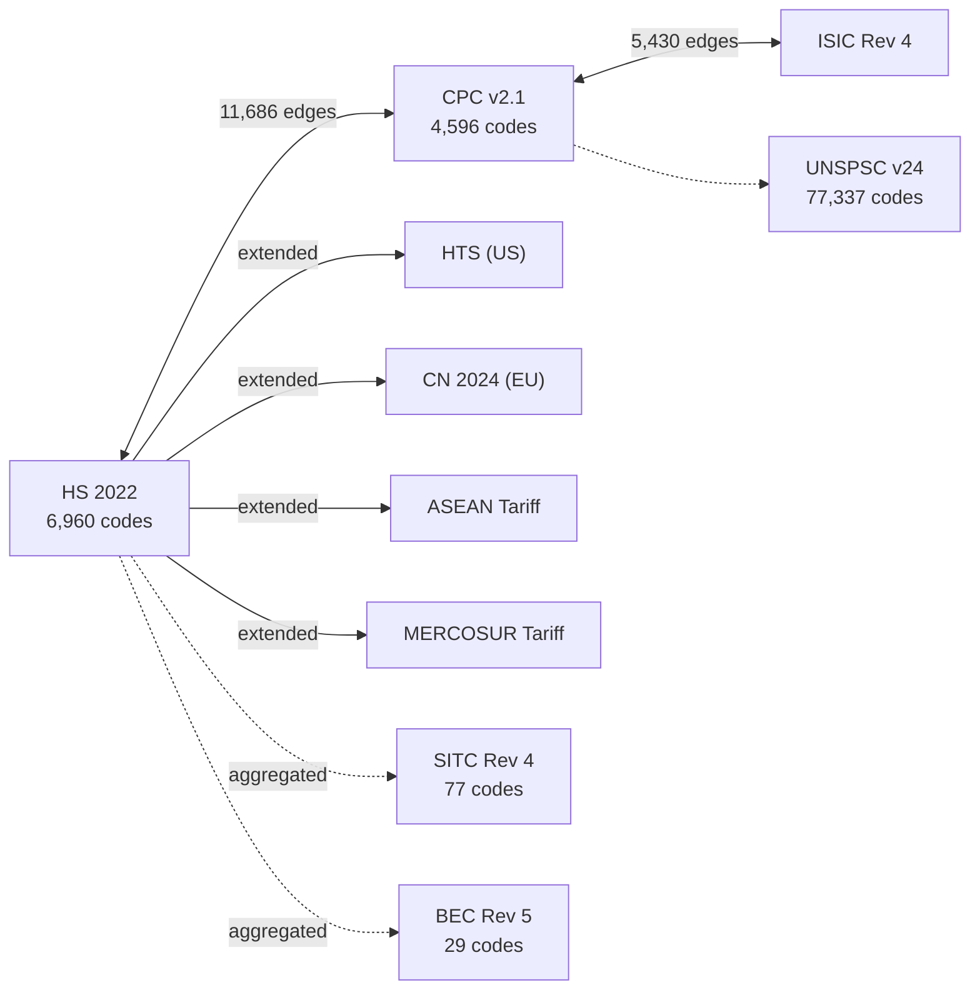
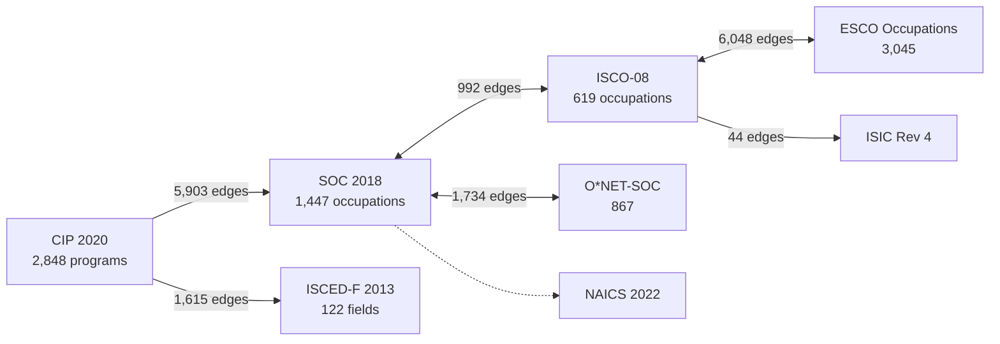
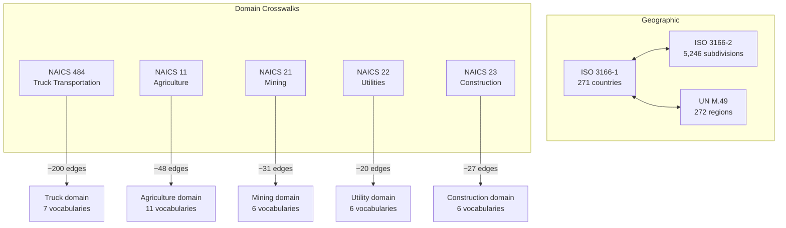
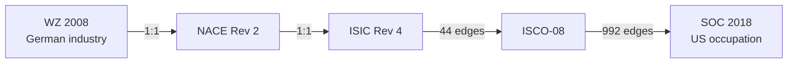
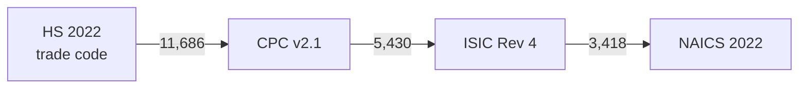

## Crosswalk Map - How Classification Systems Connect

> **TL;DR:** 326,000+ crosswalk edges link 1,000 classification systems through hub-and-spoke topology. ISIC is the industry hub, CPC bridges trade to industry, SOC/ISCO connect occupations, and every one of the 434 domain taxonomies is bridged to NAICS/ISIC/NACE via sector anchors. This guide maps the full topology and shows how to navigate translation paths.

---

## What is a crosswalk?

A crosswalk (or concordance) is a mapping between codes in two different classification systems. For example, NAICS 6211 ("Offices of Physicians") maps to ISIC 8620 ("Medical and dental practice activities").

Crosswalks have a match type that tells you how precise the mapping is:

| Type | Meaning | Example |
|------|---------|---------|
| `exact` | Identical scope and definition | NAICS 111110 "Soybean Farming" = ISIC 0111 |
| `partial` | Overlapping but not identical scope | NAICS 6211 partially overlaps ISIC 8620 |
| `broader` | Target has wider scope | A 6-digit NAICS to a 2-digit ISIC |
| `narrower` | Target has narrower scope | A section-level ISIC to a detailed NAICS |
| `related` | Conceptually related but structurally different | Domain taxonomy to parent NAICS sector |

## Core crosswalk topology

The knowledge graph has five major hubs. Each hub connects clusters of related systems.



## Industry classification hub

ISIC Rev 4 is the central node for industry classification. Every major national system connects through it.



NACE national variants (WZ, NAF, ATECO, PKD, SBI, SNI, etc.) share the identical 996-code structure. Each has a 1:1 mapping to NACE Rev 2 and transitively to ISIC Rev 4.

## Product and trade hub

CPC v2.1 is the bridge between trade codes and industry codes.



This means you can trace a trade code (HS) to its product category (CPC) to the industry that produces it (ISIC/NAICS).

## Occupation and education hub

SOC 2018 and ISCO-08 are the twin hubs for occupation data.



CIP 2020 (educational programs) connects to SOC (occupations) with 5,903 edges - the education-to-career pipeline.

## Geographic and domain hubs



Each domain taxonomy links back to its parent NAICS sector, creating drill-down paths from broad industry codes to specialized vocabularies.

As of the sector-anchor pass, all 434 domain taxonomies (up from the 15 original pilots shown above) carry at least one bridge edge to NAICS 2022, plus parallel fan-out edges into ISIC Rev 4 and NACE Rev 2 where the NAICS anchor has an existing international crosswalk. Generated edges are stamped `match_type='broad'` and one of two provenance values:

| Provenance | What it means |
|------------|---------------|
| `derived:sector_anchor:v1` | Direct NAICS<->domain bridge written by `crosswalk_domain_anchors.py` |
| `derived:sector_anchor:v1:fanout` | ISIC<->domain or NACE<->domain edge derived via a NAICS<->ISIC (or NACE) self-join |

Filter `?match_type=exact` if you want to exclude every generated bridge and see only authoritative exact statistical concordances.

## The four edge kinds

Every equivalence response now carries an `edge_kind` computed from the categories of both endpoints. See [domain-vs-standard](domain-vs-standard.md) for the full pattern. Quick reference:

| `edge_kind`         | Description |
|---------------------|-------------|
| `standard_standard` | Pre-existing statistical crosswalks (NAICS<->ISIC, ISIC<->NACE, HS<->CPC, SOC<->ISCO, ...) |
| `standard_domain`   | Bridge from an official code to a curated domain taxonomy |
| `domain_standard`   | Bridge from a domain taxonomy back to an official code |
| `domain_domain`     | Reserved for future cross-domain edges; none generated yet |

Use the filter on any equivalence or translation endpoint:

```
GET /api/v1/systems/naics_2022/nodes/6211/equivalences?edge_kind=standard_standard
GET /api/v1/systems/naics_2022/nodes/6211/equivalences?edge_kind=standard_domain,domain_standard
```

Stats grouped by edge kind:

```bash
curl "https://worldoftaxonomy.com/api/v1/equivalences/stats?group_by=edge_kind"
```

## Translation paths

Not all systems have direct crosswalks. You translate between systems by following a path through intermediate hubs.

### Example: German industry code to US occupation



### Example: HS trade code to NAICS industry



## API for crosswalk navigation

### Direct equivalences

```bash
# Get all systems that NAICS 6211 maps to
curl https://worldoftaxonomy.com/api/v1/systems/naics_2022/nodes/6211/equivalences

# Translate to all connected systems at once
curl https://worldoftaxonomy.com/api/v1/systems/naics_2022/nodes/6211/translations
```

### Crosswalk statistics

```bash
# Overall crosswalk stats
curl https://worldoftaxonomy.com/api/v1/equivalences/stats

# Stats for a specific system
curl "https://worldoftaxonomy.com/api/v1/equivalences/stats?system_id=naics_2022"
```

### Compare systems

```bash
# Side-by-side top-level comparison
curl "https://worldoftaxonomy.com/api/v1/compare?a=naics_2022&b=isic_rev4"

# Codes in system A with no mapping to B
curl "https://worldoftaxonomy.com/api/v1/diff?a=naics_2022&b=isic_rev4"
```

## MCP tools for crosswalks

| Tool | Purpose |
|------|---------|
| `get_equivalences` | Direct crosswalk mappings for a code |
| `translate_code` | Translate a code to a specific target system |
| `translate_across_all_systems` | Translate to all connected systems |
| `get_crosswalk_coverage` | Coverage statistics for a crosswalk pair |
| `get_system_diff` | Codes with no mapping between two systems |
| `compare_sector` | Side-by-side sector comparison |
| `describe_match_types` | Explain the match type categories |
| `list_crosswalks_by_kind` | Counts + samples for a specific `edge_kind` (standard_standard, standard_domain, domain_standard, domain_domain); optionally narrow to a single system |
