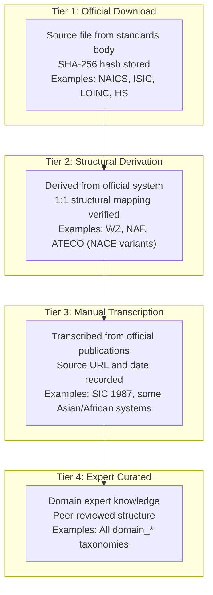
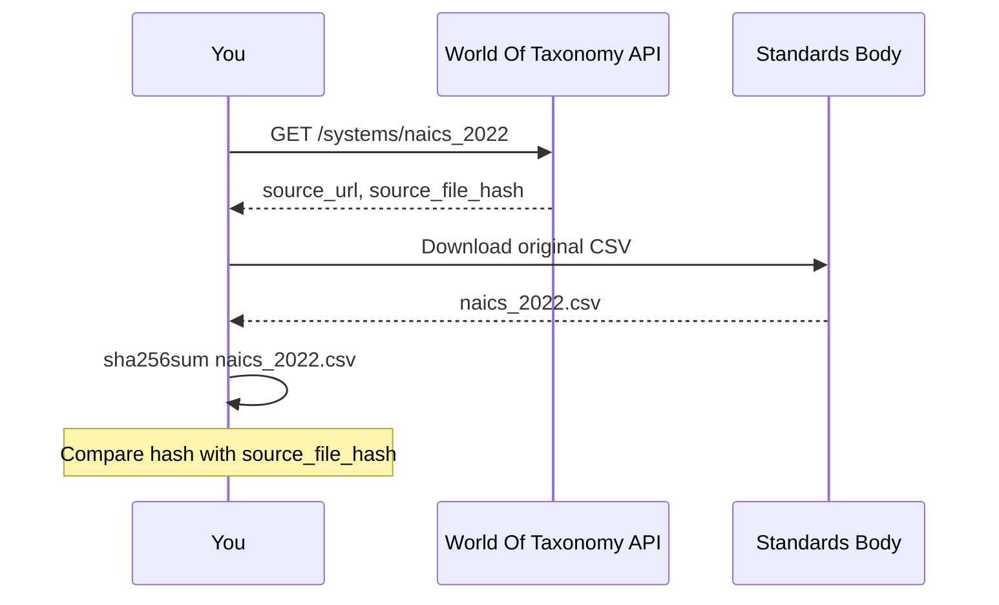

## Data Quality and Provenance

> **TL;DR:** Every system is tagged with one of four provenance tiers - from official government downloads (Tier 1) to expert-curated domain vocabularies (Tier 4). SHA-256 hashes, source URLs, and dates are stored for audit. This guide explains the framework and how to verify data.

---

## Four-tier provenance framework



| Tier | Label | Description | Verification |
|------|-------|-------------|-------------|
| 1 | `official_download` | Data downloaded directly from the authoritative source | File hash stored for audit |
| 2 | `structural_derivation` | Derived from an official system (e.g., NACE national variants) | 1:1 structural mapping verified |
| 3 | `manual_transcription` | Transcribed from official publications (PDF, HTML, print) | Cross-checked against source |
| 4 | `expert_curated` | Curated by domain experts based on industry knowledge | Peer-reviewed structure |

### Tier 1: Official download

The gold standard. Data files (CSV, Excel, XML) are downloaded directly from the standards body's website. A SHA-256 hash of the source file is stored in the `source_file_hash` column for reproducibility.

**Examples**: NAICS 2022 (Census Bureau CSV), HS 2022 (WCO), ISIC Rev 4 (UN CSV), LOINC (Regenstrief download), ICD-10-CM (CMS), NCI Thesaurus (NCI)

### Tier 2: Structural derivation

Systems that reuse the structure of an official system with localized naming. For example, all EU NACE Rev 2 national variants (WZ 2008, NAF Rev 2, ATECO 2007, etc.) share the identical code structure.

**Examples**: WZ 2008 (Germany), ONACE 2008 (Austria), NOGA 2008 (Switzerland), all EU NACE national variants, all ISIC Rev 4 national adaptations

### Tier 3: Manual transcription

Data transcribed from official documents that do not provide machine-readable downloads. The original source URL and date are recorded for audit.

**Examples**: SIC 1987 (transcribed from OSHA HTML), some Asian and African national classifications

### Tier 4: Expert curated

Domain-specific vocabularies created by subject matter experts. These fill gaps where no official standard exists.

**Examples**: All `domain_*` taxonomies (truck freight, agriculture, mining, construction, cybersecurity, AI, etc.)

## Provenance metadata fields

Each classification system carries these audit fields:

| Field | Description | Example |
|-------|-------------|---------|
| `data_provenance` | Provenance tier | `official_download` |
| `source_url` | URL of the authoritative data source | `https://www.census.gov/naics/` |
| `source_date` | Date the source data was accessed/published | `2024-01-15` |
| `license` | License terms for the data | `Public Domain` |
| `source_file_hash` | SHA-256 hash of the original file (Tier 1 only) | `a3f2b7c...` |

## Querying provenance via API

### Get provenance for a system

```bash
curl https://worldoftaxonomy.com/api/v1/systems/naics_2022
```

Response includes `data_provenance`, `source_url`, `source_date`, `license`, and `source_file_hash`.

### Audit report

```bash
# Full provenance audit across all systems
curl https://worldoftaxonomy.com/api/v1/audit
```

The audit report shows:
- Breakdown by provenance tier (system count, node count per tier)
- Tier 1 systems missing a file hash
- Tier 2 structural derivation count and node coverage
- Skeleton systems (placeholder entries awaiting full data)

### MCP audit tool

```bash
# Via MCP
tools/call get_audit_report {}
```

Returns the same audit data in a format suitable for AI agent consumption.

## Data verification practices

### Hash verification (Tier 1)

For official download systems, the `source_file_hash` lets you verify data integrity:

1. Download the original file from `source_url`
2. Compute its SHA-256 hash
3. Compare against the stored `source_file_hash`
4. If they match, the data in World Of Taxonomy matches the original file



### Structural verification (Tier 2)

For structural derivation systems, you can verify:

1. The code structure matches the parent system exactly
2. Crosswalk edges are 1:1 (every code in the derived system maps to exactly one code in the parent)

### Cross-reference verification

For any system, you can cross-reference node counts and structure against the authoritative publication.

## Skeleton systems

Some systems are included as structural placeholders where the full dataset is not freely available (e.g., SNOMED CT, CPT). These are marked with low node counts and are included to preserve the crosswalk topology. Full data requires a license from the respective standards body.

| Skeleton System | Reason | License Holder |
|----------------|--------|----------------|
| SNOMED CT | Proprietary license | SNOMED International |
| CPT | Copyright protected | American Medical Association |
| RxNorm | Partial skeleton | NLM (some data freely available) |
| DSM-5 | Copyright protected | American Psychiatric Association |

## Reporting data quality issues

If you find incorrect data, missing codes, or wrong crosswalk mappings:

1. **GitHub**: File an issue on the project repository with system ID, code, expected vs actual value, and a link to the authoritative source
2. **API**: Include the `report_issue_url` from any API response for direct reporting

> All classification data in World Of Taxonomy is provided for informational purposes only. It should not be used as a substitute for official government or standards body publications. For regulatory, legal, or compliance purposes, always verify codes against the authoritative source.
