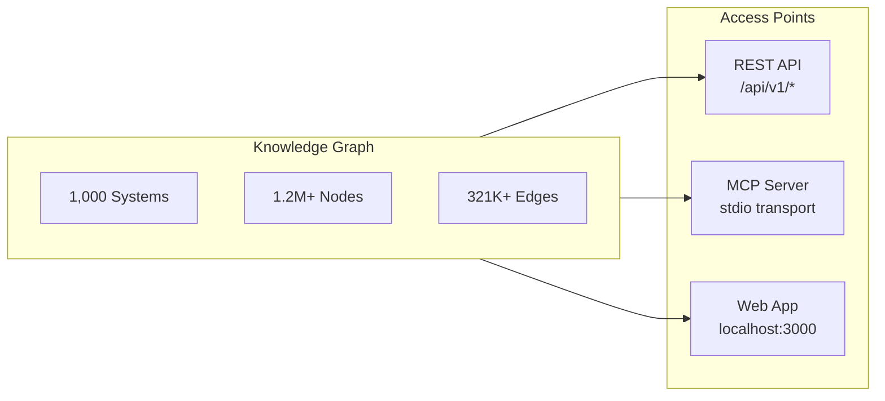
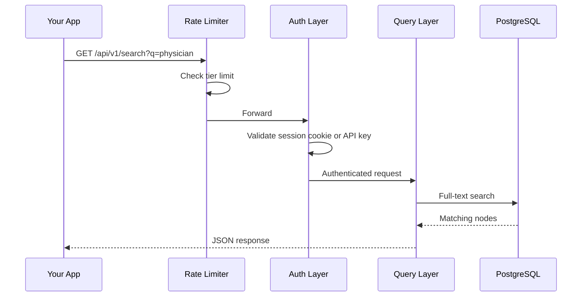

## Getting Started with WorldOfTaxonomy

> **TL;DR:** Three ways to query 1,000+ classification systems, 1.2M+ codes, and 321K+ crosswalk edges - REST API, MCP server for AI agents, and a web app. All open source, all free to start.

---

## Three access points, one knowledge graph



Pick whichever fits your workflow. The API is for application integrations and scripts. The MCP server gives AI agents direct tool access. The web app is for visual exploration.

## Quick start - REST API

Base URL: `https://worldoftaxonomy.com/api/v1`

### List all classification systems

```bash
curl https://worldoftaxonomy.com/api/v1/systems
```

Returns an array of all systems with their ID, name, region, node count, and provenance metadata.

### Search across all systems

```bash
curl "https://worldoftaxonomy.com/api/v1/search?q=physician"
```

Full-text search across all 1.2M+ nodes. A search for "physician" returns matches from SOC, ISCO, ESCO, NAICS, ICD-10-CM, and dozens more systems in a single call.

Add `&grouped=true` to group results by system, or `&context=true` to include ancestor paths and children for each match.

### Look up a specific code

```bash
curl https://worldoftaxonomy.com/api/v1/systems/naics_2022/nodes/6211
```

Returns the node with its title, description, level, parent code, and whether it is a leaf node.

### Browse children

```bash
curl https://worldoftaxonomy.com/api/v1/systems/naics_2022/nodes/62/children
```

Returns all direct child codes under a given node. This is how you drill down through a hierarchy.

### Get cross-system equivalences

```bash
curl https://worldoftaxonomy.com/api/v1/systems/naics_2022/nodes/6211/equivalences
```

Returns crosswalk mappings to other systems. NAICS 6211 ("Offices of Physicians") maps to ISIC 8620, NACE 86.2, NIC 8620, and others.

### Translate to all systems at once

```bash
curl https://worldoftaxonomy.com/api/v1/systems/naics_2022/nodes/6211/translations
```

Returns equivalences across all connected systems in a single call. One request, every known translation.

## Quick start - MCP server

The MCP (Model Context Protocol) server lets AI agents query the knowledge graph directly.

### Setup

```bash
pip install world-of-taxonomy
python -m world_of_taxonomy mcp
```

Transport: stdio. The server exposes 26 tools and wiki-based resources. It works with Claude, Cursor, VS Code, Windsurf, and any MCP-compatible client.

### Key MCP tools

| Tool | Purpose | Example |
|------|---------|---------|
| `list_classification_systems` | List all 1,000+ systems | "What systems cover Germany?" |
| `search_classifications` | Full-text search across all nodes | "Find codes for diabetes" |
| `get_industry` | Look up a specific code | "What is NAICS 5415?" |
| `browse_children` | Get child codes | "Show subcategories of HS chapter 01" |
| `get_equivalences` | Get crosswalk mappings | "What does ICD-10-CM E11 map to?" |
| `translate_code` | Translate a code to another system | "Convert SOC 29-1211 to ISCO" |
| `translate_across_all_systems` | Translate to all connected systems | "All equivalents for NAICS 4841" |
| `classify_business` | Classify free text into taxonomy codes (returns `domain_matches` + `standard_matches`) | "Classify: mobile app for pet sitting" |
| `get_audit_report` | Data provenance and quality audit | "Show provenance breakdown" |
| `get_country_taxonomy_profile` | Systems applicable to a country | "What systems apply in Brazil?" |

### MCP resources

The server also provides resources that AI agents can read for deeper context:

- `taxonomy://systems` - JSON list of all classification systems
- `taxonomy://stats` - Knowledge graph statistics
- `taxonomy://wiki/{slug}` - Individual guide pages as markdown

## Authentication

### Sign in

There is no password. Visit [https://worldoftaxonomy.com/login](https://worldoftaxonomy.com/login), enter your email, and click the one-time sign-in link in the message we send. You land on the API-key dashboard at `/developers/keys`.

### API keys

From the dashboard, click "Generate key". Copy the raw key once - we never show it again. Keys use the format `wot_` followed by 32 hex characters (or `rwot_` for restricted scopes). Pass them in the Authorization header:

```
Authorization: Bearer wot_your_key_here
```

You can revoke a key at any time from the same dashboard. Revocation propagates within ~2 seconds.

## Rate limits

| Tier | Requests/Minute | Daily Limit | Best for |
|------|-----------------|-------------|----------|
| Anonymous | 30 | Unlimited | Quick exploration |
| Free (authenticated) | 1,000 | Unlimited | Development and prototyping |
| Pro | 5,000 | 100,000 | Production applications |
| Enterprise | 50,000 | Unlimited | High-volume integrations |

## API request flow



## API endpoints reference

### Systems

| Endpoint | Description |
|----------|-------------|
| `GET /systems` | List all classification systems |
| `GET /systems/{id}` | System detail with root codes |
| `GET /systems/stats` | Leaf and total node counts per system |
| `GET /systems?group_by=region` | Systems grouped by region |
| `GET /systems?country={code}` | Systems applicable to a country |

### Nodes

| Endpoint | Description |
|----------|-------------|
| `GET /systems/{id}/nodes/{code}` | Look up a specific code |
| `GET /systems/{id}/nodes/{code}/children` | Direct children |
| `GET /systems/{id}/nodes/{code}/ancestors` | Parent chain to root |
| `GET /systems/{id}/nodes/{code}/siblings` | Sibling codes |
| `GET /systems/{id}/nodes/{code}/subtree` | Subtree summary stats |

### Search

| Endpoint | Description |
|----------|-------------|
| `GET /search?q={query}` | Full-text search |
| `GET /search?q={query}&grouped=true` | Results grouped by system |
| `GET /search?q={query}&context=true` | Results with ancestor/child context |

### Crosswalks

| Endpoint | Description |
|----------|-------------|
| `GET /systems/{id}/nodes/{code}/equivalences` | Cross-system mappings |
| `GET /systems/{id}/nodes/{code}/translations` | Translate to all systems |
| `GET /equivalences/stats` | Crosswalk statistics |
| `GET /compare?a={sys}&b={sys}` | Side-by-side sector comparison |
| `GET /diff?a={sys}&b={sys}` | Codes with no mapping |

### Classification

| Endpoint | Description |
|----------|-------------|
| `POST /classify` | Classify free text; returns `domain_matches` + `standard_matches` (see [domain-vs-standard](/guide/domain-vs-standard)) |

### Countries

| Endpoint | Description |
|----------|-------------|
| `GET /countries/stats` | Per-country taxonomy coverage |
| `GET /countries/{code}` | Full taxonomy profile for a country |

## Data disclaimer

All classification data in WorldOfTaxonomy is provided for informational purposes only. It should not be used as a substitute for official government or standards body publications. Always verify codes against the authoritative source for regulatory, legal, or compliance purposes.
