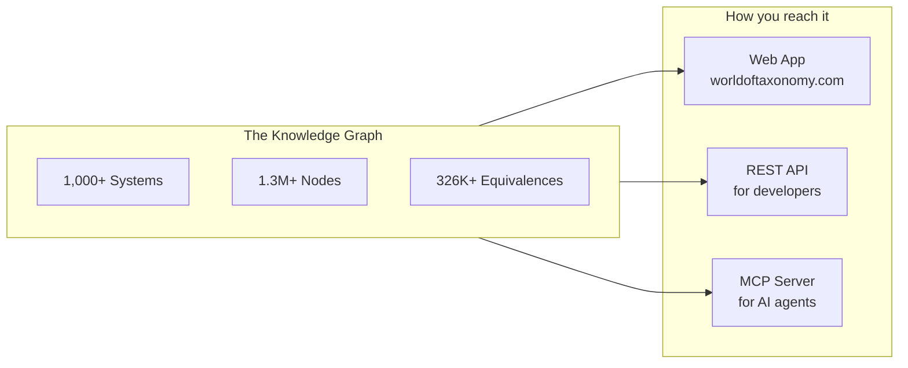
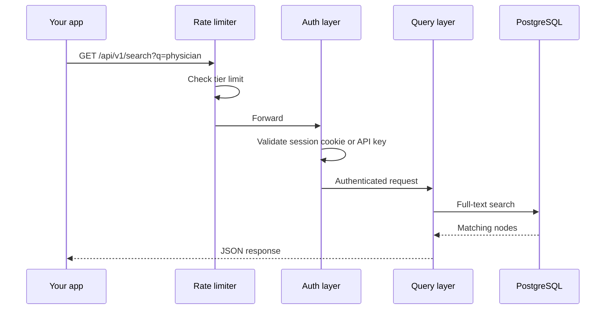

## Getting Started with World Of Taxonomy

> **In one sentence:** World Of Taxonomy is a free, open knowledge graph that connects 1,000+ ways of classifying the world (industries, jobs, diseases, products, regulations, places) and lets you translate between them.

---

## What problem does this solve?

Say you run a small bakery in Texas. Depending on who is asking, your business is:

- **NAICS 311811** to the U.S. Census Bureau
- **ISIC 1071** to the United Nations
- **NACE 10.71** to anyone selling into Europe
- **SIC 2051** to an older banking form
- **HS 1905** when you export your croissants
- **SOC 51-3011** if you are filing a job posting for a baker

Same bakery. Six different code books. None of them talk to each other.

World Of Taxonomy is the bridge. Give it a code in one system, get the equivalent code in every other system that connects to it. Or describe your business in plain English and let it find the codes for you.

## Is this for me?

Pick the path that matches you:

| You are... | Start here |
|-----------|-----------|
| **A business owner or analyst** who needs to find the right code for a business, product, or job | Try the [Explore page](https://worldoftaxonomy.com/explore) and the **Classify My Business** tool |
| **A developer** building an app, integration, or data pipeline | Skip to [Quick start: the API](#quick-start-the-api) below |
| **Using Claude, Cursor, or another AI agent** and want it to look up codes for you | Skip to [Quick start: AI agents (MCP)](#quick-start-ai-agents-mcp) below |
| **A researcher** comparing classification systems across countries | Browse the [Systems Catalog](/guide/systems-catalog) and the [Crosswalk Map](/guide/crosswalk-map) |

You do not need an account to explore. You only need to sign in if you want an API key for automated access.

## How the data is organized

Three ideas cover almost everything:

1. **Systems.** A classification system is a single code book, like NAICS 2022 or ICD-10-CM. There are over 1,000 of them in World Of Taxonomy.
2. **Nodes.** A node is one entry in a code book. NAICS 6211 ("Offices of Physicians") is a node. ICD-10-CM E11 ("Type 2 diabetes mellitus") is a node. Nodes live in a tree: each one has a parent and may have children.
3. **Equivalences.** An equivalence (also called a crosswalk) is a link that says "this code over here means roughly the same thing as this code over there." NAICS 6211 has an equivalence to ISIC 8620, NACE 86.2, NIC 8620, and so on.

That is the whole model. Everything else (search, translate, classify) is built on top of these three.


```mermaid
graph LR
  subgraph Graph["The Knowledge Graph"]
    SYS["1,000+ Systems"]
    NODES["1.3M+ Nodes"]
    EDGES["326K+ Equivalences"]
  end
  subgraph Surfaces["How you reach it"]
    WEB["Web App<br/>worldoftaxonomy.com"]
    API["REST API<br/>for developers"]
    MCP["MCP Server<br/>for AI agents"]
  end
  Graph --> WEB
  Graph --> API
  Graph --> MCP
```

## Quick start: the web app

No setup, nothing to install. Just open these in your browser:

- **[Explore](https://worldoftaxonomy.com/explore)** - type a word, see matching codes across every system. Try `physician`, `bakery`, or `solar panel`.
- **[Systems](https://worldoftaxonomy.com/systems)** - browse the full catalog of code books, filtered by region or category.
- **[Classify My Business](https://worldoftaxonomy.com/classify)** - describe a business in your own words, get back the most likely codes in each system.

If you only want to look something up once, the web app is the answer.

## Quick start: the API

Use the API when you want to integrate classification lookups into your own application.

The base URL is `https://worldoftaxonomy.com/api/v1`. Every endpoint returns JSON. The examples below use `curl`, but any HTTP client works.

### Find a code by searching

```bash
curl "https://worldoftaxonomy.com/api/v1/search?q=physician"
```

Searches all 1.3 million nodes at once and returns matches from SOC, ISCO, ESCO, NAICS, ICD-10-CM, and dozens of other systems in a single call.

Helpful query parameters:
- `&grouped=true` groups results by system, so you see one block per code book
- `&context=true` adds the ancestor path and child codes for each match, so you can see where it sits in the hierarchy

### Look up a specific code

```bash
curl https://worldoftaxonomy.com/api/v1/systems/naics_2022/nodes/6211
```

Returns the code's title, description, level, parent code, and whether it has any children.

### Walk the tree

```bash
curl https://worldoftaxonomy.com/api/v1/systems/naics_2022/nodes/62/children
```

Returns the direct children of a node. This is how you drill down: start at the top, ask for children, pick one, ask for its children.

### Translate to other systems

```bash
curl https://worldoftaxonomy.com/api/v1/systems/naics_2022/nodes/6211/translations
```

Returns equivalents in every system that has a crosswalk to NAICS 6211. One request, every known translation. For a single pairwise lookup, use `/equivalences` instead of `/translations`.

## Quick start: AI agents (MCP)

If you use Claude Desktop, Cursor, Zed, VS Code with Continue, Windsurf, or any other client that speaks MCP (Model Context Protocol), you can give your AI agent direct access to the knowledge graph.

**One-line install:**

```bash
pip install world-of-taxonomy
python -m world_of_taxonomy mcp
```

That runs the MCP server over stdio. You point your AI client at it once, and from then on the agent can search, look up codes, translate between systems, and classify free text by itself.

For client-specific config (Claude Desktop, Cursor, Zed, and others), see the [MCP Setup Guide](/guide/mcp-setup).

The server exposes 26 tools. The ones you will use most:

| Tool | What it does |
|------|--------------|
| `list_classification_systems` | List all 1,000+ systems |
| `search_classifications` | Full-text search across every node |
| `get_industry` | Look up one specific code |
| `browse_children` | Walk the tree |
| `get_equivalences` | Get crosswalk mappings for a code |
| `translate_code` | Translate a code into another system |
| `translate_across_all_systems` | Translate into every connected system |
| `classify_business` | Turn a free-text description into codes |
| `get_country_taxonomy_profile` | Which systems apply in a given country |
| `get_audit_report` | Data provenance and quality breakdown |

It also exposes MCP resources the agent can read for context:
- `taxonomy://systems` - JSON list of all systems
- `taxonomy://stats` - graph statistics
- `taxonomy://wiki/{slug}` - any guide page (including this one)

## When you need an account

You only need to sign in if you want an API key. Without one, you get 30 requests per minute (plenty for poking around). With an API key, you get 1,000 per minute and a few extra features.

### Signing in

There are no passwords. Go to [worldoftaxonomy.com/login](https://worldoftaxonomy.com/login), enter your email, click the one-time link we send. That drops you on the API key dashboard at `/developers/keys`.

### Creating an API key

From the dashboard, click "Generate key" and copy the raw key right away. We never show it again. Keys look like `wot_` followed by 32 hex characters. Send it in the Authorization header:

```
Authorization: Bearer wot_your_key_here
```

You can revoke any key from the same dashboard. Revocation takes effect within about two seconds.

### Rate limits at a glance

| Tier | Per minute | Daily | Good for |
|------|-----------|-------|----------|
| Anonymous | 30 | unlimited | Exploring |
| Free (signed in) | 1,000 | unlimited | Building and prototyping |
| Pro | 5,000 | 100,000 | Production traffic |
| Enterprise | 50,000 | unlimited | High-volume integrations |

## What happens behind the scenes


```mermaid
sequenceDiagram
    participant C as Your app
    participant RL as Rate limiter
    participant AUTH as Auth layer
    participant Q as Query layer
    participant DB as PostgreSQL

    C->>RL: GET /api/v1/search?q=physician
    RL->>RL: Check tier limit
    RL->>AUTH: Forward
    AUTH->>AUTH: Validate session cookie or API key
    AUTH->>Q: Authenticated request
    Q->>DB: Full-text search
    DB-->>Q: Matching nodes
    Q-->>C: JSON response
```

## Full API reference

The tutorial sections above cover the common cases. Here is the complete endpoint list for when you need it.

### Systems

| Endpoint | Description |
|----------|-------------|
| `GET /systems` | List all classification systems |
| `GET /systems/{id}` | System detail with root codes |
| `GET /systems/stats` | Leaf and total node counts per system |
| `GET /systems?group_by=region` | Systems grouped by region |
| `GET /systems?country={code}` | Systems applicable to a country |

### Nodes

| Endpoint | Description |
|----------|-------------|
| `GET /systems/{id}/nodes/{code}` | Look up a specific code |
| `GET /systems/{id}/nodes/{code}/children` | Direct children |
| `GET /systems/{id}/nodes/{code}/ancestors` | Parent chain to root |
| `GET /systems/{id}/nodes/{code}/siblings` | Sibling codes |
| `GET /systems/{id}/nodes/{code}/subtree` | Subtree summary stats |

### Search

| Endpoint | Description |
|----------|-------------|
| `GET /search?q={query}` | Full-text search |
| `GET /search?q={query}&grouped=true` | Results grouped by system |
| `GET /search?q={query}&context=true` | Results with ancestor and child context |

### Crosswalks

| Endpoint | Description |
|----------|-------------|
| `GET /systems/{id}/nodes/{code}/equivalences` | Cross-system mappings |
| `GET /systems/{id}/nodes/{code}/translations` | Translate to all systems |
| `GET /equivalences/stats` | Crosswalk statistics |
| `GET /compare?a={sys}&b={sys}` | Side-by-side sector comparison |
| `GET /diff?a={sys}&b={sys}` | Codes with no mapping |

### Classification

| Endpoint | Description |
|----------|-------------|
| `POST /classify` | Classify free text; returns `domain_matches` plus `standard_matches`. See [domain-vs-standard](/guide/domain-vs-standard) for the difference. |

### Countries

| Endpoint | Description |
|----------|-------------|
| `GET /countries/stats` | Per-country taxonomy coverage |
| `GET /countries/{code}` | Full taxonomy profile for a country |

## A note on accuracy

All data in World Of Taxonomy is provided for informational purposes. It is not a substitute for official government or standards body publications. For regulatory, legal, or compliance work, always verify codes against the authoritative source.
