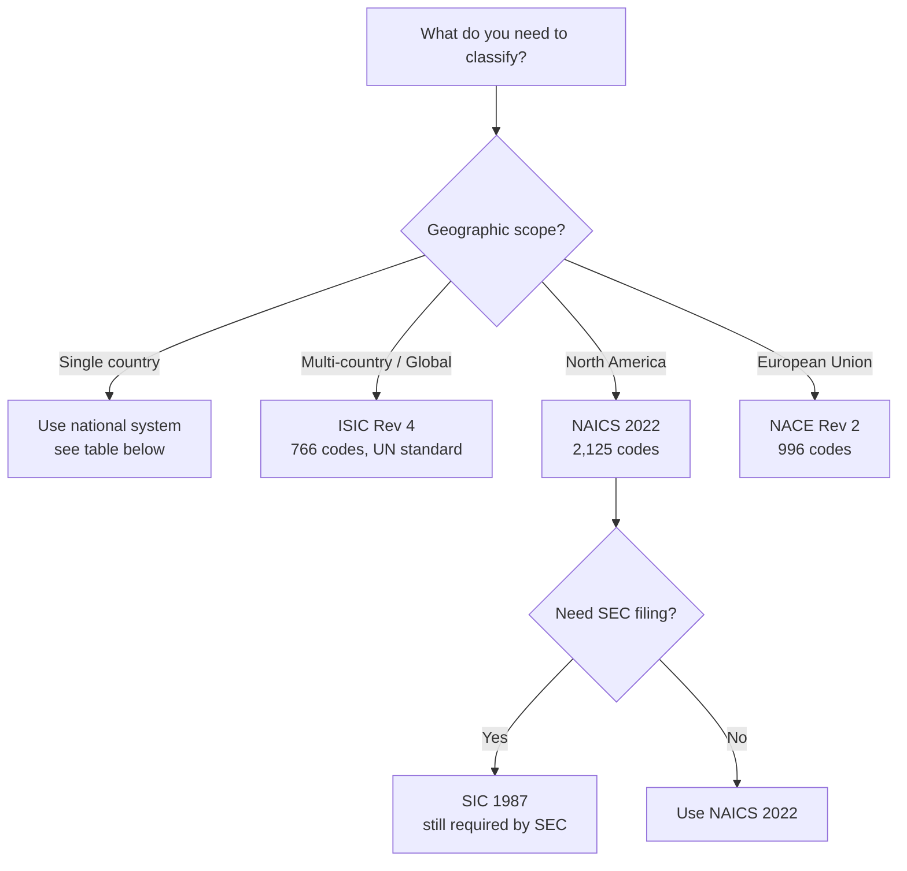
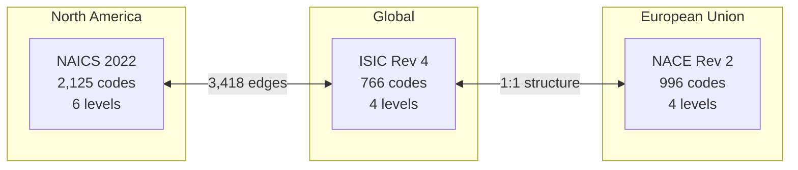

## Industry Classification Guide - Which System to Use

> **TL;DR:** Your country and purpose determine which industry classification system to use. NAICS for North America, NACE for the EU, ISIC for global. This guide provides a decision tree, country reference, and side-by-side comparisons.

---

## Decision tree



### Step 1: What is your geographic scope?

**Single country** - Use the national system for that country (see table below).

**Multi-country or global** - Use ISIC Rev 4 as your common denominator, then translate to national systems as needed.

**North America (US, Canada, Mexico)** - Use NAICS 2022.

**European Union** - Use NACE Rev 2 (or your country's national variant).

### Step 2: What level of detail do you need?

| Granularity | Typical Use | Recommended System |
|-------------|-------------|-------------------|
| Broad sectors (10-20 categories) | Executive dashboards, market sizing | ISIC sections (A-U) or NAICS 2-digit |
| Divisions (~100 categories) | Industry reports, portfolio analysis | ISIC 2-digit or NAICS 3-digit |
| Groups (~300 categories) | Detailed market analysis | ISIC 3-digit or NAICS 4-digit |
| Classes (~500+ categories) | Regulatory filings, detailed reporting | ISIC 4-digit or NAICS 5-6 digit |

### Step 3: Is this for regulatory compliance?

If you are filing with a government agency, use the system they require:

| Agency / Purpose | Required System |
|------------------|----------------|
| US Census Bureau / BLS | NAICS 2022 |
| US SEC filings | SIC 1987 |
| Eurostat / EU statistical reporting | NACE Rev 2 |
| UN statistical reporting | ISIC Rev 4 |
| Australian Bureau of Statistics | ANZSIC 2006 |
| Indian Ministry of Statistics | NIC 2008 |
| World Bank projects | ISIC Rev 4 |

## Country-to-system quick reference

### Major economies

| Country | Primary System | Codes | Notes |
|---------|---------------|-------|-------|
| United States | NAICS 2022 | 2,125 | Also SIC 1987 for SEC filings |
| Canada | NAICS 2022 | 2,125 | Shared with US and Mexico |
| United Kingdom | SIC 1987 / UK SOC | 1,176 | Companies House uses SIC |
| Germany | WZ 2008 | 996 | National NACE variant |
| France | NAF Rev 2 | 996 | National NACE variant |
| India | NIC 2008 | 2,070 | Based on ISIC Rev 4 |
| China | GB/T 4754-2017 | 118 | National standard |
| Japan | JSIC 2013 | 20 | Statistical survey use |
| Australia | ANZSIC 2006 | 825 | Shared with New Zealand |
| South Korea | KSIC 2017 | 108 | KOSTAT standard |

### Latin America

All countries use CIIU Rev 4 (the Spanish translation of ISIC Rev 4) with 766 codes: Colombia, Argentina, Chile, Peru, Ecuador, Bolivia, Venezuela, Costa Rica, Guatemala, Panama, Paraguay, Uruguay, Dominican Republic.

### European Union (27 members + EEA)

All EU member states use NACE Rev 2 with national naming: ATECO (Italy), NAF (France), WZ (Germany), CNAE (Spain), PKD (Poland), SBI (Netherlands), SNI (Sweden), and others. The structure is identical - 996 codes with 1:1 mapping.

## National variants - full enumeration

These are the WoT system IDs for every country-specific industry classification carried in the graph. They share structure with the parent system (NAICS for North/Central America, NACE Rev 2 for EU and adjacent, ISIC Rev 4 for everywhere else); each is its own WoT system with the publisher's identifiers preserved so country-specific filings stay clean.

### NACE Rev 2 family (EU and adjacent)

| System ID | Country | Authority |
|-----------|---------|-----------|
| `nace_rev2` | EU (master) | Eurostat |
| `ateco_2007` | Italy | ISTAT |
| `naf_rev2` | France | INSEE |
| `wz_2008` | Germany | Destatis |
| `onace_2008` | Austria | Statistik Austria |
| `noga_2008` | Switzerland | Federal Statistical Office |
| `pkd_2007` | Poland | GUS |
| `sbi_2008` | Netherlands | CBS |
| `sni_2007` | Sweden | SCB |
| `db07` | Denmark | Statistics Denmark |
| `tol_2008` | Finland | Statistics Finland |
| `cnae_2009` | Spain | INE |
| `nace_bel` | Belgium | Statbel |
| `nace_lu` | Luxembourg | STATEC |
| `nace_ie` | Ireland | CSO Ireland |
| `cae_rev3` | Portugal | INE Portugal |
| `cz_nace` | Czech Republic | CZSO |
| `teaor_2008` | Hungary | KSH |
| `caen_rev2` | Romania | INS |
| `nkd_2007` | Croatia | DZS |
| `sk_nace` | Slovakia | Statistical Office SR |
| `nkid` | Bulgaria | NSI |
| `emtak` | Estonia | Statistics Estonia |
| `nace_lt` | Lithuania | Statistics Lithuania |
| `nk_lv` | Latvia | CSB Latvia |
| `stakod_08` | Greece | ELSTAT |
| `nace_cy` | Cyprus | CYSTAT |
| `nace_mt` | Malta | NSO Malta |
| `skd_2008` | Slovenia | SURS |
| `sn_2007` | Norway | SSB |
| `isat_2008` | Iceland | Statistics Iceland |
| `nace_tr` | Turkey | TÜİK |
| `kd_rs` | Serbia | SORS |
| `nkd_mk` | North Macedonia | State Statistical Office |
| `kd_ba` | Bosnia and Herzegovina | BHAS |
| `kd_me` | Montenegro | MONSTAT |
| `nve_al` | Albania | INSTAT |
| `kd_xk` | Kosovo | ASK |
| `caem_md` | Moldova | National Bureau of Statistics |
| `kved_ua` | Ukraine | State Statistics Service |
| `nace_ge` | Georgia | GeoStat |
| `nace_am` | Armenia | Armstat |

### ISIC Rev 4 family (LatAm, Asia-Pacific, Africa, Middle East)

The "CIIU" prefix is the Spanish translation of ISIC. Each Latin American country publishes its own national version. The Asia-Pacific and African nations listed below use ISIC Rev 4 directly with national codes.

| System ID | Country | Notes |
|-----------|---------|-------|
| `ciiu_co` | Colombia | CIIU Rev 4 AC |
| `ciiu_ar` | Argentina | CLANAE Rev 4 |
| `ciiu_cl` | Chile | CIIU Rev 4 |
| `ciiu_pe` | Peru | CIIU Rev 4 |
| `ciiu_ec` | Ecuador | CIIU Rev 4 |
| `caeb` | Bolivia | CAEB |
| `ciiu_ve` | Venezuela | CIIU Rev 4 |
| `ciiu_cr` | Costa Rica | CIIU Rev 4 |
| `ciiu_gt` | Guatemala | CIIU Rev 4 |
| `ciiu_pa` | Panama | CIIU Rev 4 |
| `ciiu_py` | Paraguay | CIIU Rev 4 |
| `ciiu_uy` | Uruguay | CIIU Rev 4 |
| `ciiu_do` | Dominican Republic | CIIU Rev 4 |

Plus 80+ ISIC Rev 4 country adaptations (`isic_<cc>` for two-letter ISO codes - Nigeria, Kenya, Egypt, Saudi Arabia, UAE, Vietnam, Bangladesh, Pakistan, etc). These follow a consistent system_id pattern; query `GET /api/v1/systems?prefix=isic_` for the live list.

### NAICS family (North America historical and adaptations)

| System ID | Variant |
|-----------|---------|
| `naics_2022` | NAICS 2022 (current) |
| `naics_2017` | NAICS 2017 (historical) |
| `naics_2012` | NAICS 2012 (historical) |
| `scian_2018` | SCIAN 2018 (Mexico's national NAICS variant) |

### Other Asia-Pacific

| System ID | Country |
|-----------|---------|
| `gbt_4754` | China |
| `ksic_2017` | South Korea |
| `jsic_2013` | Japan |
| `ssic_2020` | Singapore |
| `msic_2008` | Malaysia |
| `tsic_2009` | Thailand |
| `psic_2009` | Philippines |
| `psic_pk` | Pakistan |
| `vsic_2018` | Vietnam |
| `bsic` | Bangladesh |
| `kbli_2020` | Indonesia (KBLI 2020 official) |
| `kbli_id` | Indonesia (alternate) |
| `slsic` | Sri Lanka |
| `nic_2008` | India |
| `anzsic_2006` | Australia / New Zealand |

### Russia and post-Soviet

| System ID | Country |
|-----------|---------|
| `okved_2` | Russia |

### South Africa

| System ID | Country |
|-----------|---------|
| `sic_sa` | South Africa |

### Historical references

| System ID | Notes |
|-----------|-------|
| `isic_rev3` | ISIC Rev 3 (predecessor to Rev 4; kept for historical filings) |
| `csic_2017` | China SIC 2017 (companion to GB/T 4754) |
| `cnae_2012` | CNAE 2.0 (alternate Spanish industry classification) |

## Comparing the major systems



### NAICS 2022 vs ISIC Rev 4

| Feature | NAICS 2022 | ISIC Rev 4 |
|---------|-----------|-----------|
| Codes | 2,125 | 766 |
| Levels | 6 (2-6 digit) | 4 (section, division, group, class) |
| Region | North America | Global |
| Detail | Very granular | Moderate |
| Crosswalk | 3,418 edges to ISIC | 3,418 edges to NAICS |
| Best for | US regulatory, detailed analysis | International comparison |

### NAICS 2022 vs NACE Rev 2

| Feature | NAICS 2022 | NACE Rev 2 |
|---------|-----------|-----------|
| Codes | 2,125 | 996 |
| Levels | 6 | 4 |
| Region | North America | European Union |
| Detail | Very granular | Moderate |
| Best for | US/Canada/Mexico | EU regulatory, Eurostat |

### NAICS 2022 vs SIC 1987

| Feature | NAICS 2022 | SIC 1987 |
|---------|-----------|---------|
| Codes | 2,125 | 1,176 |
| Status | Current | Legacy (but still used) |
| Region | North America | USA/UK |
| Best for | Current analysis | SEC filings, historical data |

## How to translate between systems

```bash
# Translate NAICS 6211 to all equivalent systems
curl https://worldoftaxonomy.com/api/v1/systems/naics_2022/nodes/6211/translations

# Direct equivalences with match types
curl https://worldoftaxonomy.com/api/v1/systems/naics_2022/nodes/6211/equivalences

# Find NAICS codes with no NACE equivalent
curl "https://worldoftaxonomy.com/api/v1/diff?a=naics_2022&b=nace_rev2"
```

For systems without direct crosswalks, follow the translation path through hub systems (see the [Crosswalk Map](crosswalk-map) guide).

## Domain-specific extensions

When a standard industry code is too broad for your use case, World Of Taxonomy provides domain-specific vocabularies:

| NAICS Sector | Domain Vocabularies | Example Codes |
|-------------|---------------------|---------------|
| 484 Truck Transportation | Freight types, vehicle classes, cargo, carrier operations | 44 + 23 + 46 + 27 |
| 11 Agriculture | Crop types, livestock, farming methods, commodity grades | 46 + 27 + 28 + 30 |
| 21 Mining | Mineral types, extraction methods, reserve classification | 25 + 20 + 12 |
| 22 Utilities | Energy sources, grid regions, tariff structures | 17 + 15 + 26 |
| 23 Construction | Trade types, building types, project delivery | 20 + 17 + 22 |

These domain taxonomies are crosswalked back to their parent NAICS/ISIC sector codes, so you can drill down from a broad industry classification to specialized detail.
