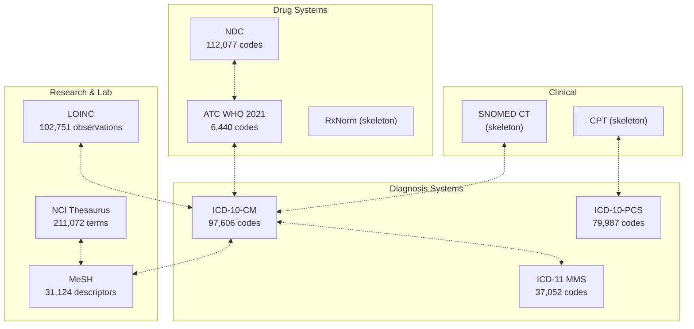
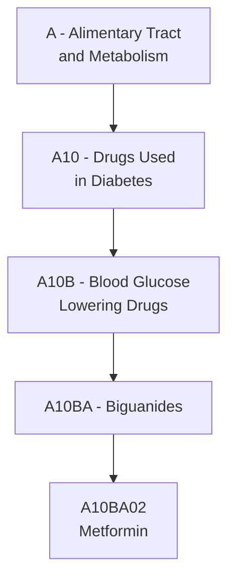

## Medical and Health Classification Systems Compared

> **TL;DR:** ICD-10-CM for US billing, ICD-11 for global reporting, LOINC for lab tests, ATC for drugs, MeSH for research. World Of Taxonomy connects all of these (and more) - 568K+ health codes across 100+ systems with crosswalk edges between them.

---

## System overview

| System | Codes | Purpose | Authority |
|--------|-------|---------|-----------|
| ICD-11 MMS | 37,052 | Disease classification (latest WHO standard) | WHO |
| ICD-10-CM | 97,606 | US clinical modification for diagnoses | CMS/NCHS |
| ICD-10-PCS | 79,987 | US procedure coding system | CMS |
| LOINC | 102,751 | Laboratory and clinical observations | Regenstrief Institute |
| MeSH | 31,124 | Medical literature subject headings | NLM |
| ATC WHO 2021 | 6,440 | Drug classification by therapeutic use | WHO |
| NCI Thesaurus | 211,072 | Cancer research terminology | National Cancer Institute |
| NDC | 112,077 | National drug codes (US) | FDA |
| SNOMED CT | ~20 (skeleton) | Clinical terminology reference | SNOMED International |
| CPT | ~18 (skeleton) | Medical procedure codes (US) | AMA |

> SNOMED CT and CPT are included as structural placeholders. Full datasets require licenses from SNOMED International and the AMA respectively.

## How health systems connect



## ICD-10-CM vs ICD-11: Which to use?

### ICD-10-CM (United States)

ICD-10-CM is the US clinical modification of the WHO's ICD-10. It is required for US healthcare billing and reporting.

- **97,606 codes** - the most granular diagnosis system in the graph
- **Structure**: 3-7 character alphanumeric codes (e.g., E11.65 - Type 2 diabetes with hyperglycemia)
- **Required by**: CMS, US health insurers, HIPAA transactions
- **Updated**: annually (October 1 each year)

### ICD-11 MMS (Global)

ICD-11 is the latest WHO revision, adopted by the World Health Assembly in 2019.

- **37,052 codes** with extension codes for additional detail
- **Structure**: Alphanumeric with cluster and post-coordination
- **Status**: Official WHO standard since January 2022

### When to use which

| Scenario | System | Why |
|----------|--------|-----|
| US hospital billing | ICD-10-CM | Required by CMS |
| US procedure coding | ICD-10-PCS | Required for inpatient procedures |
| WHO mortality/morbidity reporting | ICD-11 | Current WHO standard |
| New health IT system (non-US) | ICD-11 | Forward-looking adoption |
| International health research | ICD-11 | Global comparability |
| Legacy system integration | ICD-10-CM | Existing infrastructure |

## LOINC - Laboratory and clinical observations

LOINC (Logical Observation Identifiers Names and Codes) is the universal standard for identifying health measurements, observations, and documents.

- **102,751 codes** - the largest observation vocabulary
- **Use cases**: lab test orders and results, clinical documents, patient surveys
- **Structure**: 5-7 digit numeric codes with check digit
- **Required by**: US federal health agencies, HL7 FHIR implementations

> LOINC does not classify diseases (that is ICD's role). It classifies what was measured or observed. A LOINC code identifies the test, an ICD code identifies the condition.

## MeSH - Medical subject headings

MeSH is the controlled vocabulary used for indexing biomedical literature in PubMed/MEDLINE.

- **31,124 descriptors** organized in a hierarchical tree
- **Use cases**: literature search, research categorization, knowledge organization
- **Structure**: 16 top-level categories branching into specific terms
- **Maintained by**: US National Library of Medicine

## ATC - Drug classification

The Anatomical Therapeutic Chemical (ATC) classification organizes drugs by the organ system they target and their therapeutic properties.

- **6,440 codes** across 5 hierarchical levels
- **Structure**: 7-character codes (e.g., A10BA02 = metformin)
- **Levels**: Anatomical group, Therapeutic subgroup, Pharmacological subgroup, Chemical subgroup, Chemical substance
- **Maintained by**: WHO Collaborating Centre for Drug Statistics



## Domain-specific health vocabularies

World Of Taxonomy includes domain taxonomies for healthcare specialization:

| Domain | Codes | Coverage |
|--------|-------|----------|
| Hospital Department Types | 18 | Department classification |
| Nursing Specialty Types | 17 | Nursing specializations |
| Lab Test Category Types | 17 | Laboratory categories |
| Surgical Specialty Types | 17 | Surgical specializations |
| Pharmacy Practice Types | 16 | Pharmacy settings |
| Health Care Settings | 23 | Care delivery settings |
| Health Care Payer Types | 18 | Insurance/payer categories |
| Health Care Delivery Models | 18 | Payment and delivery models |
| Mental Health Service Types | 22 | Behavioral health |
| Dental Service Types | 18 | Oral health |

## API examples

```bash
# Search for a medical term across all systems
curl "https://worldoftaxonomy.com/api/v1/search?q=diabetes&grouped=true"

# Browse ICD-10-CM hierarchy
curl https://worldoftaxonomy.com/api/v1/systems/icd10_cm/nodes/E11/children

# Get ICD-10-CM code detail
curl https://worldoftaxonomy.com/api/v1/systems/icd10_cm/nodes/E11.65

# Browse ATC hierarchy from top level
curl https://worldoftaxonomy.com/api/v1/systems/atc_who_2021/nodes/A10/children

# LOINC system overview
curl https://worldoftaxonomy.com/api/v1/systems/loinc

# Cross-system equivalences for a diagnosis code
curl https://worldoftaxonomy.com/api/v1/systems/icd10_cm/nodes/E11/equivalences
```

## Use cases

| Who | What | Systems |
|-----|------|---------|
| Hospital IT teams | Map diagnoses to billing codes | ICD-10-CM, ICD-10-PCS, CPT |
| Pharma researchers | Link drugs to indications | ATC, ICD-10-CM, MeSH |
| Public health agencies | Compare disease burden globally | ICD-11, ICD-10-CM |
| Lab information systems | Standardize test identifiers | LOINC |
| Clinical NLP pipelines | Normalize extracted terms | SNOMED CT, ICD-10-CM, MeSH |
| Health AI agents | Navigate the full health taxonomy | All of the above via MCP |
