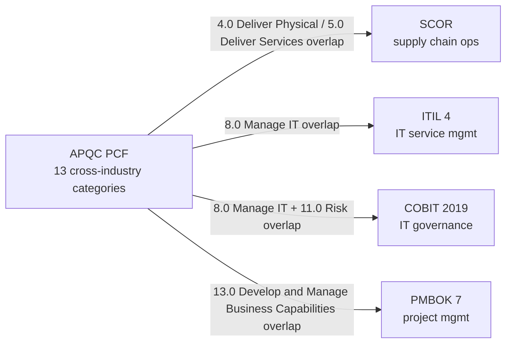

# Process and Activity Frameworks

> **TL;DR:** APQC PCF is the pan-industry process anchor (13 top-level categories of operating + management processes). SCOR covers supply-chain ops, ITIL 4 covers IT service management, COBIT covers IT governance, PMBOK / PRINCE2 cover project management, Six Sigma / Lean cover quality and operations. WoT hosts all of these so downstream products can anchor "what work does this organization do" against canonical process taxonomies.

---

## What this layer is for

Industry classifications (NAICS, ISIC, NACE) name *what an organization does* by sector. Process frameworks name *how the work itself is organized*: discrete activities, sub-processes, capabilities. The two are orthogonal: every NAICS sector executes the same APQC PCF top-level processes (it Develops Vision, Manages HR, Manages IT, Delivers Products / Services). The difference is which level-2 / level-3 elements are emphasized.

This layer matters when downstream products need to:

- Anchor a job posting against process language (an "Order Management Analyst" works on PCF 4.0 Deliver Physical Products and SCOR Deliver, not on a NAICS code).
- Crosswalk a benchmark report ("our Source-to-Pay cycle is X days") against the source taxonomy of the framework producing the benchmark.
- Drive process-mining or RPA pipelines that need standard activity vocabularies, not industry codes.
- Support consultative selling that maps a customer's pain ("our IT change-management is broken") to a published framework anchor (ITIL 4 IL.18 Change Enablement) rather than a free-text category.

## System comparison

| System | Codes | Scope | Maintained By |
|--------|-------|-------|---------------|
| APQC PCF (Skeleton) | 13 | Cross-industry process classification, top-level categories | APQC |
| SCOR Model | 17 (L1+L2) | Supply Chain Operations Reference (Plan / Source / Make / Deliver / Return / Enable / Orchestrate) | ASCM (formerly APICS) |
| ITIL 4 | 26 (L1+L2 practices) | IT service management, 25 ITIL 4 practices across General / Service / Technical | AXELOS / PeopleCert |
| COBIT 2019 | 44 (5 governance domains + 40 objectives) | IT governance and management framework | ISACA |
| PMBOK 7th Ed | 21 (8 performance domains + 12 principles) | Project management body of knowledge | PMI |
| PRINCE2 | 15 | Projects in Controlled Environments (UK Cabinet Office method) | AXELOS |
| Six Sigma | 16 | DMAIC / DMADV process improvement methodology | ASQ |
| Lean Tools | 15 | Lean manufacturing / lean management toolkit | various (Toyota Production System lineage) |
| TOGAF ADM | 14 | Enterprise architecture method (Architecture Development Method phases) | The Open Group |
| ArchiMate | 14 | Enterprise architecture modelling language | The Open Group |
| SCOR Model (extended) | included above | also covers performance attributes and best-practice recommendations | ASCM |

## How these relate



APQC PCF is the most general anchor. The others specialize:

- **SCOR** elaborates what PCF 4.0 (Deliver Physical Products) and 5.0 (Deliver Services) actually involve at the supply-chain level. Process Plan / Source / Make / Deliver / Return / Enable / Orchestrate.
- **ITIL 4** elaborates what PCF 8.0 (Manage IT) involves at the service-management level. 25 practices grouped General / Service Mgmt / Technical.
- **COBIT 2019** governs IT (overlaps PCF 8.0 and 11.0 Manage Enterprise Risk). 5 domains (EDM, APO, BAI, DSS, MEA), 40 objectives.
- **PMBOK 7** elaborates what PCF 13.0 (Develop and Manage Business Capabilities) means when you are managing it as a portfolio of projects.
- **Six Sigma / Lean** are improvement methodologies that span PCF categories rather than living inside one.

## Crosswalk navigation

WoT carries Level-1 conceptual crosswalks between APQC PCF and the supply-chain / IT / project-management frameworks listed above. These are tagged `match_type='related'` rather than `'exact'` because they are *conceptual overlaps* (PCF 8.0 and ITIL 4 both cover IT operations), not strict identity. Use them as anchoring hints, not as substitution rules.

```bash
# Find what overlaps with APQC PCF 8.0 (Manage IT)
GET /api/v1/systems/apqc_pcf/nodes/8.0/equivalences

# Find what SCOR Deliver maps to in PCF
GET /api/v1/systems/scor_model/nodes/SC.04/equivalences
```

## What WoT does not host

- **Per-industry APQC PCFs** (Banking, Healthcare, Telecom, etc.). APQC publishes industry-specific variants of the PCF; only the cross-industry skeleton is in this PR.
- **APQC PCF Levels 2-5** (~1,500 detailed process elements). The full tree requires APQC's official spreadsheet (free with registration). The ingester (`world_of_taxonomy/ingest/apqc_pcf.py`) is structured for in-place extension when that file is provided; the system_id stays `apqc_pcf` so existing crosswalks survive.
- **BPMN / DMN / CMMN notations**. These are graphical modelling notations, not classification systems. They fail the inclusion policy's "stable identifiers" and "enumerated / hierarchical" tests because every vendor's BPMN library defines its own element subset.
- **ISO 15926** (process plant data integration). Behind ISO paywall and per-part licensing; deferred unless a paying customer explicitly asks for it.

## Use cases

1. **Process discovery for consulting engagements.** Anchor a discovery conversation against PCF Level-1 categories so all stakeholders use the same vocabulary.
2. **Job-architecture design.** Map a role to PCF + SCOR + ITIL elements to define what "good" looks like for the role's deliverables.
3. **Benchmark normalization.** When a vendor cites "our Order-to-Cash cycle averages 7 days," anchor against PCF 4.0 + SCOR Deliver to compare against your own metrics.
4. **RPA / process mining tagging.** Use PCF + SCOR / ITIL codes as the controlled vocabulary for activity logs feeding process-mining tools.
5. **Compliance scoping.** Map a control framework (NIST CSF, ISO 27001) against COBIT objectives to identify which IT processes the controls actually touch.

## Related reading

- [Industry Classification Guide](./industry-classification.md) - the orthogonal sector axis.
- [Crosswalk Map](./crosswalk-map.md) - how systems connect via equivalence edges.
- [Inclusion Policy](./inclusion-policy.md) - why BPMN and ISO 15926 are not in WoT.
