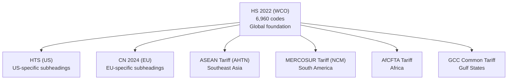
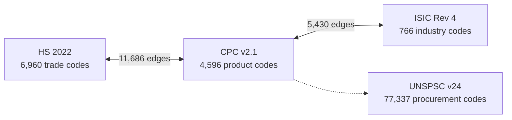
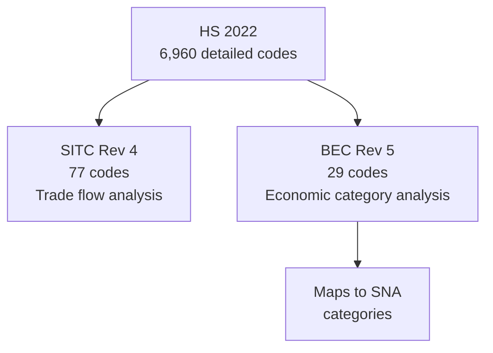

## Trade and Product Classification Guide

> **TL;DR:** HS for customs, CPC to bridge trade and industry, UNSPSC for procurement (77K codes). This guide shows how the trade classification systems relate, which one to use, and how to navigate between them with 11,686+ crosswalk edges.

---

## System comparison

| System | Codes | Purpose | Maintained By |
|--------|-------|---------|---------------|
| HS 2022 | 6,960 | International customs tariffs | World Customs Organization |
| CPC v2.1 | 4,596 | Statistical product classification | United Nations |
| UNSPSC v24 | 77,337 | Procurement and spend analysis | GS1 US |
| GS1 GPC | 6,450 | Global Product Classification (Segment / Family / Class / Brick), retail and B2B trade | GS1 |
| SITC Rev 4 | 77 | Trade statistics (aggregated) | United Nations |
| BEC Rev 5 | 29 | Broad economic categories | United Nations |
| HTS (US) | 120 | US-specific tariff schedule | US International Trade Commission |
| CN 2024 | 118 | EU Combined Nomenclature | European Commission |

GS1 GPC sits next to UNSPSC as the second major procurement-anchored vocabulary, but with a different focus: GPC is the global product-identification standard published by GS1 (the same authority behind GTINs / UPCs / EANs), used heavily across retail, healthcare, and supply chain. UNSPSC is procurement-shaped (for spend analysis), GPC is product-identification-shaped (for catalog and POS systems). Both serve B2B trade, often in parallel.

## How these systems relate

### The HS family tree

The Harmonized System (HS) is the foundation of international trade classification. Other systems build on it.



Every country that trades internationally uses HS at the 6-digit level. National extensions add more digits for country-specific detail.

### The statistical bridge

CPC v2.1 bridges product classification and industry classification. This is where trade meets production.



This means you can trace: a **trade code** (HS) to its **product category** (CPC) to the **industry that produces it** (ISIC/NAICS).

### Aggregation for statistics

SITC and BEC aggregate trade data at higher levels for economic analysis:



## Which system to use

| Purpose | Recommended System | Why |
|---------|-------------------|-----|
| Customs declarations | HS 2022 (or national variant) | Legally required for trade |
| US import/export filings | HTS (US) | Required by US Customs |
| EU trade compliance | CN 2024 | Required by EU customs |
| Procurement/spend analysis | UNSPSC v24 | Most granular (77K codes) |
| International trade statistics | SITC Rev 4 | Designed for aggregate analysis |
| Economic modeling | BEC Rev 5 | Maps to SNA categories |
| Product-to-industry mapping | CPC v2.1 | Bridges HS to ISIC |

## HS code structure

HS codes use a hierarchical 6-digit structure:

| Level | Digits | Example | Description |
|-------|--------|---------|-------------|
| Chapter | 2 | 01 | Live animals |
| Heading | 4 | 0101 | Horses, asses, mules |
| Subheading | 6 | 010121 | Pure-bred horses |

National extensions add further digits. HTS (US) goes up to 10 digits. CN (EU) uses 8 digits.

## CPC code structure

CPC v2.1 uses a 5-level hierarchy:

| Level | Example | Description |
|-------|---------|-------------|
| Section | 0 | Agriculture, forestry and fishery products |
| Division | 01 | Products of agriculture, horticulture |
| Group | 011 | Cereals |
| Class | 0111 | Wheat |
| Subclass | 01110 | Wheat, unmilled |

## UNSPSC structure

UNSPSC uses an 8-digit hierarchy across 4 levels:

| Level | Example | Description |
|-------|---------|-------------|
| Segment | 10 | Live Plant and Animal Material |
| Family | 1010 | Live animals |
| Class | 101015 | Dogs |
| Commodity | 10101501 | Guard dogs |

With 77,337 codes, UNSPSC is the most detailed product classification available. It is widely used in procurement platforms and spend analytics.

## Crosswalk navigation

### Translate an HS code to an industry

```bash
# Get CPC equivalences for an HS code
curl https://worldoftaxonomy.com/api/v1/systems/hs_2022/nodes/0101/equivalences

# Translate HS code to all connected systems
curl https://worldoftaxonomy.com/api/v1/systems/hs_2022/nodes/0101/translations
```

### Find trade codes for an industry

```bash
# Start from a NAICS code, get all translations including HS/CPC
curl https://worldoftaxonomy.com/api/v1/systems/naics_2022/nodes/1111/translations

# Or use the search to find trade codes by product name
curl "https://worldoftaxonomy.com/api/v1/search?q=wheat&grouped=true"
```

### Find gaps

```bash
# HS codes with no CPC equivalent
curl "https://worldoftaxonomy.com/api/v1/diff?a=hs_2022&b=cpc_v21"
```

## Use cases

| Who | What | Systems |
|-----|------|---------|
| Customs brokers | Classify goods for import/export | HS 2022, HTS, CN 2024 |
| Procurement teams | Categorize spend across suppliers | UNSPSC v24 |
| Trade economists | Analyze bilateral trade flows | SITC Rev 4, BEC Rev 5 |
| Supply chain analysts | Map products to producing industries | CPC v2.1, ISIC Rev 4 |
| Compliance officers | Verify tariff classification | HS 2022 + national variants |
| AI trade agents | Automate classification via MCP | All of the above |

## MCP tools for trade classification

| Tool | Purpose |
|------|---------|
| `search_classifications` | Find trade codes by product name |
| `get_equivalences` | Get crosswalk to other systems |
| `translate_code` | Direct translation between systems |
| `browse_children` | Explore HS/CPC/UNSPSC hierarchy |
| `get_crosswalk_coverage` | Check crosswalk completeness |
